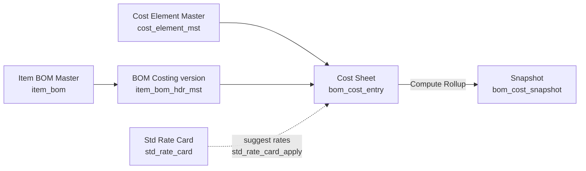

# Module Guide: BOM Costing

Last verified: 2026-06-12

## 1. Module overview

BOM Costing estimates what a manufactured item costs to make. The chain: **Cost Element Master**
defines a configurable cost taxonomy as a tree (material / conversion / overhead roots, leaf
elements accept direct entries, parents are computed sums); **Item BOM Master** defines the
component structure of an item (parent → child adjacency in `item_bom`, recursive tree); **BOM
Costing** creates a versioned costing header per item (`item_bom_hdr_mst`), whose **Cost Sheet**
holds per-cost-element entries (`bom_cost_entry`) and frozen rollup results (`bom_cost_snapshot`);
**Standard Rate Card** (`std_rate_card`) stores standard rates that can be suggested into cost
sheets. Domain design doc: `../vowerp3be/docs/bom_costing_db_instructions_1.md` (AMCL Machineries
machine-manufacturing costing).

Persona: **Portal** — tenant DB. **Note the capitalized FE folder name `BomCosting`** (unlike
other portal modules): pages live under `src/app/dashboardportal/BomCosting/`. No service file —
pages call `apiRoutesPortalMasters` constants directly via `fetchWithCookie`. Everything is scoped
by `co_id` only (read from `localStorage.sidebar_selectedCompany` via a local `getCoId()` helper);
**no endpoint in this module consumes `branch_id`**. Reporting view: `vw_bom_cost_summary`.

This module does **not** implement the standard approval workflow (no /open, /send-for-approval,
/approve endpoints) — see section 5.

## 2. Page quick-map

| FE page (src/app/dashboardportal/...) | Purpose | BE prefix | Detailed in |
|---|---|---|---|
| `BomCosting/costElementMaster/page.tsx` | Cost element taxonomy tree (seed/create/edit) | `/bomCostElement` | inline below |
| `BomCosting/itemBomMaster/page.tsx` | Item BOM list + tree editor dialog | `/itemBomMaster` | inline below |
| `BomCosting/bomCosting/page.tsx` | BOM costing version list + create dialog | `/bomCosting` | inline below |
| `BomCosting/bomCosting/costSheet/page.tsx` | Cost sheet editor (entries, rollup, snapshots) | `/bomCosting` | inline below |
| `masters/stdRateCard/page.tsx` | Standard rate card CRUD (masters module) | `/stdRateCard` | inline below + module-masters |

`masters/costFactor/` is **not** part of this module (uses `COSTFACTOR_*` constants → a different
masters router). There is no `masters/itemBomMaster/` page — the only Item BOM page is the one
under `BomCosting/`.

## 3. Page catalog (inline)

### Cost Element Master — taxonomy tree
- Page: `src/app/dashboardportal/BomCosting/costElementMaster/page.tsx`
- How it works: smart page + `_components/` (`CostElementTree.tsx` renders the nested tree,
  `CostElementForm.tsx` create/edit dialog). On empty tree the page offers **Seed** — copies the
  `co_id=0` template hierarchy into the tenant company (idempotent; 409 if already seeded).
  Elements carry `element_code`, `element_type` (material/conversion/overhead), `default_basis`,
  `is_leaf`, `sort_order`.
- Endpoints:
  | api.ts const | URL | vowerp3be file |
  |---|---|---|
  | `COST_ELEMENT_TREE` | GET `/bomCostElement/cost_element_tree` | `src/bomcosting/costElement.py` |
  | `COST_ELEMENT_SEED` | POST `/bomCostElement/cost_element_seed` | `src/bomcosting/costElement.py` |
  | `COST_ELEMENT_CREATE` | POST `/bomCostElement/cost_element_create` | `src/bomcosting/costElement.py` |
  | `COST_ELEMENT_UPDATE` | POST `/bomCostElement/cost_element_update` | `src/bomcosting/costElement.py` |
- Scope: `co_id` from `localStorage.sidebar_selectedCompany`; no `branch_id`.
- Approval: no.

### Item BOM Master — list + tree editor
- Page: `src/app/dashboardportal/BomCosting/itemBomMaster/page.tsx`
- How it works: `IndexWrapper` list of BOM items with a `bom_status` chip (New / Under Development
  / Certified / Closed). Edit opens the `BomTreeEditor` full dialog. `_components/`:
  `BomTreeEditor.tsx` (loads tree, item/UOM options via `BOM_CREATE_SETUP`, status switcher),
  `BomTreeNode.tsx`, `InlineBomRow.tsx` (inline add/edit row), `BulkAddComponentsDialog.tsx`,
  `ConfirmDialog.tsx`, `BomPrintDialog.tsx` + `bomPrintRender.ts` (print), `treeOps.ts`,
  `types.ts` (shared types + `getCoId()`).
- Endpoints:
  | api.ts const | URL | vowerp3be file |
  |---|---|---|
  | `BOM_LIST` | GET `/itemBomMaster/get_bom_list` | `src/masters/itemBom.py` |
  | `BOM_TREE` | GET `/itemBomMaster/get_bom_tree` | `src/masters/itemBom.py` |
  | `BOM_CREATE_SETUP` | GET `/itemBomMaster/bom_create_setup` | `src/masters/itemBom.py` |
  | `BOM_ADD_COMPONENT` | POST `/itemBomMaster/bom_add_component` | `src/masters/itemBom.py` |
  | `BOM_ADD_COMPONENTS_BULK` | POST `/itemBomMaster/bom_add_components_bulk` | `src/masters/itemBom.py` |
  | `BOM_EDIT_COMPONENT` | POST `/itemBomMaster/bom_edit_component` | `src/masters/itemBom.py` |
  | `BOM_REMOVE_COMPONENT` | POST `/itemBomMaster/bom_remove_component` | `src/masters/itemBom.py` |
  | `BOM_REORDER_SIBLINGS` | POST `/itemBomMaster/bom_reorder_siblings` | `src/masters/itemBom.py` |
  | `BOM_UPDATE_STATUS` | POST `/itemBomMaster/bom_update_status` | `src/masters/itemBom.py` |
- Backend notes: `ensure_bom_hdr_exists()` auto-creates an `item_bom_hdr_mst` row (version 1,
  `status_id=21`, `is_current=1`) the first time a component is added; circular-reference check
  before add; tree built via a single recursive CTE (`build_bom_tree`).
- Scope: `co_id` only (helper in `_components/types.ts`).
- Approval: no — `bom_status` is a free label, see section 5.

### BOM Costing — version list + create
- Page: `src/app/dashboardportal/BomCosting/bomCosting/page.tsx`
- How it works: `IndexWrapper` list of costing versions per item (version, label, status, material
  / conversion / total cost pulled from the **current snapshot**, `last_computed_at`). Create
  dialog: item autocomplete (`BOM_COSTING_CREATE_SETUP` returns items + cost-element tree) +
  optional version label; create auto-computes next `bom_version`, sets `status_id=21` (Draft),
  `is_current=0`, then routes to
  `/dashboardportal/BomCosting/bomCosting/costSheet?mode=edit&bom_hdr_id={id}`. View/Edit row
  actions route to the same page with `mode=view|edit`.
- Endpoints:
  | api.ts const | URL | vowerp3be file |
  |---|---|---|
  | `BOM_COSTING_LIST` | GET `/bomCosting/bom_costing_list` | `src/bomcosting/bomCosting.py` |
  | `BOM_COSTING_CREATE_SETUP` | GET `/bomCosting/bom_costing_create_setup` | `src/bomcosting/bomCosting.py` |
  | `BOM_COSTING_CREATE` | POST `/bomCosting/bom_costing_create` | `src/bomcosting/bomCosting.py` |
- Scope: `co_id` only.
- Approval: no (status set at Draft 21 on create; see section 5).

### Cost Sheet — entry editor (view/edit via query params)
- Page: `src/app/dashboardportal/BomCosting/bomCosting/costSheet/page.tsx`
  (no separate create page — mode comes from `?mode=view|edit&bom_hdr_id=`)
- How it works: loads `BOM_COSTING_DETAIL` which returns `{header, cost_entries_tree, snapshots}`
  in one call. Renders the cost-element tree (`_components/CostSheetTreeNode.tsx`) with inline
  qty/rate/amount editing (amount auto = qty × rate), **save-on-blur** per entry; the response's
  `updated_parents` patches ancestor sums in place (backend `recompute_parent_rollup` re-sums
  every ancestor as `source="calculated"`). `CostEntrySummaryBar.tsx` shows material / conversion
  / overhead / total computed client-side from root elements. **Compute Rollup** button calls
  `BOM_COST_ROLLUP` → backend `compute_full_rollup` writes a `bom_cost_snapshot` and supersedes
  previous ones; `SnapshotHistoryPanel.tsx` lists the snapshots returned inside the detail payload
  (it does not fetch separately).
- Endpoints:
  | api.ts const | URL | vowerp3be file |
  |---|---|---|
  | `BOM_COSTING_DETAIL` | GET `/bomCosting/bom_costing_detail` | `src/bomcosting/bomCosting.py` |
  | `BOM_COST_ENTRY_SAVE` | POST `/bomCosting/bom_cost_entry_save` | `src/bomcosting/bomCosting.py` |
  | `BOM_COST_ENTRY_DELETE` | POST `/bomCosting/bom_cost_entry_delete` | `src/bomcosting/bomCosting.py` |
  | `BOM_COST_ROLLUP` | POST `/bomCosting/bom_cost_rollup` | `src/bomcosting/bomCosting.py` |
- Scope: `co_id` only; `mode !== "edit"` disables all editing.
- Approval: no.

### Standard Rate Card — masters module page (cross-reference)
- Page: `src/app/dashboardportal/masters/stdRateCard/page.tsx` (+ `_components/RateCardForm.tsx`)
- Lives under **masters** (see `module-masters`) but its backend router is part of this module's
  `src/bomcosting/` package. Rows: `rate_type`, reference, `rate`, `uom`, validity window, active.
- Endpoints:
  | api.ts const | URL | vowerp3be file |
  |---|---|---|
  | `STD_RATE_CARD_LIST` | GET `/stdRateCard/std_rate_card_list` | `src/bomcosting/stdRateCard.py` |
  | `STD_RATE_CARD_CREATE` | POST `/stdRateCard/std_rate_card_create` | `src/bomcosting/stdRateCard.py` |
  | `STD_RATE_CARD_UPDATE` | POST `/stdRateCard/std_rate_card_update` | `src/bomcosting/stdRateCard.py` |
- Scope: `co_id` only.
- Approval: no.

## 4. Backend quick-map

| Router (../vowerp3be/src/...) | main.py prefix | Highlights |
|---|---|---|
| `masters/itemBom.py` | `/api/itemBomMaster` (main.py:155) | BOM adjacency CRUD on `item_bom`; recursive-CTE tree; cycle check; auto-creates `item_bom_hdr_mst`; `bom_update_status` |
| `bomcosting/costElement.py` | `/api/bomCostElement` (main.py:161) | Tree/list/create/update; `toggle_active` cascades to descendants; `seed` copies co_id=0 template |
| `bomcosting/bomCosting.py` | `/api/bomCosting` (main.py:162) | Versioned costing headers; entry save with ancestor rollup; `bulk_save`; full rollup → snapshot; snapshot list/detail; `bom_cost_summary` (reads `vw_bom_cost_summary`) |
| `bomcosting/stdRateCard.py` | `/api/stdRateCard` (main.py:163) | Rate card CRUD + `toggle_active` + `std_rate_card_apply` (GET — suggests entries by matching leaf `default_basis` → `rate_type`) |

Shared SQL: `../vowerp3be/src/bomcosting/query.py`. ORM models (`BomHdr`, `CostElementMst`,
`BomCostEntry`, `StdRateCard`, `BomCostSnapshot`, `ItemBom`): `../vowerp3be/src/masters/models.py`.
Migrations: `../vowerp3be/dbqueries/migrations/` — `create_bom_costing_tables.sql`, `item_bom.sql`,
`add_bom_status_to_item_bom_hdr_mst.sql`, `add_item_bom_additional_description.sql`,
`item_bom_drop_uk_parent_child_co.sql`.

**Backend-only endpoints** (exist + have api.ts constants, but no FE page calls them yet):
`get_bom_children`, `get_bom_parents`, `bom_costing_update`, `bom_cost_entry_bulk_save`,
`bom_cost_snapshot_list`, `bom_cost_snapshot_detail`, `bom_cost_summary`, `cost_element_list`,
`cost_element_toggle_active`, `std_rate_card_current`, `std_rate_card_toggle_active`,
`std_rate_card_apply`. Constants: `src/utils/api.ts:143-183`. Don't treat them as dead — they are
wired and ready for UI consumption.

## 5. Statuses — no approval workflow

`item_bom_hdr_mst` carries **two independent status fields**; neither has the standard
open/send-for-approval/approve endpoint set:

- **`status_id`** — set to 21 (Draft) on create (`bom_costing_create` and
  `ensure_bom_hdr_exists`); only changeable by passing `status_id` in the `bom_costing_update`
  payload (an endpoint the FE does not currently call). No transition rules are enforced.
  `bom_costing_update` can also set `is_current=1`, which un-sets `is_current` on the item's other
  versions.
- **`bom_status`** — free lifecycle label on the current BOM header: `New` / `Certified` /
  `Under Development` / `Closed` (`BOM_STATUS_VALUES` in `../vowerp3be/src/masters/constants.py`).
  Changed via POST `/itemBomMaster/bom_update_status`; the docstring states it is "independent of
  status_id (BOM Costing approval) — interchangeable, no workflow." Added by migration
  `add_bom_status_to_item_bom_hdr_mst.sql`. The FE shows it as a colored chip and a switcher in
  `BomTreeEditor`.

Snapshots have their own `status` / `is_current` (`current` vs superseded) managed entirely by
`bom_cost_rollup`. No `ApprovalActionsBar` is used anywhere in this module.

## 6. Related docs & skills

- Domain design: `../vowerp3be/docs/bom_costing_db_instructions_1.md` — cost element taxonomy
  rules, entry semantics, rollup + snapshot design, rate card section
- Skills: `wire-api` (new endpoints), `add-menu` (sidebar entries) — canonical in
  `../vowerp3be/.claude/skills/`
- Sibling module guide: `module-masters` (stdRateCard page lives under masters)

## 7. Maintenance

Last verified date is at the top of this file.

Drift signals — while answering, watch for:
- a referenced file path that no longer exists
- a page folder under `BomCosting/` not in the quick-map
- an endpoint listed here that is absent from the backend router (or vice versa)
- status behavior in code that contradicts section 5 (e.g., approval endpoints being added)

When drift is detected: **flag the staleness in your answer and ask the user whether to update
this agent. Never silently self-edit.** On approval: update the affected catalog entry and
quick-map row, then bump the Last verified stamp.
