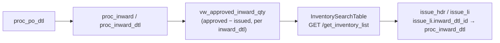
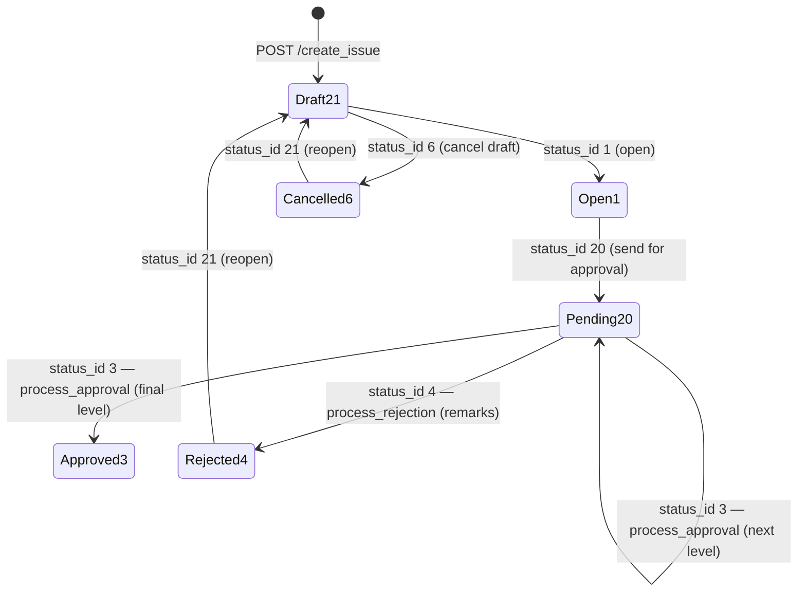

# Module Guide: Inventory

Last verified: 2026-06-12

## 1. Module overview

Inventory covers **material issue from stores**: items received and approved through procurement
inward are picked from available stock and issued to a department (optionally against a project,
machine, and cost factor). Persona: **Portal** — tenant DB, tables `issue_hdr` (header) and
`issue_li` (lines), scoped by `co_id`/`branch_id` from the sidebar. Each issue line traces back to
procurement via `issue_li.inward_dtl_id → proc_inward_dtl.inward_dtl_id`; available quantity comes
from the view `vw_approved_inward_qty` (approved inward qty minus already-issued qty).

The Issue document carries the **full approval lifecycle** (21 Draft → 1 Open → 20 Pending →
3 Approved / 4 Rejected / 6 Cancelled, multi-level via `issue_hdr.approval_level`), but unlike
procurement it exposes it through a **single status endpoint** (`PUT /update_issue_status/{id}`)
rather than per-action routes. The backend also ships an inventory **reports** router
(stock position, issue-itemwise) that currently has **no frontend page or `api.ts` constant**.

This module is small — the whole catalog is inline below (no knowledge folder).

## 2. Page quick-map

| FE page (src/app/dashboardportal/inventory/...) | Purpose | BE prefix | Detailed in |
|---|---|---|---|
| `page.tsx` | Module landing (placeholder — title only, no tiles) | — | — |
| `issue/page.tsx` | Issue list (paginated, searchable) | `/inventoryIssue` | inline below |
| `issue/createIssue/page.tsx` | Issue create/edit/view transaction | `/inventoryIssue` | inline below |

Service: `src/utils/issueService.ts` (all issue calls; setup-2 reuses a procurement endpoint).

## 3. Page catalog

### Issue list
- Page: `src/app/dashboardportal/inventory/issue/page.tsx`
- How it works: single-file list built on `IndexWrapper` (MUI DataGrid) — columns branch, issue no.,
  date, expense type, department, status chip. View/Edit navigate to
  `createIssue?mode=view|edit&id={issue_id}`.
- Service: none — calls `fetchWithCookie` directly with `apiRoutesPortalMasters.ISSUE_TABLE`
  (`issueService.fetchIssueList` exists but is NOT used by this page; see quirks in §7).
- Endpoints:
  | api.ts const | URL | vowerp3be file |
  |---|---|---|
  | `ISSUE_TABLE` | `GET /inventoryIssue/get_issue_table` | `../vowerp3be/src/inventory/issue.py` |
- Scope: `co_id` read from `localStorage["sidebar_selectedCompany"]`; `page`/`limit`/`search` as
  query params (backend caps `limit` at 100). No branch filter on this page.
- Approval: no actions here — status shown as a colored chip only.

### Issue — create/edit/view
- Page: `src/app/dashboardportal/inventory/issue/createIssue/page.tsx`
  (mode via `?mode=create|edit|view&id={issue_id}&menu_id={menu_id}`)
- How it works: `TransactionWrapper` + shared `src/components/ui/transaction` helpers
  (`useTransactionSetup`, `useTransactionPreview`, `buildApprovalTransactionActions`,
  `useRejectDialog`, `useUnsavedChanges`). Folder layout uses `components/` (NOT `_components/`):
  - `components/`: `IssueHeaderForm`, `IssueLineItemsTable` (exports `useIssueLineItemColumns`),
    `IssuePreview`, `InventorySearchTable` (paginated stock picker; has `__tests__/`)
  - `hooks/`: `useIssueFormState`, `useIssueLineItems`, `useIssueFormSchemas`
    (exports `useIssueFormSchema`), `useIssueSelectOptions`, `useIssueApproval`
  - `types/issueTypes.ts`; `utils/`: `issueConstants.ts` (`ISSUE_STATUS_IDS`, frozen empties),
    `issueFactories.ts` (`createBlankLine`, `createLineFromInventory`), `issueMappers.ts`
  - Lines are picked from `InventorySearchTable` (available stock per `inward_dtl_id`), not typed
    free-form — each line carries `inward_dtl_id`, qty validated against `available_qty`.
- Service: `src/utils/issueService.ts` — `getIssueById`, `fetchIssueSetup1`, `fetchIssueSetup2`,
  `fetchInventoryList`, `fetchAvailableInventory`, `fetchCostFactors`, `fetchMachines`,
  `createIssue`, `updateIssue`, `updateIssueStatus`.
- Endpoints:
  | api.ts const | URL | vowerp3be file |
  |---|---|---|
  | `ISSUE_GET_BY_ID` | `GET /inventoryIssue/get_issue_by_id/{issue_id}` | `../vowerp3be/src/inventory/issue.py` |
  | `ISSUE_SETUP_1` | `GET /inventoryIssue/get_issue_setup_1` | `../vowerp3be/src/inventory/issue.py` |
  | `ISSUE_INVENTORY_LIST` | `GET /inventoryIssue/get_inventory_list` | `../vowerp3be/src/inventory/issue.py` |
  | `ISSUE_AVAILABLE_INVENTORY` | `GET /inventoryIssue/get_available_inventory` | `../vowerp3be/src/inventory/issue.py` |
  | `ISSUE_COST_FACTORS` | `GET /inventoryIssue/get_cost_factors` | `../vowerp3be/src/inventory/issue.py` |
  | `ISSUE_MACHINES` | `GET /inventoryIssue/get_machines` | `../vowerp3be/src/inventory/issue.py` |
  | `ISSUE_CREATE` | `POST /inventoryIssue/create_issue` | `../vowerp3be/src/inventory/issue.py` |
  | `ISSUE_UPDATE` | `PUT /inventoryIssue/update_issue/{issue_id}` | `../vowerp3be/src/inventory/issue.py` |
  | `ISSUE_UPDATE_STATUS` | `PUT /inventoryIssue/update_issue_status/{issue_id}` | `../vowerp3be/src/inventory/issue.py` |
  | `GET_INDENT_SETUP_2` (reused) | `GET /procurementIndent/get_indent_setup_2` | `../vowerp3be/src/procurement/indent.py` |
- Scope: `coId` from `useSelectedCompanyCoId`; branch options from `useBranchOptions`
  (SidebarContext-backed); `menu_id` from URL or resolved by matching `pathname` against
  `availableMenus` in `useSidebarContext` — required for approve/reject (backend 400s without it).
- Approval: yes — full lifecycle via `useIssueApproval` + `buildApprovalTransactionActions`
  (shared transaction action bar, no module-specific bar component). See §6.

## 4. Backend quick-map

| Router (../vowerp3be/src/inventory/) | main.py prefix | Highlights |
|---|---|---|
| `issue.py` | `/api/inventoryIssue` (main.py:200) | 12 endpoints: table, by-id (computes `permissions` + `max_approval_level` when `menu_id` given), setup_1, inventory list/available (from `vw_approved_inward_qty`), cost factors, machines, create (inserts at status 21, per-branch `issue_pass_no`), update (replaces all `issue_li` lines), update_status (whole lifecycle) |
| `reports.py` | `/api/inventoryReports` (main.py:201) | `GET /inventory-stock` (opening/receipt/issue/closing per item over date range; `co_id`+`date_from`+`date_to` required) and `GET /issue-itemwise` — **no FE constants or pages reference these today** |

Support files: `query.py` (raw SQL — `issue_hdr`/`issue_li` CRUD + `vw_approved_inward_qty`
stock queries), `reportQueries.py`, `models.py` (`IssueHdr`, `IssueLi`); canonical ORM also in
`../vowerp3be/src/models/inventory.py` (adds `VwApprovedInwardQty`, `VwItemBalanceQtyByBranch`).

## 5. Document chain (inward → issue)

## 6. Approval workflow

Yes — Issue has the full multi-level lifecycle, driven entirely through
`PUT /inventoryIssue/update_issue_status/{issue_id}` with body `{status_id, remarks?}` and
`menu_id` query param (no separate `/open`, `/approve` routes). Approve (3) and reject (4) route
through the generic `process_approval` / `process_rejection` in
`../vowerp3be/src/common/approval_utils.py` — these check per-user approval permission, increment
`issue_hdr.approval_level` while staying at 20 until the final level, then set 3 (and stamp
`approved_by`/`approved_date`). All other transitions are direct updates that reset
`approval_level` to NULL. FE handlers live in `hooks/useIssueApproval.ts`; status constants in
`utils/issueConstants.ts`. Migration: `../vowerp3be/dbqueries/migrations/add_approval_level_to_issue_hdr.sql`.

Status 5 (Closed) is defined in both repos' label maps but no FE handler ever sends it.

## 7. Known quirks

- `issueService.fetchIssueList` sends `page_size` but the backend reads `limit` — page size
  silently defaults to 10 through that path. The list page avoids the bug by building its own
  query with `limit`.
- `fetchIssueSetup2` deliberately reuses the procurement endpoint `GET_INDENT_SETUP_2`
  (items/makes/UOMs by item group) — cross-module dependency.
- `GET /get_machines` requires `dept_id` (400 without); `get_issue_setup_1` instead returns
  machines for the branch and the FE filters them by department.
- `/api/inventoryReports` endpoints are live on the backend but unwired on the FE (orphan
  endpoints) — check before assuming a reports page exists.
- The inventory landing `page.tsx` is a placeholder with no navigation tiles.

## 8. Related skills & docs

- Skills (canonical in `../vowerp3be/.claude/skills/`): `wire-api` (new endpoints),
  `add-approval-workflow` (lifecycle endpoints), `add-menu` (sidebar entries).
- Sibling guide: `.claude/agents/module-procurement.md` (inward side of the chain).
- Transaction page patterns: `docs/claude/transaction-patterns.md`.

## 9. Maintenance

Last verified date is at the top of this file.

Drift signals — while answering, watch for:
- a referenced file path that no longer exists
- a page folder under `inventory/` not in the quick-map (e.g., a reports page finally landing)
- an endpoint listed here that is absent from the backend router (or vice versa)
- approval behavior in code that contradicts the state diagram (e.g., dedicated /open /approve
  routes replacing `update_issue_status`)

When drift is detected: **flag the staleness in your answer and ask the user whether to update
this agent. Never silently self-edit.** On approval: update the affected entry and quick-map row,
then bump the Last verified stamp.
