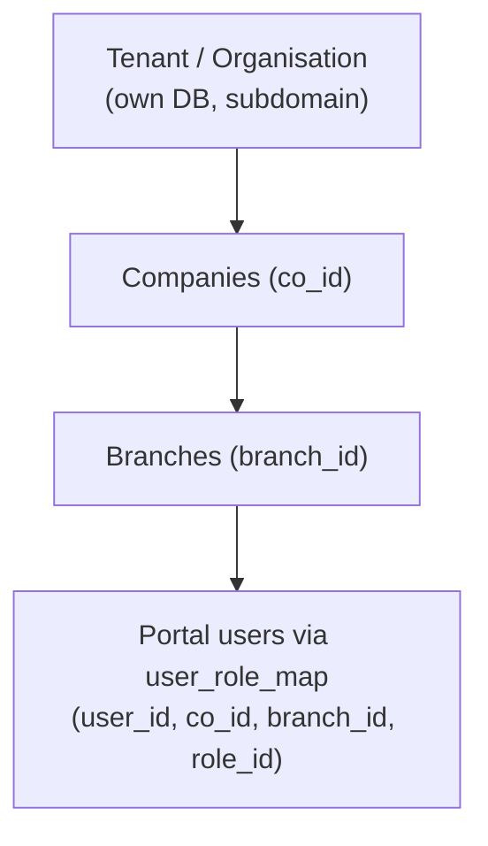

# VoWERP3 Frontend - Developer Guide for Claude

## Project Overview

VoWERP3 UI is a **multi-tenant ERP frontend** built with **Next.js 15**, **TypeScript**, and **React 19**. It provides a modern, type-safe interface for complex ERP operations including procurement, inventory, sales, and jute/yarn management.

**Tech Stack:** Next.js 15 (App Router) | TypeScript (strict) | React 19 | Tailwind CSS 4.1 + MUI 7.3 | Zod 4.2 | React Hook Form 7.69 | Vitest + Storybook | pnpm

**Current Repo:** `vowerp3ui` | **Backend:** `vowerp3be` (FastAPI/Python, sibling repo at `../vowerp3be`)

---

## File-Path Registry

Everything discoverable from one place. Paths are repo-relative; the backend repo is `../vowerp3be`.

### Documentation map

| Path | Purpose |
|------|---------|
| `CLAUDE.md` | This guide |
| `docs/claude/TEAM.md` | Agent team roster: roles → agent files → when to engage; skills table; team norms |
| `docs/claude/roles-and-users.md` | Users/roles/permissions across all three dashboards |
| `docs/claude/transaction-patterns.md` | Transaction page architecture, hooks, approval workflow patterns |
| `docs/claude/code-examples.md` | TypeScript, Zod, component, styling examples + pitfalls |
| `docs/claude/api-patterns.md` | API client, service layer, auth flows |
| `docs/claude/testing-guide.md` | Vitest, Storybook, JSDoc standards |
| `docs/claude/modules/_TEMPLATE.md` | Canonical structure for module guides |
| `docs/claude/modules/{module}/` | Per-module knowledge docs (page catalogs, backend maps, approval flows) |
| `AGENTS_GUIDE.md` | Comprehensive developer guide |
| `instructions.md` | ApprovalActionsBar contract (status IDs, button visibility) |
| `docs/hrms/`, `docs/GST_PROCUREMENT_FRONTEND.md` | Domain docs |
| `docs/yarn-quality/` | Yarn-quality feature docs (historical) |
| `.github/WORKSPACE-INSTRUCTIONS.md` | Active vs legacy repos |

### Agents (`.claude/agents/`)

| Agent | Role |
|-------|------|
| `transaction-page.md` | Scaffold transaction pages with approval workflows |
| `master-page.md` | Scaffold master CRUD pages (list + dialog) |
| `index-page.md` | Scaffold list/index pages |
| `api-service.md` | Scaffold service layer + route constants + mappers |
| `component.md` | Create shared UI components |
| `dashboard-widget.md` | Create dashboard widgets |
| `reviewer.md` | Review code against project standards |
| `module-masters.md`, `module-procurement.md`, `module-sales.md`, `module-jute-purchase.md`, `module-jute-production.md`, `module-inventory.md`, `module-hrms.md`, `module-accounting.md`, `module-bom-costing.md`, `module-ctrldesk.md`, `module-tenant-admin.md` | Module guides — which page does what, endpoints used, approval flows. Full bodies live HERE; `../vowerp3be/.claude/agents/` has pointer copies |

### Skills (`.claude/skills/` — canonical bodies in `../vowerp3be/.claude/skills/`)

| Skill | Use for |
|-------|---------|
| `wire-api` | FE+BE endpoint wiring (most repeated process) |
| `new-master` | New master table end-to-end (DDL → ORM → CRUD → page → menu) |
| `add-approval-workflow` | Standard approval lifecycle endpoints + ApprovalActionsBar |
| `add-menu`, `tenant-schema-check`, `run-migration` | Backend repo only — menu rows, schema drift vs dev3, migration execution |

### Key source files

| Path | Purpose |
|------|---------|
| `src/utils/api.ts` | All route constants (`apiRoutes`, `apiRoutesconsole`, `apiRoutesPortalMasters`) |
| `src/utils/apiClient2.ts` | `fetchWithCookie` — the only way to call APIs |
| `src/middleware.ts` | Session verification + portal per-route permission check |
| `src/components/ui/transaction/ApprovalActionsBar.tsx` | Shared approval bar |
| `src/components/dashboard/sidebarContext.tsx` | Portal sidebar context (companies, branches, menus, permissions) |
| `src/utils/portalPermissions.ts` | Portal action helpers |
| `src/styles/tokens.ts` | Theme tokens (never hardcode colors) |

### Per-module entry points

| Module | FE pages | FE service | BE source (`../vowerp3be/`) | Module agent |
|--------|----------|------------|------------------------------|--------------|
| Masters | `src/app/dashboardportal/masters/` | per-page constants | `src/masters/` | `module-masters` |
| Procurement | `src/app/dashboardportal/procurement/` | `indentService`, `poService`, `inwardService`, `billPassService` | `src/procurement/` | `module-procurement` |
| Sales | `src/app/dashboardportal/sales/` | sales services + `salesReportService` | `src/sales/` | `module-sales` |
| Jute Purchase | `src/app/dashboardportal/jutePurchase/` | per-page constants + `juteReportService` | `src/juteProcurement/` | `module-jute-purchase` |
| Jute Production + SQC | `src/app/dashboardportal/juteProduction/`, `juteSQC/` | per-page constants | `src/juteProduction/`, `src/juteSQC/` | `module-jute-production` |
| Inventory | `src/app/dashboardportal/inventory/` | per-page constants | `src/inventory/` | `module-inventory` |
| HRMS | `src/app/dashboardportal/hrms/`, `hrmsmasters/` | `hrmsService` | `src/hrms/` | `module-hrms` |
| Accounting | `src/app/dashboardportal/accounting/` | `accountingService` | `src/accounting/` | `module-accounting` |
| BOM Costing | `src/app/dashboardportal/BomCosting/` | per-page constants | `src/bomcosting/` | `module-bom-costing` |
| Control Desk | `src/app/dashboardctrldesk/` | `apiRoutesconsole` | `src/common/ctrldskAdmin/` | `module-ctrldesk` |
| Tenant Admin | `src/app/dashboardadmin/` | `apiRoutes`/`apiRoutesconsole` | `src/common/companyAdmin/`, `src/common/portal/` | `module-tenant-admin` |

---

## Tenancy & Environments

The system is **multi-tenant**: each tenant (organisation) has its own backend database, and within
each tenant there are **companies (`co_id`)** and **branches (`branch_id`)**.



- **`dev3` is the QA/dev tenant** — the default target for all new work and creation.
- Production tenants may have schema drift vs dev3 (extra tables/columns). Before developing against
  them, run the `tenant-schema-check` skill and **ask the user** before syncing anything into dev3.
- **Company & branch sidebar (CRITICAL for portal work):** every `dashboardportal` page must honor
  the company/branch selection from `SidebarContext` — the selected `co_id`/`branch_id` flow into
  every API call and default the form headers. Never ignore the sidebar selection.
- Full roles/users/permissions model: `docs/claude/roles-and-users.md`.

---

## Three-Dashboard Architecture (MOST IMPORTANT)

The app has **three completely separate dashboards** for three user personas. Each has its own layout, sidebar, menus, API endpoints, and permission model. **Identify which dashboard you're working in before writing any code.**

### Dashboard 1: VOW Admin (Control Desk) -- `/dashboardctrldesk`

**Purpose:** high-level control desk used by the **VOW team itself** (vendor-internal) to manage
organizations/tenants, system-wide menus, and control-desk roles/users. Tenants never see it.

| Aspect | Details |
|--------|---------|
| **Route prefix** | `/dashboardctrldesk/` |
| **Layout** | `src/app/dashboardctrldesk/layout.tsx` |
| **Sidebar** | `SidebarConsole` -> `sidebarConsole.tsx` |
| **Menu hook** | `use-org-ctrldesk.tsx` -> fetches from `MENU_CTRLDESK` |
| **Login endpoint** | `SUPERADMINLOGINCONSOLE` -> `/authRoutes/loginconsole` |
| **API prefix** | `/ctrldskAdmin/` |
| **Backend DB** | `vowconsole3` (no org filter) |
| **Subdomain** | `admin` (hardcoded detection) |
| **Pages** | orgSetup, roleManagementAdmin, userManagementAdmin, menuManagement, orgModuleMap |

### Dashboard 2: Tenant Admin -- `/dashboardadmin`

**Purpose:** where **each tenant** sets its own configuration — companies, branches, departments,
users, roles, approval hierarchy, pay schemes.

| Aspect | Details |
|--------|---------|
| **Route prefix** | `/dashboardadmin/` |
| **Layout** | `src/app/dashboardadmin/layout.tsx` |
| **Sidebar** | `SidebarConsole` -> `sidebarCompanyConsole.tsx` |
| **Menu hook** | `use-org-console_menu.tsx` -> fetches from `GET_TENANT_ADMIN_MENU_ROLE` |
| **Login endpoint** | `USERLOGINCONSOLE` -> `/authRoutes/login` |
| **API prefix** | `/companyAdmin/` |
| **Backend DB** | `vowconsole3` (scoped by `con_org_id`) |
| **Subdomain** | Tenant subdomain (e.g., `dev3`, `sls`) |
| **Pages** | companyManagement, branchManagement, deptManagement, roleManagement, userManagement, approvalHierarchy |

### Dashboard 3: Tenant Portal -- `/dashboardportal`

**Purpose:** day-to-day business operations (procurement, masters, inventory, sales, jute, HRMS,
accounting) for the tenant's operational users, scoped by the company/branch sidebar selection.

| Aspect | Details |
|--------|---------|
| **Route prefix** | `/dashboardportal/` |
| **Layout** | `src/app/dashboardportal/layout.tsx` |
| **Sidebar** | `Sidebar` -> `sidebar.tsx` + `SidebarProvider` + `PortalPermissionBoundary` |
| **Menu hook** | `SidebarContext` (context-based, with localStorage caching) |
| **Login endpoint** | `USERLOGINCONSOLE` -> `/authRoutes/login` |
| **API prefix** | `/admin/PortalData/` (admin) + business routes (`/itemMaster/`, `/procurementIndent/`, etc.) |
| **Backend DB** | Tenant-specific DB (e.g., `dev3`, `sls`) |
| **Permission model** | Action-level: view(1), print(2), create(3), edit(4) via `portal_permission_token` |
| **State management** | `SidebarProvider` context (companies, branches, menus, permissions) |
| **Pages** | masters/, procurement/, inventory/, jutePurchase/, juteProduction/ |

### Permission Differences

| Dashboard | Permission Model | Middleware Check |
|-----------|-----------------|-----------------|
| Control Desk | Role-based (via menu structure) | Access token only |
| Tenant Admin | Role-based (via menu structure) | Access token only |
| Portal | **Action-level** (view/print/create/edit per menu) | Access token + `portal_permission_token` + per-route permission check |

Portal permission check is in `src/middleware.ts`.

### Choosing Where to Add New Pages

| If the page is for... | Put it under... | API prefix |
|----------------------|----------------|------------|
| Managing organizations, system menus | `dashboardctrldesk/` | `/ctrldskAdmin/` |
| Managing companies, branches, departments, tenant users | `dashboardadmin/` | `/companyAdmin/` |
| Managing portal users, roles, menus, approvals | `dashboardportal/` (uses `/admin/PortalData/`) | `/admin/PortalData/` |
| Business operations (procurement, masters, inventory) | `dashboardportal/{module}/` | `/{moduleName}/` |

### Key Frontend Files by Dashboard

| Control Desk | Tenant Admin | Portal |
|-------------|-------------|--------|
| `src/app/dashboardctrldesk/layout.tsx` | `src/app/dashboardadmin/layout.tsx` | `src/app/dashboardportal/layout.tsx` |
| `src/components/dashboard/sidebarConsole.tsx` | `src/components/dashboard/sidebarCompanyConsole.tsx` | `src/components/dashboard/sidebar.tsx` |
| `src/hooks/use-org-ctrldesk.tsx` | `src/hooks/use-org-console_menu.tsx` | `src/components/dashboard/sidebarContext.tsx` |
| -- | -- | `src/utils/portalPermissions.ts` |

> For login flow details and auth flows, see `docs/claude/api-patterns.md`.

---

## Critical Rules (MANDATORY)

### TypeScript
- **NEVER use `any`** -- use `unknown` with type guards
- Always define interfaces for component props
- Use type inference where possible
- Path alias `@/*` maps to `./src/*`
- Avoid circular dependencies -- use single type definition files per module
- Strict mode is enabled (`strict`, `noImplicitAny`, `strictNullChecks`)

### Zod Validation
- **Zod is REQUIRED for ALL forms and API inputs**
- Define schema -> infer type with `z.infer<>` -> use with `zodResolver` in React Hook Form
- Single source of truth for types and validation

### Company & Branch Scope (Portal)
- Every `dashboardportal` page must honor the company/branch selection from `SidebarContext`
- Pass the selected `co_id`/`branch_id` on every API call; default form headers from them
- Master pages: at minimum `co_id`; transactional pages: `co_id` + `branch_id`

### Component Organization
- **Shared components:** `src/components/ui/` or `src/components/{feature}/` -- require JSDoc, prop interfaces
- **Page-specific components:** `_components/` subfolder within page directory
- **Smart (container) components:** `page.tsx` handles state, data, logic
- **Dumb (presentational) components:** `_components/*.tsx` renders from props only

### Styling (Three Layers)
- **Tailwind CSS** for layout and spacing
- **MUI components** for complex interactions (DataGrid, Autocomplete, Dialog)
- **Theme tokens** (`src/styles/tokens.ts`) for colors -- **NEVER hardcode colors**
- Theme files: `tokens.ts`, `theme.ts`, `AppThemeProvider.tsx`, `tailwind.config.ts`

> For code examples of all the above, see `docs/claude/code-examples.md`.

---

## Backend Integration Essentials

### Status IDs (MUST match backend exactly)

| ID | Status | ID | Status |
|----|--------|----|--------|
| 21 | Draft | 3 | Approved |
| 1 | Open | 4 | Rejected |
| 20 | Pending Approval | 5 | Closed |
| | | 6 | Cancelled |

### API Response Format
```typescript
{ "data": [...], "master": [...] } // master is optional
```

### Cookies
- `access_token` -- JWT auth token (all dashboards)
- `portal_permission_token` -- permission data (Portal only)
- `subdomain` -- tenant identifier

### API Client
- Use `fetchWithCookie` from `src/utils/apiClient2.ts` (never call APIs directly in components)
- Routes defined in `src/utils/api.ts` (three route objects by dashboard)
- Service layer in `src/utils/{feature}Service.ts`

> For full API patterns, service layer examples, and auth flows, see `docs/claude/api-patterns.md`.

---

## Transaction Pages (Approval Workflows)

For documents like Indent, PO, GRN, Invoice -- follow the standardized architecture:

- **Folder structure:** `{transaction}/page.tsx` + `create{Transaction}/page.tsx` with `_components/`, `hooks/`, `types/`, `utils/`
- **Types:** ALL in one file per module (prevent circular deps)
- **Constants:** Status IDs, frozen empty arrays (`Object.freeze()`)
- **Factories:** `createBlankLine()`, `buildDefaultFormValues()`
- **Hooks:** Form state, line items (with cascade resets), select options (memoized), schemas, approval
- **Key patterns:** Deferred loading (`useDeferredOptionCache`), cascade resets, trailing blank rows, mode-aware rendering
- **Approval bar:** `src/components/ui/transaction/ApprovalActionsBar.tsx`

> For complete patterns, hook examples, and step-by-step guide, see `docs/claude/transaction-patterns.md`.

---

## Best Practices

### DO
1. Validate with Zod -- all forms and API inputs
2. Strict TypeScript -- no `any`, use proper types
3. Memoize expensive computations -- `useMemo`, `useCallback`
4. Pure presentational components -- based on props only
5. Comment complex logic
6. Mode-aware rendering -- check `mode !== "view"` before enabling edits
7. Immutable defaults -- `Object.freeze()` on empty arrays/objects
8. Separate concerns -- types, constants, factories in own files
9. Test critical paths
10. Remove `console.log` before commit

### DON'T
1. Never hardcode colors -- use theme tokens
2. Never use `any` types -- use `unknown` with type guards
3. Never call APIs directly in components -- use service functions
4. Never create circular dependencies -- single type definition files
5. Never commit `console.log`
6. Never use browser globals in server components
7. Never skip Zod validation
8. Never mutate frozen objects
9. Never hardcode status IDs -- use constants
10. Never skip tests for complex logic

### Naming Conventions
- **Components:** `PascalCase.tsx` (e.g., `ApprovalActionsBar.tsx`)
- **Hooks:** `camelCase.ts` with `use` prefix (e.g., `useIndentFormState.ts`)
- **Utilities/Services:** `camelCase.ts` (e.g., `indentService.ts`)
- **Files:** `.tsx` for JSX, `.ts` for logic

### React Hook Declaration Order
Block-scoped `useMemo`/`useCallback` are NOT hoisted. Always declare dependencies before dependents.

> For pitfall examples with code, see `docs/claude/code-examples.md`.

---

## Development Commands

```bash
pnpm dev               # Dev server (port 3000) with Turbopack
pnpm build             # Production build
pnpm lint              # Lint code
pnpm test              # Run tests
npx tsc --noEmit       # TypeScript check
pnpm storybook         # Storybook (port 6006)
```

> For testing examples and Storybook usage, see `docs/claude/testing-guide.md`.

---

## Reference Files

| File | Content |
|------|---------|
| `docs/claude/TEAM.md` | Agent team roster, skills table, team norms |
| `docs/claude/roles-and-users.md` | Users/roles/permissions across the three dashboards |
| `docs/claude/modules/{module}/` | Per-module page catalogs, backend maps, approval flows |
| `docs/claude/transaction-patterns.md` | Transaction page architecture, hooks, approval workflow, MuiForm schema, step-by-step guide |
| `docs/claude/code-examples.md` | TypeScript, Zod, component, styling examples + common pitfalls with code |
| `docs/claude/api-patterns.md` | API client, service layer, auth flows, route definitions |
| `docs/claude/testing-guide.md` | Vitest setup, test examples, Storybook, JSDoc standards |
| `AGENTS_GUIDE.md` | Comprehensive developer guide (26KB) |
| `instructions.md` | ApprovalActionsBar contract (status IDs, button visibility) |

## Common Examples in Codebase
- **List Pages:** `src/app/dashboardportal/masters/itemMaster/page.tsx`
- **Transaction Pages:** `src/app/dashboardportal/procurement/indent/createIndent/`
- **Shared Components:** `src/components/ui/`

---

## Knowledge-Graph Index (secondary — may be stale)

Machine-generated indices for both repos live in `../vowerp3be/graphify-out/` (`bridge.json` with
FE-const → BE-endpoint matches, `index_fe.json`, `index_be.json`, `GRAPH_REPORT.md`).

**Status: the graphify CLI is currently non-operational and the artifacts may be stale.** The
module guides (`docs/claude/modules/` + the `module-*` agents) and the actual source files are the
PRIMARY reference — consult the graph only as a quick cross-check, and verify every hit against the
backend router source before relying on it. Regenerate (when fixed) from the backend repo with
`python tools/bridge_extractor.py` / `tools/index_extractor_fe.py` / `tools/index_extractor_be.py`.

---

## Version Info
- Next.js: 15 | React: 19 | TypeScript: 5.x (strict) | Node: 18+ | pnpm

**Last Updated:** 2026-06-12
