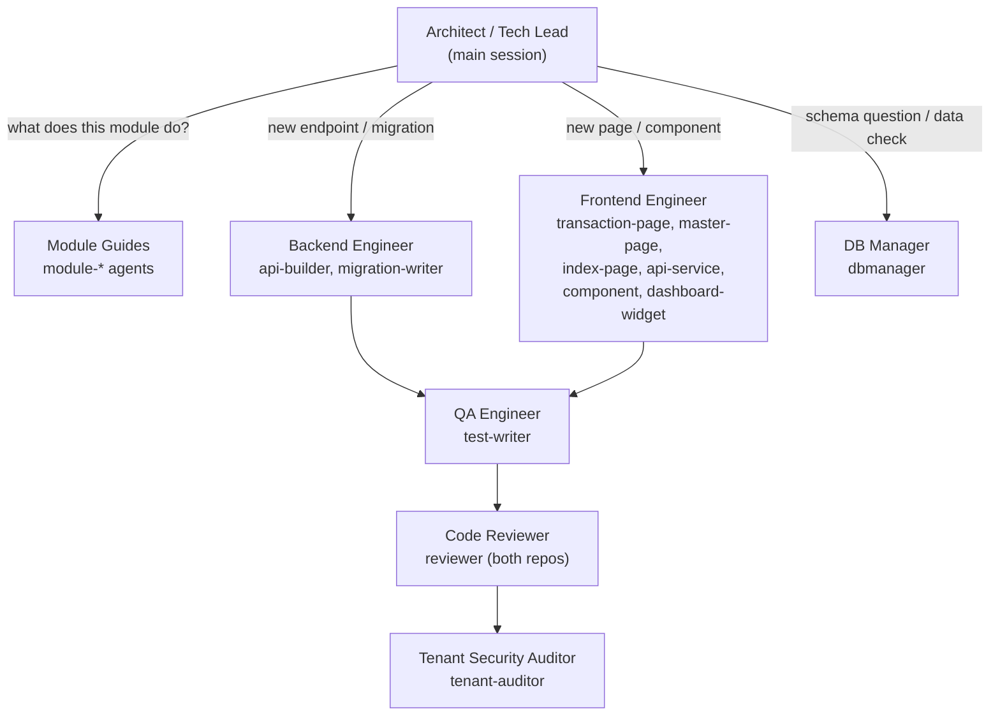

# VoWERP3 Agent Team

Last verified: 2026-06-12

The roster of Claude Code agents and skills across **both repos** (`vowerp3ui` — this repo — and the
sibling backend `../vowerp3be`), what each role covers, and when to engage it. Agents live in each
repo's `.claude/agents/`; skills live in `.claude/skills/`.

## Team at a glance

## Roles

| Role | Agent file(s) | Repo | When to engage | Example delegation |
|------|---------------|------|----------------|--------------------|
| **Architect / Tech Lead** | — (main session, guided by `CLAUDE.md` + module guides) | both | Cross-cutting design, choosing persona/module, sequencing multi-step work | "Plan how delivery challan fits between SO and invoice" |
| **Module Guides** | `module-masters`, `module-procurement`, `module-sales`, `module-jute-purchase`, `module-jute-production`, `module-inventory`, `module-hrms`, `module-accounting`, `module-bom-costing`, `module-ctrldesk`, `module-tenant-admin` | full bodies in `vowerp3ui/.claude/agents/`; pointer agents in `vowerp3be/.claude/agents/` | "Which page does X?", "Which endpoints does page Y hit?", "How does the approval flow work here?" | "Ask module-procurement which endpoints the PO create page uses" |
| **Backend Engineer** | `api-builder.md`, `migration-writer.md` | `vowerp3be/.claude/agents/` | New FastAPI endpoints, query functions, SQL migrations + ORM updates | "Scaffold a get_challan_table endpoint for the portal persona" |
| **Frontend Engineer** | `transaction-page.md`, `master-page.md`, `index-page.md`, `api-service.md`, `component.md`, `dashboard-widget.md` | `vowerp3ui/.claude/agents/` | New pages (transaction/master/list), service layers, shared components, dashboard widgets | "Scaffold a Delivery Challan transaction page in sales" |
| **DB Manager** | `dbmanager.md` | `vowerp3be/.claude/agents/` | Schema inspection, ORM modeling, query authoring, data checks; owns the dev3-first + schema-drift rules | "What columns does proc_inward_dtl have, and which tables FK into it?" |
| **QA Engineer** | `test-writer.md` | `vowerp3be/.claude/agents/` | Pytest suites for new endpoints/queries/business logic (mocked DB + auth) | "Write tests for the new challan endpoints" |
| **Code Reviewer** | `reviewer.md` (backend) + `reviewer.md` (frontend) | both | Review diffs against each repo's conventions before commit/PR | "Review this diff against project standards" |
| **Tenant Security Auditor** | `tenant-auditor.md` | `vowerp3be/.claude/agents/` | Audit for wrong DB dependency per persona, missing co_id filters, cross-tenant leaks | "Audit src/sales/ for tenant-safety issues" |

## Skills

Skills are repeatable step-by-step procedures for highly-repeated processes. Canonical bodies live in
`../vowerp3be/.claude/skills/` (workflows are backend-first); `wire-api`, `new-master`, and
`add-approval-workflow` have pointer skills in this repo. **Every skill asks its questions
(target DB/tenant, roles, persona, etc.) before acting — never assume.**

| Skill | Use when | Asks first |
|-------|----------|------------|
| `add-menu` | A new page/feature needs sidebar menu entries | Which menu level(s), which DB(s)/tenant(s) (default `dev3`), module, roles |
| `wire-api` | Wiring a frontend feature to a backend endpoint (the most repeated process) | Persona, module + prefix, route object, payload shape |
| `new-master` | Creating a brand-new master table end-to-end (DDL → ORM → endpoints → page → menu) | Entity + fields, target tenant DB, menu placement + roles |
| `add-approval-workflow` | A transaction needs the standard /open /cancel /send-for-approval /approve /reject /reopen endpoints + ApprovalActionsBar | Transaction + module, approval levels, reopen target |
| `tenant-schema-check` | Before developing against a non-dev3 tenant, or when schema drift is suspected | Which tenant to compare vs dev3; whether to generate a sync migration |
| `run-migration` | Executing a `dbqueries/migrations/` script | Which target tenant DB (suggests dev3, never assumes); confirms before executing |

## Team-wide norms

1. **dev3 first.** `dev3` is the QA/dev tenant and the default target for new work. Other tenants may
   have drifted schemas — run `tenant-schema-check` before touching them, and **ask the user** before
   incorporating any drift into dev3.
2. **Company & branch scope.** Every `dashboardportal` page honors the company/branch selection from
   `SidebarContext`; `co_id`/`branch_id` flow into every API call.
3. **Ask-first maintenance.** Module guides and knowledge docs carry `Last verified:` stamps. When an
   agent detects drift (missing path, unknown page, endpoint gone from a router), it flags the
   staleness in its answer and **asks the user whether to update its own instructions/knowledge
   docs** — it never silently self-edits. After any session that adds a page or endpoint in a
   module's scope, offer the module-guide update; don't assume.
4. **Source over index.** The knowledge-graph artifacts (`../vowerp3be/graphify-out/`) are a
   secondary, possibly-stale lookup. Module guides and the actual source files are primary.
