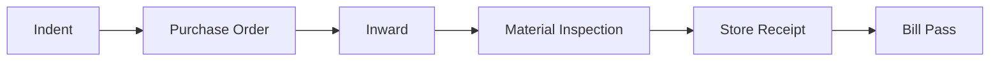
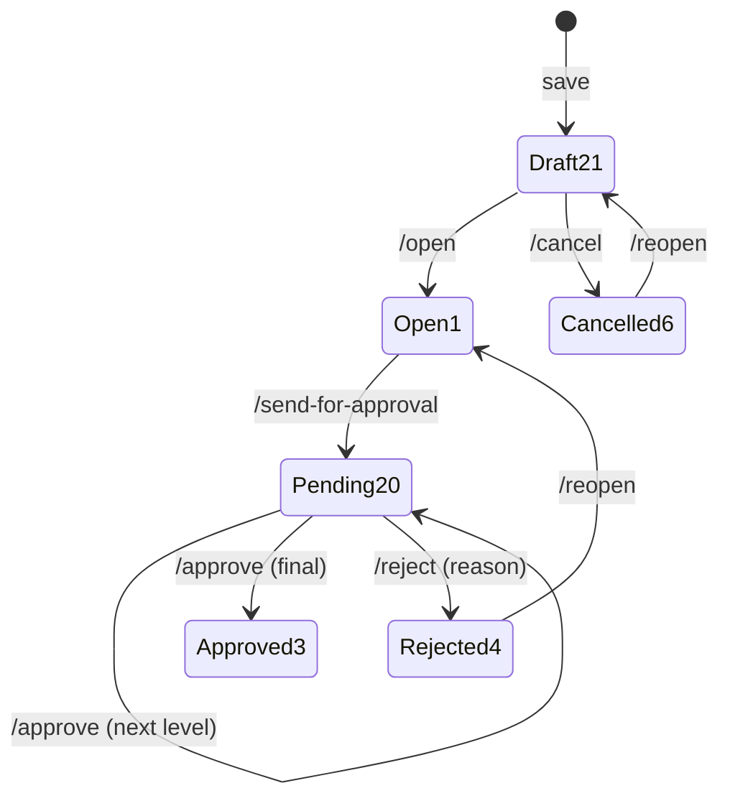

# Module Guide Template

Last verified: 2026-06-12

Canonical structure for the `module-*` guide agents and their knowledge docs. Follow this when
creating or updating a module guide so all modules stay uniform.

## Where things live

- **Full agent**: `vowerp3ui/.claude/agents/module-{name}.md`
- **Pointer agent**: `vowerp3be/.claude/agents/module-{name}.md` — identical frontmatter, ~10-line
  body redirecting to the full agent + knowledge docs via `../vowerp3ui/...`
- **Knowledge docs** (split modules only): `vowerp3ui/docs/claude/modules/{name}/`

**Placement rule (hybrid by size):** if the whole catalog fits in ≤ ~300 lines, put it inline in the
agent file (no knowledge folder). Otherwise keep the agent ≤ ~150 lines and split the knowledge into
part files of ≤ ~400 lines each.

## Agent file structure

```markdown
---
name: module-{name}
description: Cross-repo guide for the {Name} module ({key features}). Use when asked which
  {name} page does what, which backend endpoints a page uses, or how {name} approvals behave.
tools: Read, Grep, Glob
---

# Module Guide: {Name}

Last verified: YYYY-MM-DD

## 1. Module overview
2–3 paragraphs: business purpose, persona (usually Portal), DB table prefix, document chain.

## 2. Knowledge docs           <- split modules only
- docs/claude/modules/{name}/_index.md
- docs/claude/modules/{name}/pages-01-{group}.md
- docs/claude/modules/{name}/backend-map.md
- docs/claude/modules/{name}/approval-flows.md   <- only if the module has approvals

## 3. Page quick-map
| FE page (src/app/...) | Purpose | BE prefix | Detailed in |
(one row per page; "Detailed in" names the part file — or "inline below" for inline modules)

## 4. Backend quick-map
| Router file (../vowerp3be/src/...) | main.py prefix | Highlights |

## 5. Approval workflow summary   <- only if applicable
Statuses: 21 Draft → 1 Open → 20 Pending → 3 Approved / 4 Rejected / 5 Closed / 6 Cancelled.
Which transactions have it, approval bar components, link to approval-flows.md.

## 6. Related docs & skills
Links to domain docs (e.g., ../vowerp3be/docs/...) and relevant skills (wire-api, add-menu, ...).

## 7. Maintenance
See "Maintenance section" below — include it verbatim, filled in for this module.
```

## Knowledge doc structure (split modules)

### `_index.md`
- Scope header (3–5 lines: what this folder covers).
- Module overview + FE/BE directory map.
- Mermaid `flowchart LR` of the document chain, e.g.:



- Cross-repo file registry for the module (pages dir, service file, BE dir, prefixes).

### `pages-NN-{group}.md`
Scope header, then one catalog entry per page:

```markdown
### {Transaction/Page} — create/edit/view
- Page: src/app/dashboardportal/{module}/{feature}/page.tsx
- Create page: .../create{Feature}/page.tsx        <- if present
- How it works: hooks/ (use{X}FormState, ...), types/, utils/, key components
  (document the ACTUAL folder layout — e.g., indent uses components/, not _components/)
- Service: src/utils/{module}Service.ts
- Endpoints:
  | api.ts const | URL | vowerp3be file |
  |---|---|---|
- Scope: how the page consumes co_id/branch_id from SidebarContext
- Approval: yes/no — if yes, link approval-flows.md section + approval bar component
```

### `backend-map.md`
Scope header, then: router file → `main.py` prefix → key endpoints (method, path, purpose).
Verify every endpoint against the router source — never trust `bridge.json` alone.

### `approval-flows.md`
Scope header, then per transaction: a mermaid `stateDiagram-v2` + the endpoint table.



## Maintenance section (include in every module agent)

```markdown
## Maintenance

Last verified date is at the top of this file and each knowledge doc.

Drift signals — while answering, watch for:
- a referenced file path that no longer exists
- a page folder under this module not in the quick-map
- an endpoint listed here that is absent from the backend router (or vice versa)
- approval behavior in code that contradicts the state diagram

When drift is detected: **flag the staleness in your answer and ask the user whether to update
this agent / the knowledge docs. Never silently self-edit.** On approval: update the affected
part file and quick-map row, then bump the Last verified stamps.
```
