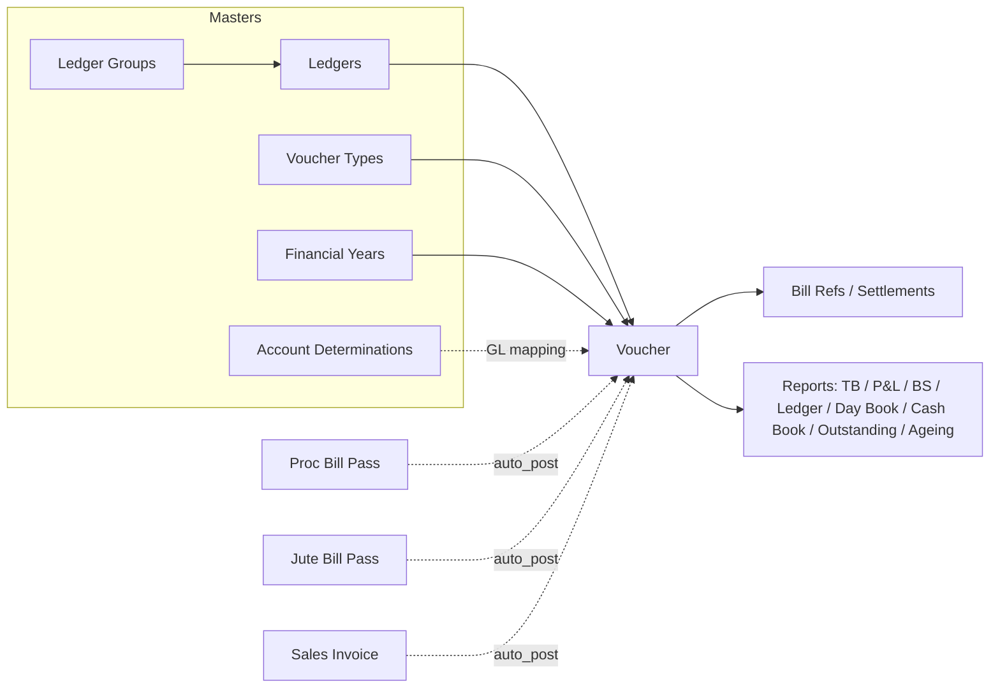

# Accounting Module — Index

Last verified: 2026-06-12

> Scope: the double-entry accounting module — chart-of-accounts masters (ledger groups, ledgers,
> voucher types, financial years, account determinations), the Voucher transaction (manual entry +
> auto-posting from other modules), and the eight financial report pages. Persona: **Portal**
> (tenant DB, tables prefixed `acc_`). Full design spec: `../vowerp3be/docs/accounting-module-design.md`.

## Document chain

Balances are never stored — every report is computed from `acc_voucher_line` rows on the fly.
Approved vouchers are immutable; corrections happen via reversal vouchers
(`reversal_of_voucher_id` / `reversed_by_voucher_id`). Auto-posted vouchers carry
`source_doc_type` + `source_doc_id` (e.g. `PROC_BILLPASS` → `proc_inward.inward_id`) and are born
Approved (3). `POST /activate_company` seeds the default chart of accounts, voucher types, party
ledgers, account determinations and financial year for a company (`seed_data.py`).

## Cross-repo file registry

| What | Path |
|------|------|
| FE pages | `src/app/dashboardportal/accounting/` (vouchers, voucherTypes, ledgers, ledgerGroups, financialYears, accountDeterminations, reports/) |
| FE shared types | `src/app/dashboardportal/accounting/types/accountingTypes.ts` (single file — status IDs, voucher categories, all entity types) |
| FE service | `src/utils/accountingService.ts` (every accounting call goes through it) |
| FE route constants | `src/utils/api.ts` → `apiRoutesPortalMasters.ACC_*` (lines ~663–701) |
| BE router | `../vowerp3be/src/accounting/routers.py` (single router, all 34 endpoints) |
| BE services | `../vowerp3be/src/accounting/voucher_service.py` (lifecycle, reversal, settlement), `auto_post.py` (postings from other modules), `seed_data.py` (company activation) |
| BE queries | `../vowerp3be/src/accounting/query.py` (masters + vouchers), `report_query.py` (reports) |
| BE models / constants | `../vowerp3be/src/accounting/models.py` (15 `acc_*` tables), `constants.py` (status IDs, voucher categories, source doc types, line types, warning codes) |
| Design doc | `../vowerp3be/docs/accounting-module-design.md` (~98 KB full spec — link, don't duplicate) |

## Knowledge parts

| File | Covers |
|------|--------|
| `pages-01-vouchers-masters.md` | Vouchers (list + createVoucher) and the five master pages |
| `pages-02-reports.md` | The eight report pages under `reports/` |
| `backend-map.md` | Router file → prefix → every endpoint; service files; auto-post sources |
| `approval-flows.md` | Voucher status lifecycle (mermaid state diagram + endpoint table) |
| `gap-analysis.md` | Verified gaps (FE↔BE contract breaks, missing AP/AR/expense surfaces); full plan in `../vowerp3be/docs/accounting-gap-analysis-and-integration-plan.md` |
