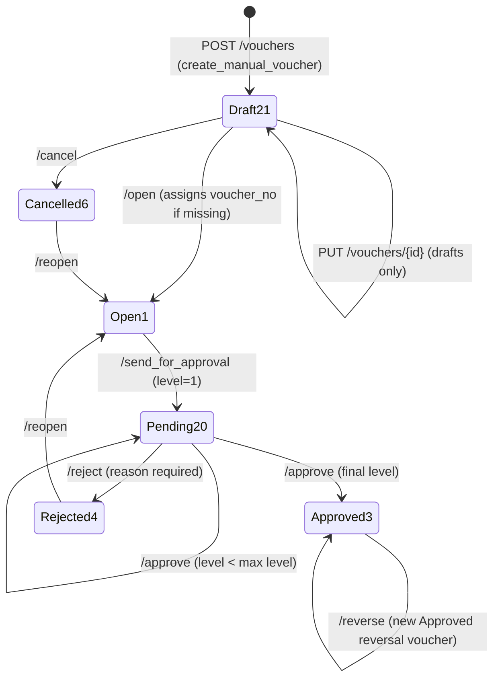

# Accounting Approval Flows

Last verified: 2026-06-12

> Scope: the Voucher status lifecycle — the only accounting document with a workflow. Status IDs
> are the global set: 21 Draft · 1 Open · 20 Pending Approval · 3 Approved · 4 Rejected · 5 Closed ·
> 6 Cancelled (mirrored in `acc_query`-side `constants.ACC_STATUS_IDS` and FE
> `accountingTypes.ACC_STATUS_IDS`). Every transition writes a row to `acc_voucher_approval_log`.

## Voucher — full workflow

Endpoints on `/api/accounting` (BE `src/accounting/routers.py` → `voucher_service.py`); FE
`vouchers/createVoucher/page.tsx` uses the shared
`src/components/ui/transaction/ApprovalActionsBar.tsx` directly via `accountingService.ts`
(no module-specific bar, no approval hook — permissions are computed inline from
`status_id` + `is_auto_posted`).

Notes verified in `voucher_service.py`:

- **Create** runs `validate_voucher` first: DR/CR must balance, voucher date must not fall in a
  locked period, Payment/Receipt/Contra must include a Bank/Cash (`ledger_type` B/C) line, and a
  same-party/same-date/similar-amount duplicate raises a warning (not an error).
- **Open** generates the voucher number from the type prefix + per-branch/FY sequence when missing.
- **Approve** reads the max level from `acc_approval_mst` (co + voucher type + branch); below max
  it increments `approval_level` and stays at 20, at max it moves to 3 — same level logic as
  procurement, but a module-specific hierarchy table (not the dashboardadmin hierarchy).
- **Reopen** sends *both* Cancelled 6 and Rejected 4 back to **Open 1** (procurement reopens
  cancelled drafts to 21 — accounting does not) and clears `approval_level`.
- **Reverse** is allowed only on Approved 3, only once (`is_reversed` guard): it inserts a new
  voucher with DR/CR swapped, born Approved, linked via `reversal_of_voucher_id` /
  `reversed_by_voucher_id`. The original stays Approved.
- **Settle bills** (`/settle_bills`) is Approved-only and restricted to Payment/Receipt voucher
  types; it writes `acc_bill_settlement` rows and decrements `acc_bill_ref.pending_amount`
  (status OPEN → PARTIAL → CLOSED).

## Endpoint table

| Action | Endpoint | Guard (from) | Result (to) |
|---|---|---|---|
| Save draft | POST `/vouchers` | — | 21 (voucher_no assigned at create) |
| Edit draft | PUT `/vouchers/{id}` | 21 only | 21 |
| Open | POST `/vouchers/{id}/open` | 21 only | 1 |
| Cancel draft | POST `/vouchers/{id}/cancel` | 21 only | 6 |
| Send for approval | POST `/vouchers/{id}/send_for_approval` | 1 only | 20 (level 1) |
| Approve | POST `/vouchers/{id}/approve` | 20 only | 20 (next level) or 3 (final) |
| Reject | POST `/vouchers/{id}/reject` | 20 only; `reason` required | 4 |
| Reopen | POST `/vouchers/{id}/reopen` | 6 or 4 | 1 |
| Reverse | POST `/vouchers/{id}/reverse` | 3 only, not yet reversed | new voucher at 3 |
| Settle bills | POST `/vouchers/{id}/settle_bills` | 3 only, Payment/Receipt | bill refs updated |

## Auto-posted vouchers — no workflow

Vouchers created by `auto_post.py` (PROC_BILLPASS / JUTE_BILLPASS / SALES_INVOICE) are inserted
directly at **Approved 3** with `is_auto_posted = 1` and never pass through Draft/Open/Pending.
The FE treats them as read-only everywhere (banner on the create page, edit hidden on the list).
Cancelling the source document does not currently touch the voucher (no caller is wired yet —
see `backend-map.md §Auto-posting`).

## Known FE drift

- FE `sendForApproval` calls `/vouchers/{id}/send_approval` — the BE route is
  `/vouchers/{id}/send_for_approval`, so the Send-for-Approval button currently 404s.
- `handleReverse` exists in `createVoucher/page.tsx` but no Reverse button is rendered
  (`ApprovalActionsBar` exposes no reverse action).
