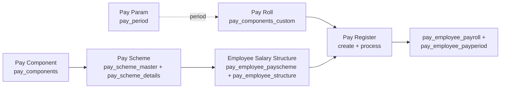

# HRMS Module — Index

Last verified: 2026-06-12

> Scope: the HRMS module — Employee Database (wizard + lifecycle), Leave Type master, Leave Request
> (FE built, backend pending), and the payroll chain: Pay Component → Pay Scheme → Pay Param →
> Pay Roll → Pay Register. Persona: **Portal** (tenant DB; employee tables prefixed `hrms_`,
> payroll tables prefixed `pay_`). HR reference masters (designation, category, shift, spell) are
> served from `../vowerp3be/src/masters/` under `/api/hrmsMasters` — see `module-masters`.

## Payroll chain

Verified order (from `../vowerp3be/src/hrms/payRegister.py` `_run_payroll_processing` and
`../vowerp3be/docs/hrms-payroll-design.md`):

1. **Pay Component** — component master (`pay_components`). Managed from the **Tenant Admin**
   dashboard (`src/app/dashboardadmin/paySchemeParameters/`), not from this module's portal pages,
   but the endpoints live in `../vowerp3be/src/hrms/payComponent.py`.
2. **Pay Scheme** — groups components with formulas (`pay_scheme_master` + `pay_scheme_details`).
3. **Employee Salary Structure** — the employeeDatabase wizard's Salary step maps an employee to a
   scheme and stores base-value overrides (`pay_employee_payscheme`, `pay_employee_structure`).
4. **Pay Param** — defines a pay period (`pay_period` CRUD, status 1 on create).
5. **Pay Roll** — per-employee variable/custom component values for a period
   (`pay_components_custom`), entered in a grid or via Excel upload.
6. **Pay Register** — creates its own `pay_period` row and **processes** it: evaluates scheme
   formulas per employee, writes `pay_employee_payroll` (per component) and
   `pay_employee_payperiod` (BASIC/NET/GROSS summary), sets period status 28 Processed.
   Approve/Reject from the view page. See `approval-flows.md`.

## Cross-repo file registry

| What | Path |
|------|------|
| FE pages (main) | `src/app/dashboardportal/hrms/` (`employeeDatabase/`, `payScheme/`, `payParam/`, `payRegister/`, `payRoll/`, `hrmsmasters/leaveRequest/`) |
| FE pages (separate top-level folder) | `src/app/dashboardportal/hrmsmasters/LeaveMaster/` — Leave Type master list + dialog |
| FE pages (adjacent, Tenant Admin) | `src/app/dashboardadmin/paySchemeParameters/` — Pay Component CRUD (uses `HRMS_PAY_COMPONENT_*`) |
| FE service | `src/utils/hrmsService.ts` (sole HRMS service — wraps every call) |
| FE route constants | `src/utils/api.ts` → `apiRoutesPortalMasters` (`HRMS_*`, `LEAVE_TYPE_*`, `LEAVE_REQUEST_*`) |
| BE routers | `../vowerp3be/src/hrms/` (`employee.py`, `payScheme.py`, `payParam.py`, `payRegister.py`, `payRoll.py`, `payComponent.py`, `leaveType.py`) |
| BE shared SQL | `../vowerp3be/src/hrms/query.py` (~50 query fns) |
| BE schemas / constants | `../vowerp3be/src/hrms/schemas.py` (`SectionSaveRequest`), `constants.py` (lifecycle statuses, sections, steps, component types) |
| BE models | `../vowerp3be/src/models/hrms.py` (`HrmsEd*`, `Pay*`); `HrmsLeaveTypesMst` in `../vowerp3be/src/models/mst.py` |
| main.py registrations | `../vowerp3be/src/main.py:211-216` → `/api/hrms`; line 217 → `leaveType` under `/api/hrmsMasters`; lines 151-157 → designation/category/shift/spell (from `src/masters/`) also under `/api/hrmsMasters` |
| Deep-dive doc | `../vowerp3be/docs/hrms-payroll-design.md` — pay register create & process, step by step |

**Prefix overlap warning:** `/api/hrmsMasters` is shared by `leaveType.py` (in `src/hrms/`) and the
designation/category/shift/spell routers (in `src/masters/`). The latter belong to `module-masters`;
only Leave Type is documented here.

**Dead routes:** the eight `LEAVE_REQUEST_*` / `LEAVE_LEDGER_BY_EB` / `WORKER_BY_EB_NO` constants in
`api.ts` have **no backend implementation** (verified by grep across `../vowerp3be/src/`). The
leaveRequest pages are fully built but non-functional until the backend lands. See
`pages-01-employee-leave.md §Leave Request`.

## Knowledge parts

| File | Covers |
|------|--------|
| `pages-01-employee-leave.md` | Employee Database (+addEmployee wizard), Leave Request, Leave Master |
| `pages-02-payroll.md` | Pay Scheme, Pay Param, Pay Register, Pay Roll |
| `backend-map.md` | Router file → prefix → every endpoint |
| `approval-flows.md` | Pay Register status lifecycle, employee lifecycle statuses, planned Leave Request flow |
