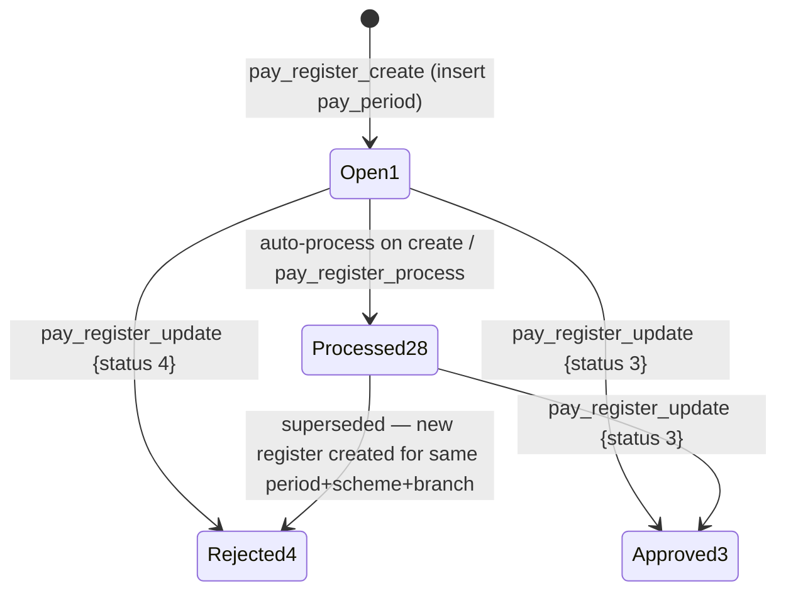
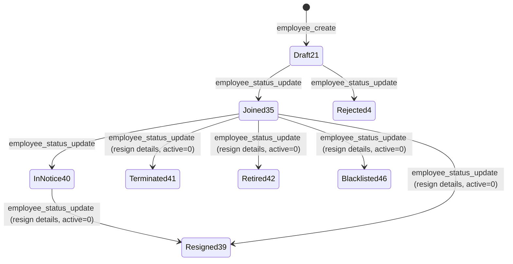

# HRMS Approval & Status Flows

Last verified: 2026-06-12

> Scope: the status lifecycles in HRMS. Pay Register has a real (simplified) approve/reject flow;
> Employee has a lifecycle status machine (not an approval workflow); Leave Request has a planned
> standard flow with **no backend yet**. None of the HRMS flows use the multi-level approval
> hierarchy or `ApprovalActionsBar` — actions are inline page buttons.

## Pay Register

Source: `../vowerp3be/src/hrms/payRegister.py`. Status constants: 1 Open, 28 Processed
(`STATUS_PROCESSED = "28"`, line 421; 32 = LOCKED, unused by code today), 3 Approved, 4 Rejected.
The design doc (`../vowerp3be/docs/hrms-payroll-design.md`) still says Processed = 32 — trust the
code.

| Action | Endpoint | Effect |
|---|---|---|
| Create | POST `/api/hrms/pay_register_create` | Inserts `pay_period` (status 1), marks any prior **28** for the same period/scheme/branch as **4**, then runs processing in the same call (failure surfaces as `processing_error`, the period survives at 1) |
| Process / re-process | POST `/api/hrms/pay_register_process` | Deletes prior payroll rows for the period, recalculates, sets status **28** |
| Approve / Reject | PUT `/api/hrms/pay_register_update/{period_id}` | viewPayRegister page sends `{status: 3}` or `{status: 4}` |

Caveats (verified in source):
- `pay_register_by_id` returns `approveButton: true` when status is **1 or 20** — there is no
  per-user approval-hierarchy check, only the status gate.
- `pay_register_update` is a **free-form setter** for `from_date`/`to_date`/`payscheme_id`/
  `branch_id`/`status_id` — the backend does **not** enforce transition order; the FE drives it.
- FE constants in `payRegisterTypes.ts` list the standard set (21/1/20/3/4/5/6) but only
  1/28/3/4 are produced by the backend code paths above.

## Employee lifecycle (status machine, not an approval workflow)

Source: `../vowerp3be/src/hrms/employee.py` (`employee_create`, `employee_status_update`) and
`constants.py` (`EMPLOYEE_LIFECYCLE_STATUS`, `RESIGN_DETAIL_STATUSES`).

- `employee_status_update` accepts only the lifecycle set {35, 4, 46, 39, 40, 41, 42}; any other
  `status_id` is a 400. It does **not** enforce the source state — the arrows above reflect the
  FE's `StatusActionDialog` usage, not server-side guards.
- Statuses 39/41/42/46 set `active = 0` and write an `hrms_ed_resign_details` row
  (date, reason, remarks); any previous active resign record is deactivated.
- The leaveRequest worker lookup only accepts employees at status **35 Joined**
  (`useLeaveRequestForm.ts`, `ACTIVE_EMP_STATUS = 35`).

## Leave Request (planned — backend not implemented)

The FE (`leaveRequest/types/leaveRequestTypes.ts`, `createLeaveRequest/page.tsx`) is built for the
standard flow — 21 Draft → 1 Open → 20 Pending → 3 Approved / 4 Rejected / 6 Cancelled — with
`approve_button`/`reject_button` flags expected from the detail endpoint and PUT
`leave_request_approve/{id}` / `leave_request_reject/{id}` actions. **No state diagram is drawn
here because no backend exists to verify against** (all eight `LEAVE_REQUEST_*`-family routes are
missing from `../vowerp3be/src/` as of 2026-06-12). When implementing, use the
`add-approval-workflow` skill and then replace this section with the verified diagram.
