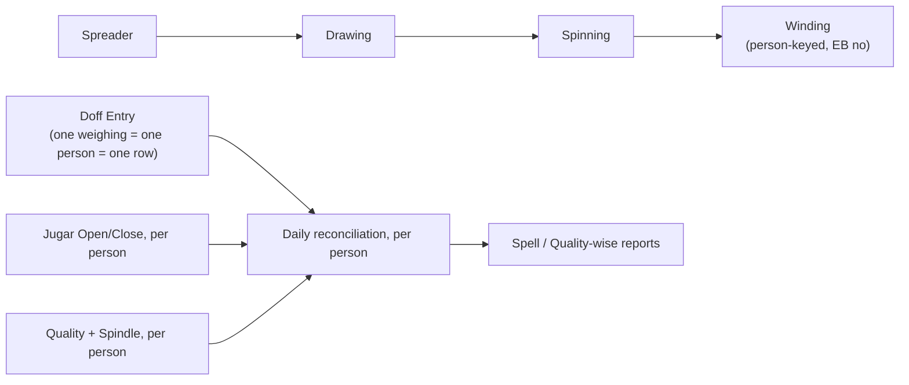

# Jute Production — Winding sub-section Index

Last verified: 2026-07-30

> Scope: the **Winding Production** sub-section of the Jute Production module
> (Spreader → Drawing → Spinning → **Winding**, entry now **person-keyed** — one doff is one
> weighing by one winder/EB no, not a machine). Winding is **built**; this folder's knowledge parts
> describe the shipped page/routers plus the legacy code3i logic they replaced. **Primary source of
> truth for the current design:** `../vowerp3be/docs/winding-person-keyed-entry-spec.md` (locked
> 2026-07-30) — read it first. `../vowerp3be/docs/winding-production-design.md` is the historical
> record of the legacy formulas and the original machine-keyed target design.
> Persona: **Portal** (tenant DB). The existing spreader/drawing/spinning catalog stays inline in
> the `module-jute-production` agent; this folder is the winding-specific knowledge part.

## Document chain

## Cross-repo file registry

| What | Path |
|------|------|
| **Locked design spec (BE)** | `../vowerp3be/docs/winding-person-keyed-entry-spec.md` — the person-keyed contract; current source of truth |
| Historical design doc (BE) | `../vowerp3be/docs/winding-production-design.md` — legacy code3i logic + formulas + the original (superseded) machine-keyed target design |
| Superseded quality-mapping proposal (BE) | `../vowerp3be/docs/winding-quality-reference-spec.md` — machine→quality Helper+Mapper+Sync architecture, dropped in favor of the person→quality re-key above |
| Legacy views (code3i) | `c:\code\code3i\application\views\admin\winding_doff\winding_doff_data.php`, `winding_jugar_entry.php`, `winding_quality_entry.php` |
| Legacy controllers | `c:\code\code3i\application\controllers\admin\Winding_doff_data.php`, `Winding_quality_entry.php` |
| Legacy model (all SQL) | `c:\code\code3i\application\models\Winding_doff_Model.php` |
| FE page (shipped) | `src/app/dashboardportal/juteProduction/winding/page.tsx` (Doff / Jugar / Quality tabs) |
| FE route constants (shipped) | `src/utils/api.ts` → `WINDING_*` (see `pages-01-winding-production.md` for the current names) |
| BE routers (shipped) | `../vowerp3be/src/juteProduction/winding_entry.py` (entry), `winding_reports.py` (reports) |
| Existing sibling pattern | `juteProduction/spreader/` (3-tab page) and `drawing/` (calc-mirroring) |

`masters/windingMachineAttr/` and a `winding_masters.py` BE router were proposed in earlier drafts
of this catalog and **were never built** — the person-keyed design removes the machine from the
doff row entirely, so a per-machine winding attribute master has no consumer. See `backend-map.md`.

## Knowledge parts

| File | Covers |
|------|--------|
| `pages-01-winding-production.md` | The shipped Winding page (Doff/Jugar/Quality tabs), the person-keyed API contract, data points, client formulas |
| `backend-map.md` | The shipped winding routers → prefix → endpoints (person-keyed), and legacy → vowerp3 endpoint mapping |

> No `approval-flows.md` — winding has **no approval workflow** (direct CRUD + soft delete),
> consistent with the rest of jute production.
