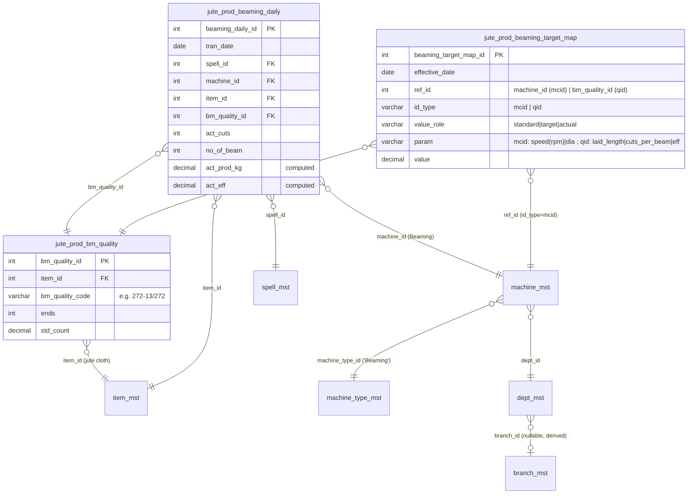

# Jute Production — Beaming (implemented)

Last verified: 2026-06-22 (standards re-architecture: qid/mcid split)

> Scope: complete design + as-built specification for the **Beaming** section under Jute Production
> (built & applied to dev3 2026-06-22 — §0).
> Beaming is the warp-preparation stage: yarn/jute-cloth is laid onto **warp beams** (in *cuts*) ready
> for weaving. This spec covers **three pages**:
>
> 1. **Beaming Quality Master** (`jute_prod_bm_quality`) — master page, maps each *item* (jute cloth)
>    to one-or-many *bm_quality* codes (e.g. `Red → 272-13/272`), each carrying **ends** + **std_count**.
> 2. **Beaming Standards / Targets Map** (`jute_prod_beaming_target_map`) — master page, **clones the
>    `spngTargetMap` save pattern** (the data-saving style the user explicitly referenced): an
>    effective-dated, inline-grid editor. **As of the standards re-architecture (2026-06-22) it carries
>    TWO id_types** (mirroring Spinning): **machine-linked** params (`id_type='mcid'`, `ref_id=machine_id`)
>    = std/tgt speed (**RPM**) + dia (std); **quality-linked** params (`id_type='qid'`,
>    `ref_id=bm_quality_id` from the **Beaming Quality Master** — explicitly **NOT** `item_id`) =
>    laid_length + std cuts/beam + std/tgt eff. The FE page has a **Type selector (Machine | Quality)**.
>    The `speed` param is **RPM**, not a surface speed — surface speed = `rpm × dia × π / 36` (§2/§3).
> 3. **Beaming Production Entry** (`jute_prod_beaming_daily`) — daily per-machine/per-quality
>    production entry (date/shift/spell + machine; rows of item, bm_quality, **no. of beams**, then
>    **act cuts** (defaults to the machine's std cuts/beam, editable) — **no rpm, no dia**: dia is a
>    machine-linked standard and the **actual rpm** that feeds `act_speed` is captured on the **Beaming
>    SQC page** (built — §0.2, Q11), value_role='actual'), with a server-computed planning grid
>    (yards/beam, kg/cut, kg/beam, 100%-prod, std/tgt/act prod, act eff) mirroring the Spinning
>    planning grid.
>
> A fourth page lives in the **juteSQC** module: **Beaming SQC** (`juteSQC/beaming`) — it reuses the
> `/beamingTargetMap` endpoints with `value_role='actual'` (param `speed` = **actual rpm**, RPM label)
> to capture the observed machine rpm that feeds `act_speed`; it works exactly like Standards/Targets
> (§0.2, §11, §12 Q11).
>
> **Status: IMPLEMENTED & APPLIED to dev3 (2026-06-22).** The **foundations** (the `Jute Cloth` item
> type, the `Beaming` machine type, the 3 sidebar menu rows — §0.1) AND the full module — **all 4
> beaming tables** (`jute_prod_bm_quality`, **`jute_prod_bm_quality_dtl`** for composite warps,
> `jute_prod_beaming_target_map`, `jute_prod_beaming_daily`), the ORM (`beaming_models.py`), the 3
> routers (`beaming_masters.py`, `beaming_target_map.py`, `beaming_entry.py`), the resolver/rules
> services, and the FE pages (Quality Master, Standards/Targets, Production Entry, **plus the Beaming
> SQC page** in the juteSQC module) — are now **built and applied to dev3** (§0.1, §0.2). The DDL/ORM/API/page
> content below is the **as-built reference** (sections still tagged "proposed" inline are historical
> wording — the objects exist). Persona: **Portal**
> (`Depends(get_tenant_db)` + `get_current_user_with_refresh`, `{"data": …}` responses, soft delete
> via `active = 0`, **no approval workflow**, trigger-based audit — no `created_*`). The **idle/working
> hours impact** (idle = Stoppage Hours) is now **WIRED** — `working_hours = max(0, spell working_hours
> − Σ jute_prod_stoppage_hours)` (§3, §12 Q8).

---

## 0. Locked decisions (this session)

| # | Decision | Locked value |
|---|----------|--------------|
| 1 | **Production-entry grain** | **Per machine + quality.** Header = `tran_date, spell_id, eb_id, machine_id`; each row = `beam_no, item_id, bm_quality_id, no_of_beam, act_cuts`. **`dia` is machine-linked (standard)**, resolved server-side — **not** an entry input (Q7). **`rpm_roller` and the derived `act_speed` are NOT production-entry inputs** — the **actual rpm** is now captured on the **Beaming SQC page** (built, §0.2/Q11) which reuses the `/beamingTargetMap` endpoints with `value_role='actual'` (param `speed` = actual rpm); production entry carries **no rpm** at all, so `act_speed` resolves from the SQC `act_rpm` as-of date (0 until an actual rpm exists). `beam_no` (physical beam number, like trolley no) is an entry field (Q10). **Standards now resolve across two dimensions (re-architecture 2026-06-22):** machine-linked **speed/dia** resolve by `machine_id` (`mcid`); quality-linked **laid_length/cuts_per_beam/eff** resolve by `bm_quality_id` (`qid`). (Mirrors Spinning.) |
| 2 | **Quality master content** | Each `jute_prod_bm_quality` row stores `item_id`, `bm_quality_code`, `bm_quality_name`, **`ends`**, **`std_count`**. Many qualities per `item_id`. |
| 3 | **`laid_length`, `std_cuts_per_beam` & `eff`** | **QUALITY-linked (re-architecture 2026-06-22)** → params in `jute_prod_beaming_target_map` with **`id_type = 'qid'`**, **`ref_id = bm_quality_id`** (the **Beaming Quality Master** PK from `jute_prod_bm_quality` — explicitly **NOT** `item_id`). `laid_length` + `cuts_per_beam` are `qid/standard`; `eff` is **both** `qid/standard` and `qid/target`. These were originally modelled machine-linked (`mcid`); they are now keyed by the warp being beamed because they are properties of the quality, not the machine. Only **speed (RPM)** and **dia** remain machine-linked (`mcid` — decision 5 / §B). |
| 4 | **Actuals** | Operator **enters `no_of_beam` + `act_cuts`** (`act_cuts` defaults to the machine's std cuts/beam, editable); **kg & yards are derived** from `laid_length / ends / count`. `act_eff = act_prod_yards / p100prod %` (length÷length; kg reported separately). **`act_count = std_count`** (confirmed Q5 — no beaming SQC count override). |
| 5 | **Speed model (RPM)** | The machine `speed` param stored in `jute_prod_beaming_target_map` is **RPM** (rotations/min), NOT a surface speed. The **beaming surface speed** (yd/min) = `RPM × dia × π / 36` (`beaming_rules.act_speed(rpm, dia)`). **std / target / act surface speeds each derive from their own RPM** (std rpm, target rpm, actual rpm) through that conversion. **`p100prod` uses the STD SURFACE speed** (not the raw rpm). UI label for the param is **`RPM`**. |

### 0.1 Applied to dev3 (2026-06-21)

Foundations executed on the **dev3** tenant (migrations
`dbqueries/migrations/create_beaming_item_type_and_machine_type.sql` +
`seed_beaming_menu.sql`):

| Object | Result in dev3 |
|--------|----------------|
| Item type | **`Jute Cloth` = `item_type_id` 5** (`item_type_master`) |
| Cloth item groups | `item_grp_mst` 625, 626, 640, 642, 1266, 1716 re-tagged `item_type_id 1 → 5` |
| Machine type | **`Beaming` = `machine_type_id` 12** (`machine_type_mst`, active=1) |
| Menus | `menu_mst` 785 Beaming Production · 786 Beaming Quality Master · 787 Beaming Standards (parent `menu_id` 768 *Jute Production*); `role_menu_map` left to tenant admin |

> Beaming item filter is therefore **`item_grp_mst.item_type_id = 5`** (NOT the jute/jute-waste
> `(2,3)`). `BEAMING_MACHINE_TYPE_NAME = "Beaming"` resolves to `machine_type_id 12`. Group 642
> (*Sale Yarn*) was included per explicit instruction though its name reads as yarn — revisit if
> unintended. Not yet promoted to other tenants.

### 0.2 Module built & applied to dev3 (2026-06-22)

The full module (everything beyond the §0.1 foundations) was implemented and applied to the **dev3**
tenant. The open questions resolved this session (Q3, Q5, Q7–Q11 — §12) are all reflected in the
as-built code.

| Object | Result in dev3 |
|--------|----------------|
| Tables | **4** created: `jute_prod_bm_quality`, **`jute_prod_bm_quality_dtl`** (composite warp components, §A.4), `jute_prod_beaming_target_map`, `jute_prod_beaming_daily` (with `beam_no`, Q10) |
| ORM | `src/juteProduction/beaming_models.py` — `JuteProdBmQuality`, `JuteProdBmQualityDtl`, `JuteProdBeamingTargetMap`, `JuteProdBeamingDaily` |
| Routers | `beaming_masters.py` (`/api/beamingMasters`), `beaming_target_map.py` (`/api/beamingTargetMap`), `beaming_entry.py` (`/api/beamingProd`) — registered in `src/main.py` |
| Services | `services/beaming_standards.py` (LAST-DATE resolver, incl. `dia` + `act_rpm` via `value_role='actual'`), `services/beaming_rules.py` (calc — `compute_beaming_daily`, `kg_per_cut_composite` for Σ_n, `act_speed` RPM→surface) |
| Constants | **Re-architecture 2026-06-22 split machine vs quality params:** `BEAMING_MC_PARAMS_STD=('speed','dia')`, `BEAMING_MC_PARAMS_TARGET=('speed',)`, `BEAMING_PARAMS_ACTUAL=('speed',)` (SQC, Q11) for `mcid`; `BEAMING_QID_PARAMS_STD=('laid_length','cuts_per_beam','eff')`, `BEAMING_QID_PARAMS_TARGET=('eff',)` for `qid`; `BEAMING_ID_TYPE_QLTY='qid'` re-added; `BEAMING_VALUE_ROLES` incl. `actual`; `speed` param is **RPM** (decision 5); see §8 |
| FE pages | Beaming Quality Master, Beaming Standards (Target Map), Beaming Production Entry, **Beaming SQC** (`juteSQC/beaming`, reuses the `beamingTargetMap` `TargetMapEditor` with `valueRole='actual'`, RPM label) — built |
| Beaming SQC | New page in the **juteSQC** module (`src/app/dashboardportal/juteSQC/beaming/page.tsx`) reuses the `/beamingTargetMap` endpoints with `value_role='actual'` (param `speed` = actual rpm) — works exactly like Standards/Target. The saved `act_rpm` is resolved as-of the production date and feeds `act_speed = act_rpm × dia × π / 36` (Q11) |
| Speed model | `speed` param = **RPM**; surface speed = `RPM × dia × π / 36`; `p100prod` uses the **STD SURFACE** speed; std/target/act surface speeds each derive from their own RPM (decision 5, §2/§3) |
| Key resolutions | **Standards re-architecture (2026-06-22):** `laid_length`/`cuts_per_beam`/`eff` are now **quality-linked** (`id_type='qid'`, `ref_id=bm_quality_id` — the Beaming Quality Master PK, NOT `item_id`); only `speed`(RPM)+`dia` stay machine-linked (`mcid`). `resolve_machine_standards(db, co_id, machine_id, bm_quality_id, on_date)` resolves quality params via `qid`+`bm_quality_id` and machine params via `mcid`+`machine_id`; the entry passes `bm_quality_id`, and the `machine_standards` GET endpoint accepts `bm_quality_id` so the FE act-cuts default = the **quality's** `cuts_per_beam`. The FE Beaming Standards page now has a **Type selector (Machine | Quality)**; the SQC page stays `mcid/actual`. — `dia` machine-linked standard not an entry input; **actual rpm now captured on the Beaming SQC page** (value_role='actual', `/beamingTargetMap`), production entry carries no rpm — `act_speed` resolves from SQC `act_rpm` as-of date, 0 until entered (Q7/Q11); `working_hours` net of Stoppage Hours (Q8); composite Σ_n via `_dtl`, **entry block removed — composite qualities now allowed** (Q3); per-(machine,item,shift) rollup (Q9); `beam_no` entry field, no auto numbering (Q10); entry form drops EB No / Std Count / Beam No text inputs and orders **No. of Beams before Act Cuts** (act cuts defaults to std cuts/beam, editable) |

> Not yet promoted to other tenants.
>
> **Existing dev3 `jute_prod_beaming_target_map` rows were CLEARED** when the standards re-architecture
> landed (2026-06-22): `laid_length`/`cuts_per_beam`/`eff` moved from `id_type='mcid'` (`ref_id=machine_id`)
> to `id_type='qid'` (`ref_id=bm_quality_id`), so the prior rows were keyed by the wrong dimension and
> ref. Re-enter standards via the Beaming Standards page (Machine grid for speed/dia, Quality grid for
> laid_length/cuts_per_beam/eff).

---

## 1. Overview

**Beaming** sits between yarn production (spinning/winding) and weaving. Warp threads (*ends*) of a
given *count* are wound onto **beams**; a beam is built up over a number of **cuts**. Each *item*
(a jute-cloth item, `item_grp_mst.item_type_id = 5` — **Jute Cloth**, applied §0.1) is woven from one or more
**beaming qualities** (`bm_quality`), a short code such as `272-13/272` that encodes the warp
construction. Multiple qualities map to a single item (screenshot: `Red → 272-13/272`,
`red black → 272-13/240-20/32`, `blue → 268-13/240-20/28`).

The three pages form a small pipeline:

```
Page A  Beaming Quality Master      define item → bm_quality (+ ends, std_count)   [reference data]
Page B  Beaming Standards/Targets   define per-machine laid_length, cuts/beam,      [reference data,
        Map                          std/tgt speed, std/tgt eff (effective-dated)     spngTargetMap clone]
Page C  Beaming Production Entry     daily: machine + quality + beams + cuts          [transaction]
                                     → server computes prod / eff planning grid
```

Pages A and B are **masters** (under `juteProduction/masters/`); Page C is a **production-entry**
page (under `juteProduction/beaming/`), exactly like Spinning's `spngTargetMap` master vs `spinning`
entry split.

---

## 2. Parameter dictionary & linkage (locked)

The screenshot's "Parameters List / source / linking" sheet, resolved against this session's
decisions. **Linkage** column says *where the value comes from* at production time and the
`id_type` (`mcid` = machine, `qid` = quality) each target-map param keys off.

> **Standards re-architecture (2026-06-22).** `laid_length`, `cuts_per_beam` and `eff` are now
> **QUALITY-linked** (`id_type='qid'`, `ref_id=bm_quality_id` — the **Beaming Quality Master** PK from
> `jute_prod_bm_quality`, explicitly **NOT** `item_id`). Only `speed` (RPM) and `dia` remain
> **machine-linked** (`id_type='mcid'`, `ref_id=machine_id`). The resolver keys quality params by
> `bm_quality_id` and machine params by `machine_id` (§B.6).

| Parameter | Source (`id_type`) | Linkage (resolved) |
|-----------|--------|--------------------|
| `item_id` | `item_mst` via `item_grp_mst.item_type_id = 5` (**Jute Cloth** — applied, §0.1) | **entry** (per row) |
| `bm_quality` | `jute_prod_bm_quality` | **entry** (per row); many qualities per item |
| `ends` | `jute_prod_bm_quality.ends` | **quality-linked** (master column) |
| `std_count` | `jute_prod_bm_quality.std_count` | **quality-linked** (master column) |
| `act_count` | `= std_count` | **derived** (Q5 — `act_count = std_count`; no beaming SQC override) |
| `laid_length` | `jute_prod_beaming_target_map` **`qid`**`/standard/laid_length` (`ref_id=bm_quality_id`) | **quality-linked** (std, effective-dated, re-architecture 2026-06-22) |
| `std_cuts_per_beam` | **`qid`**`/standard/cuts_per_beam` (`ref_id=bm_quality_id`) | **quality-linked** (std, re-architecture 2026-06-22) |
| `act_cuts_per_beam` | entry | **data-entry field** (per row) |
| `std_speed` (**RPM**) | **`mcid`**`/standard/speed` (`ref_id=machine_id`) | **machine-linked** (std). The stored value is **RPM**; std SURFACE speed (yd/min) = `std_rpm × dia × π / 36` (decision 5). UI label **`RPM`** |
| `tgt_speed` (**RPM**) | **`mcid`**`/target/speed` | **machine-linked** (target). Stored **RPM**; target surface = `tgt_rpm × dia × π / 36` |
| `act_rpm` (**RPM**) | **`mcid`**`/actual/speed` | **Beaming SQC page** (built, Q11) — value_role=`actual`, param `speed`. Resolved as-of `tran_date`; 0 until an SQC actual rpm exists |
| `act_speed` (yd/min) | computed `= act_rpm × dia × π / 36` | **derived** — act SURFACE speed from the SQC `act_rpm` (above). 0 until an actual rpm is entered on the Beaming SQC page (Q7/Q11) |
| `dia` (starch-roller diameter) | `jute_prod_beaming_target_map` **`mcid`**`/standard/dia` | **machine-linked** (std, fixed — **NOT** an entry input, Q7) |
| `std_eff` | **`qid`**`/standard/eff` (`ref_id=bm_quality_id`) | **quality-linked** (std, re-architecture 2026-06-22) |
| `trgt_eff` | **`qid`**`/target/eff` (`ref_id=bm_quality_id`) | **quality-linked** (target, re-architecture 2026-06-22) |
| `shift_hours` | `spell_mst.working_hours` | **spell-linked** |
| `idle_hours` | `Σ jute_prod_stoppage_hours.stoppage_hours` for (machine, date, spell) — Stoppage Hours module | **wired** (§3, Q8); 0 when no stoppage rows |
| `working_hours` | `max(0, shift_hours − idle_hours)` | **derived** (net of Stoppage Hours, Q8) |
| `spnydle` (constant) | `14400` | constant `BEAMING_SPYNDLE_YDS` (jute count unit = 14400 yd) |
| `kg_to_lb` (constant) | `2.20462` | constant `BEAMING_KG_TO_LB` |
| `date` | entry | **header** |
| `shift` | derived from `spell` (`LEFT(spell_code,1)`) | **derived** |
| `spell` | `spell_mst` | **header** |
| `eb_no` | `eb_id` (operator/batch) | **header** |
| `beam_no` | entry | **data-entry field** (per row) — physical beam number, like trolley no (Q10) |
| `rpm of starch roller` | `jute_prod_beaming_target_map` `mcid/actual/speed` (Beaming SQC page) | **Beaming SQC page** (built, Q11) — reuses the `/beamingTargetMap` endpoints with `value_role='actual'`; **NOT** a production-entry input. Resolved as-of `tran_date` into `act_rpm`; 0/blank until entered |
| `dia of starch roller` | `jute_prod_beaming_target_map` `mcid/standard/dia` | **machine-linked** (std, fixed, Q7 — not an entry field; stored in `dia_roller` col) |
| `no_of_beam` | entry | **data-entry field** (per row) |
| `kg` | derived (§3) | **computed** |

> **`std_count` is quality-linked** (locked Q2) — it differs from Spinning, where `std_count` comes
> from `jute_yarn_mst`. Beaming reads it from `jute_prod_bm_quality`, so each warp construction owns
> its own count even when several share an item.

---

## 3. Calculations (formulas)

The screenshot's "Calculations list" with constants resolved. All numeric calc is **server
authoritative** (FE shows previews only), exactly as Spinning (`spinningCalc.ts` previews,
`spinning_rules.py` authoritative). Constants: `SPNDL = 14400`, `KG_TO_LB = 2.20462`.

Per production row, for the resolved standards (machine + quality, as-of `tran_date`):

```
# ---- speed (RPM → SURFACE speed) ------------------------------------------
# The machine 'speed' param (jute_prod_beaming_target_map, id_type='mcid') is RPM,
# NOT a surface speed. Each role's SURFACE speed (yd/min) derives from its own RPM via
# the same conversion (dia = machine-linked STANDARD mcid/standard/dia, resolved
# server-side). laid_length / cuts_per_beam / std_eff / trgt_eff are QUALITY-linked
# (id_type='qid', ref_id=bm_quality_id) — re-architecture 2026-06-22:
std_surface     = std_rpm    × dia × π / 36                 # STD surface speed (yd/min); feeds p100prod
tgt_surface     = tgt_rpm    × dia × π / 36                 # target surface speed (yd/min)
act_speed       = act_rpm    × dia × π / 36                 # ACTUAL surface speed (yd/min). act_rpm is
                                                            #   the value_role='actual' rpm resolved as-of
                                                            #   tran_date from the Beaming SQC page (Q11) —
                                                            #   NOT a production-entry input. act_speed = 0
                                                            #   until an actual rpm exists.

# ---- LENGTH basis — efficiency is computed HERE; unit = yards -------------
p100prod        = std_surface × working_hours × 60          # 100%-eff length capacity (yards). ONE value,
                                                            #   ALWAYS std SURFACE-speed-based (the std_rpm
                                                            #   converted via dia — NOT the raw rpm).
                                                            #   Mirrors Spinning.
std_prod        = std_eff%  × p100prod                      # yards
tgt_prod        = trgt_eff% × p100prod                      # yards
yards_per_beam  = laid_length × cuts_per_beam               # cuts = std_cuts_per_beam (std) | act_cuts (act)
act_prod_yards  = (laid_length × act_cuts) × no_of_beam     # actual length produced (yards)
act_eff (%)     = act_prod_yards ÷ p100prod × 100           # like-for-like: yards ÷ yards

# ---- WEIGHT reporting — kg; NOT compared to the length standard -----------
kg_per_cut      = Σ_n ( ends_n × laid_length × count_n ) ÷ ( 14400 × 2.20462 )
                                                            # count_n = std_count (std) | act_count (act);
                                                            #   Σ over warp components (one term if simple)
kg_per_beam     = kg_per_cut × no_of_cuts_per_beam          # cuts = std_cuts_per_beam (std) | act_cuts (act)
act_prod_kg     = kg_per_cut(act_count) × act_cuts × no_of_beam   # actual weight produced (kg)
```

Notes:
- **Two bases, one efficiency.** The planning grid carries a **LENGTH** basis (`p100prod`, `std_prod`,
  `tgt_prod`, `act_prod_yards` — all **yards**) and a **WEIGHT** basis (`kg_per_cut`, `kg_per_beam`,
  `act_prod_kg` — **kg**). **Efficiency is length÷length only**: `act_eff = act_prod_yards / p100prod
  × 100`. The kg columns are reported weight outputs and must **never** be divided by the yards
  `p100prod`. Grid columns are unit-labelled so the kg figure is never mistaken for a
  comparable-to-standard value. (Spinning computes its single-unit efficiency the same way —
  `compute_spinning_daily` keeps numerator/denominator in one unit.)
- **Speed = RPM (decision 5).** The `speed` param in `jute_prod_beaming_target_map` is **RPM**, not a
  surface speed. The beaming **surface speed** (yd/min) = `RPM × dia × π / 36` (`beaming_rules.act_speed`,
  reused for every role). `std_speed`, `target_speed`, `act_speed` reported on the grid are the
  **computed SURFACE speeds**, each derived from its own RPM (`std_rpm` / `target_rpm` / `act_rpm`); the
  raw RPMs are not displayed. UI label for the param is **`RPM`**.
- **`p100prod` is a single, std-SURFACE-speed-based value** (one column). It uses the **std surface
  speed** (`std_rpm × dia × π / 36`), NOT the raw rpm. `std_prod` and `tgt_prod` both derive from that
  one `p100prod` via their own `eff%` — exactly the Spinning pattern. `tgt_speed` is
  **stored/displayed only** (as a surface speed); it does **not** create a second `p100prod`. (If a
  separate tgt-speed 100% line is ever required, add a distinct `p100prod_tgt` column — not in scope.)
- **`count_n` basis.** `kg_per_cut` uses `std_count` for the **standard** line and `act_count` for the
  **actual** line (`act_count` defaults to `std_count` until an SQC override lands, §12 Q5) — mirroring
  the std/act treatment of `cuts_per_beam`.
- **`Σ_n` (composite qualities) — IMPLEMENTED (Q3).** Codes like `272-13/240-20/32` combine **two warp
  constructions** (different `ends`/`count`). Composite qualities (`is_composite = 1`) now store their
  real per-component `(ends, count)` pairs in **`jute_prod_bm_quality_dtl`** (§A.4) — each component
  also carries `yarn_item_id` so its count traces to the jute yarn. `kg_per_cut` evaluates the true
  `Σ_n` over those components (`kg_per_cut_composite` in `beaming_rules.py`) and the parent's `ends` =
  `SUM(component ends)`. The earlier entry block on `is_composite = 1` has been **removed** (§A.2,
  §C.5). Simple qualities (`272-13/272`, `is_composite = 0`) keep the single `(ends, count)` pair on
  the parent (the one-component case of the same formula).
- **`working_hours`** = `max(0, spell_mst.working_hours − idle_hours)`, where
  `idle_hours = Σ jute_prod_stoppage_hours.stoppage_hours` for the matching (machine, `tran_date`,
  spell) — **wired to the Stoppage Hours module** (Q8). When no stoppage rows exist, `idle_hours = 0`,
  so `working_hours = spell_mst.working_hours`.
- Rounding mirrors Spinning: `p100prod` to 0 dp; kg/eff to 2–3 dp (`round2`/`round3`).

These constants already exist for Spinning as `SPNG_PROD_C2 = 14400`, `SPNG_PROD_C3 = 2.2046`
(`constants.py:57-58`). Beaming defines its **own** constants (`= 14400`, `= 2.20462`) to avoid the
`2.2046` vs `2.20462` precision drift — see §8.

---

## 4. The three pages

### Page A — Beaming Quality Master

#### A.1 Purpose & UX
Master CRUD page (list + create/edit dialog), **clones `bins/page.tsx` / `trollyMaster/page.tsx`**
shape. Each row maps **one bm_quality to one item**; an item appears on many rows (many qualities per
item). No approval workflow; soft delete (`active=0`) recommended for consistency.

- **FE page (proposed):** `src/app/dashboardportal/juteProduction/masters/beamingQualityMaster/page.tsx`
- **Grid columns:** Item (code — name), bm_quality_code, bm_quality_name, Ends, Std Count, Active, actions (Edit/Delete).
- **Create/Edit dialog fields:** Item (`select` from setup, jute-cloth items only), bm_quality_code
  (text, e.g. `272-13/272`), bm_quality_name (text, optional, e.g. `Red`), ends (number, int>0),
  std_count (number, >0).
- **Validation:** all required except name; duplicate `(co_id, item_id, bm_quality_code)` → 400.

#### A.2 Data model — `jute_prod_bm_quality`

| Column | Type | Null | Default | Notes |
|--------|------|------|---------|-------|
| `bm_quality_id` | INT AUTO_INCREMENT | no | — | PK |
| `co_id` | INT | no | — | tenant/company; indexed |
| `branch_id` | INT | yes | NULL | optional; company-scoped master (reads tolerate NULL) |
| `item_id` | INT | no | — | FK → `item_mst.item_id` (jute-cloth item); indexed |
| `bm_quality_code` | VARCHAR(50) | no | — | warp code, e.g. `272-13/272` |
| `bm_quality_name` | VARCHAR(100) | yes | NULL | label, e.g. `Red` |
| `ends` | INT | no | — | warp ends (quality-linked, locked Q2) |
| `std_count` | DECIMAL(10,3) | no | — | standard count (quality-linked, locked Q2). **Count comes from the linked jute yarn** (`jute_yarn_mst.jute_yarn_count`) — see §A.8 |
| `yarn_item_id` | INT | yes | NULL | FK → `jute_yarn_mst`/`item_mst` (yarn item supplying the count); §A.8 |
| `is_composite` | TINYINT | no | `0` | `1` ⇒ multi-component warp (e.g. `272-13/240-20/32`); components live in `jute_prod_bm_quality_dtl` (§A.4, **built**); `kg_per_cut` evaluates Σ_n over them (§3, §C.5). For composite the parent `ends`/`std_count`/`yarn_item_id` are NULL (carried per component) |
| `active` | TINYINT | no | `1` | soft-delete |
| `updated_by` | INT | yes | NULL | last writer (`user_id`) |
| `updated_date_time` | TIMESTAMP | no | `CURRENT_TIMESTAMP` | `ON UPDATE CURRENT_TIMESTAMP` |

**Uniqueness (app-enforced):** `(co_id, item_id, bm_quality_code)` among `active=1` (mirrors
`item_maturity_mst` duplicate-guard). **Index:** `idx_bmq_co_item (co_id, item_id)`.

#### A.3 DDL (as-built — applied to dev3 2026-06-22)
```sql
-- APPLIED to dev3. Tenant DB.
-- Rollback: DROP TABLE IF EXISTS jute_prod_bm_quality;
CREATE TABLE jute_prod_bm_quality (
    bm_quality_id     INT          NOT NULL AUTO_INCREMENT,
    co_id             INT          NOT NULL,
    branch_id         INT          NULL,
    item_id           INT          NOT NULL,
    bm_quality_code   VARCHAR(50)  NOT NULL,
    bm_quality_name   VARCHAR(100) NULL,
    ends              INT          NOT NULL,
    std_count         DECIMAL(10,3) NOT NULL,            -- from jute_yarn_mst.jute_yarn_count (§A.8)
    yarn_item_id      INT          NULL,                 -- linked jute yarn supplying the count (§A.8)
    is_composite      TINYINT      NOT NULL DEFAULT 0,   -- 1 = multi-component warp; components in jute_prod_bm_quality_dtl (§A.4); Σ_n computed (Q3)
    active            TINYINT      NOT NULL DEFAULT 1,
    updated_by        INT          NULL,
    updated_date_time TIMESTAMP    NOT NULL DEFAULT CURRENT_TIMESTAMP ON UPDATE CURRENT_TIMESTAMP,
    PRIMARY KEY (bm_quality_id),
    KEY idx_bmq_co_item (co_id, item_id),
    CONSTRAINT fk_bmq_item FOREIGN KEY (item_id) REFERENCES item_mst (item_id)
);
```

#### A.4 `jute_prod_bm_quality_dtl` — composite components (BUILT)
For composite codes (`272-13/240-20/32`): child rows holding per-component `(ends, count)` so
`kg_per_cut` sums over `Σ_n`. **Implemented and applied to dev3** (§12 Q3) — the ORM class
`JuteProdBmQualityDtl` is in `beaming_models.py` and `kg_per_cut_composite` consumes these rows. Only
populated when the parent `is_composite = 1` (≥ 2 components); simple qualities have no rows here and
keep `(ends, count)` on the parent. Each component carries its own `yarn_item_id` so its `count`
traces to the jute yarn.
```sql
-- APPLIED to dev3 — composite warp components for Σ_n kg/cut.
CREATE TABLE jute_prod_bm_quality_dtl (
    bm_quality_dtl_id INT NOT NULL AUTO_INCREMENT,
    bm_quality_id     INT NOT NULL,
    component_no      INT NOT NULL,             -- 1,2,…
    ends              INT NOT NULL,
    yarn_item_id      INT NULL,                 -- jute yarn supplying this component's count (§A.8)
    count             DECIMAL(10,3) NOT NULL,   -- from jute_yarn_mst.jute_yarn_count
    active            TINYINT NOT NULL DEFAULT 1,
    PRIMARY KEY (bm_quality_dtl_id),
    KEY idx_bmqd_parent (bm_quality_id),
    CONSTRAINT fk_bmqd_parent FOREIGN KEY (bm_quality_id) REFERENCES jute_prod_bm_quality (bm_quality_id)
);
```

#### A.5 ORM sketch
```python
# PROPOSED — src/juteProduction/beaming_models.py
from sqlalchemy import Column, Integer, String, DECIMAL, TIMESTAMP, func
from src.models.mst import Base

class JuteProdBmQuality(Base):
    __tablename__ = "jute_prod_bm_quality"
    bm_quality_id     = Column(Integer, primary_key=True, autoincrement=True)
    co_id             = Column(Integer, nullable=False, index=True)
    branch_id         = Column(Integer, nullable=True)
    item_id           = Column(Integer, nullable=False, index=True)
    bm_quality_code   = Column(String(50), nullable=False)
    bm_quality_name   = Column(String(100), nullable=True)
    ends              = Column(Integer, nullable=False)
    std_count         = Column(DECIMAL(10, 3), nullable=False)   # from jute_yarn_mst.jute_yarn_count (§A.8)
    yarn_item_id      = Column(Integer, nullable=True)           # linked jute yarn supplying the count
    is_composite      = Column(Integer, nullable=False, default=0, server_default="0")
    active            = Column(Integer, nullable=False, default=1, server_default="1")
    updated_by        = Column(Integer, nullable=True)
    updated_date_time = Column(TIMESTAMP, nullable=False, server_default=func.current_timestamp())
```

#### A.6 API contract (router prefix `/api/beamingMasters`, file `beaming_masters.py`)

| api.ts const | Method · URL | Params / Body | Response `data` |
|---|---|---|---|
| `BM_QUALITY_CREATE_SETUP` | `GET /api/beamingMasters/bm_quality_create_setup` | `co_id`, `branch_id?` | `{ items:[{item_id,item_code,item_name}] (Jute Cloth, type 5), yarns:[{item_id,item_code,item_name,jute_yarn_count}] (§A.8) }` |
| `BM_QUALITY_LIST` | `GET /api/beamingMasters/bm_quality_list` | `co_id`, `branch_id?`, `item_id?` | `[{bm_quality_id, co_id, item_id, item_code, item_name, bm_quality_code, bm_quality_name, ends, std_count, active}]` |
| `BM_QUALITY_CREATE` | `POST /api/beamingMasters/bm_quality_create` | body §A.7 | `{ bm_quality_id }` |
| `BM_QUALITY_EDIT` | `PUT /api/beamingMasters/bm_quality_edit/{bm_quality_id}` | `co_id` + editable fields | `{ message: "Updated" }` |
| `BM_QUALITY_DELETE` | `DELETE /api/beamingMasters/bm_quality_delete/{bm_quality_id}` | `co_id` | `{ message: "Deleted" }` (soft `active=0`) |

The items list filters to **`item_grp_mst.item_type_id = 5`** (Jute Cloth, applied §0.1) — i.e. items
whose group is one of 625/626/640/642/1266/1716. (Reuse the join shape from `query.py:49-57`, swapping
the `IN (2,3)` predicate for `= 5`.)

#### A.7 `bm_quality_create` body (Pydantic)
```python
class BmQualityCreate(BaseModel):
    co_id: int
    branch_id: Optional[int] = None
    item_id: int
    bm_quality_code: str
    bm_quality_name: Optional[str] = None
    ends: int = Field(gt=0)
    yarn_item_id: Optional[int] = None  # linked jute yarn; std_count derived from it (§A.8)
    std_count: float = Field(gt=0)      # may be auto-filled from jute_yarn_mst.jute_yarn_count
    is_composite: int = 0               # 1 ⇒ multi-component; components in jute_prod_bm_quality_dtl (§A.4); Σ_n computed (Q3)

class BmQualityUpdate(BaseModel):
    bm_quality_code: Optional[str] = None
    bm_quality_name: Optional[str] = None
    ends: Optional[int] = Field(default=None, gt=0)
    yarn_item_id: Optional[int] = None
    std_count: Optional[float] = Field(default=None, gt=0)
    is_composite: Optional[int] = None
    active: Optional[int] = None
```

#### A.8 Count comes from jute yarn
`std_count` is **not free-typed** — it is taken from the warp's **jute yarn**
(`jute_yarn_mst.jute_yarn_count`, the same source Spinning uses). The create dialog adds a **jute-yarn
picker** (`yarn_item_id`) whose selection auto-fills `std_count`; the stored `std_count` is a snapshot
so it survives later yarn-master edits. The create-setup endpoint therefore also returns a `yarns`
list (`{item_id, item_code, item_name, jute_yarn_count}`) alongside `items`. For **composite**
qualities each `_dtl` component (§A.4) carries its own `yarn_item_id` → `count`, so `kg_per_cut`'s
`Σ_n` reads the per-component jute-yarn count. (User-owned build, Q3.)

---

### Page B — Beaming Standards / Targets Map

#### B.1 Purpose & UX — **clone of `spngTargetMap`**
This page is a **near-verbatim clone of the Spinning Target Map** (`spngTargetMap/page.tsx` +
`_components/TargetMapEditor.tsx` + `TargetGrid.tsx`) — the "same style of saving data" the user
referenced. It is an **effective-dated, inline-grid bulk-upsert** editor.

- **FE page (proposed):** `src/app/dashboardportal/juteProduction/masters/beamingTargetMap/page.tsx`
- **Header bar:** Type (**`mcid` — Machine** | **`qid` — Quality**, re-architecture 2026-06-22),
  Role (`standard` | `target`), Effective Date. (The `actual` role lives on the **Beaming SQC** page,
  §0.2/Q11 — it reuses these same components/endpoints with `valueRole='actual'` on `mcid`, so it is
  not exposed in the Standards/Targets header.)
- **Grid (two grids selected by Type):** the **Machine grid** has one **row per beaming machine** and
  one **column per machine param** (RPM, dia); the **Quality grid** has one **row per beaming quality**
  (from `jute_prod_bm_quality`) and one **column per quality param** (laid_length, cuts_per_beam, eff).
  Inline numeric cells with dirty-cell highlight + inherited-value (italic, `is_exact=false`) display
  from the LAST-DATE resolution. One **Save** button bulk-upserts all dirty cells in one transaction.
- The generic `TargetMapEditor` / `TargetGrid` components are **reusable as-is** — only the API-route
  constants and `paramLabels` change. (They take `coId, branchId, idType, valueRole, effectiveDate`.)

**Params by `id_type` + role** (the beaming analog of `grid_params_for`) — **TWO id_types as of the
re-architecture 2026-06-22**:

| `id_type` | `ref_id` | `value_role` | params |
|-----------|----------|--------------|--------|
| `mcid` | `machine_id` | `standard` | `speed` (**RPM**), **`dia`** (starch-roller diameter, Q7) — `BEAMING_MC_PARAMS_STD` |
| `mcid` | `machine_id` | `target` | `speed` (**RPM**) — `BEAMING_MC_PARAMS_TARGET` |
| `mcid` | `machine_id` | `actual` | `speed` (**RPM**) — written by the **Beaming SQC** page (Q11), `BEAMING_PARAMS_ACTUAL=('speed',)` |
| `qid` | `bm_quality_id` | `standard` | `laid_length`, `cuts_per_beam`, `eff` — `BEAMING_QID_PARAMS_STD` |
| `qid` | `bm_quality_id` | `target` | `eff` — `BEAMING_QID_PARAMS_TARGET` |

`speed` is **RPM**, not a surface speed (decision 5, §2/§3); the surface speed (yd/min) =
`rpm × dia × π / 36` is computed downstream in `beaming_rules`. The `actual` role's single `speed`
param is the observed machine **rpm**, captured via the Beaming SQC page (reuses these endpoints on
`mcid`). **`laid_length`, `cuts_per_beam` and `eff` are quality-linked** — they key off
`id_type='qid'`, `ref_id=bm_quality_id` (the **Beaming Quality Master** PK from `jute_prod_bm_quality`,
explicitly **NOT** `item_id`), because they are properties of the warp being beamed, not the machine.
(`ends`/`std_count` still live as columns on the Quality Master, Page A — they are not target-map
params.)

#### B.2 Data model — `jute_prod_beaming_target_map`
**Structurally identical to `jute_prod_spng_target_map`** (a dedicated table, *not* the spinning one,
to keep param namespaces and resolvers separate). Like spinning it is now **two-dimensional** —
`id_type` is `'mcid'` (`ref_id=machine_id`) or `'qid'` (`ref_id=bm_quality_id`).

| Column | Type | Null | Notes |
|--------|------|------|-------|
| `beaming_target_map_id` | INT AUTO_INCREMENT | no | PK |
| `co_id` | INT | no | indexed |
| `branch_id` | INT | yes | UI ref-list scope only; resolution ignores branch |
| `effective_date` | DATE | no | time-versioning key (LAST-DATE resolution) |
| `ref_id` | INT | no | `machine_id` when `id_type='mcid'`; **`bm_quality_id`** (`jute_prod_bm_quality` PK — NOT `item_id`) when `id_type='qid'` |
| `id_type` | VARCHAR(8) | no | `'mcid'` (machine) \| `'qid'` (quality) — re-architecture 2026-06-22 |
| `value_role` | VARCHAR(10) | no | `'standard'` \| `'target'` \| `'actual'` (actual = SQC rpm, `mcid` only, Q11) |
| `param` | VARCHAR(20) | no | `mcid`: `speed` (RPM) \| `dia` (Q7). `qid`: `laid_length` \| `cuts_per_beam` \| `eff` |
| `value` | DECIMAL(12,4) | no | `>= 0` |
| `active` | TINYINT | no | soft-delete |
| `updated_by` | INT | yes | last writer |
| `updated_date_time` | TIMESTAMP | no | `CURRENT_TIMESTAMP` |

**Indexes:** `idx_btm_lookup (co_id, ref_id, id_type, value_role, param, effective_date)`,
`idx_btm_co (co_id)`.
**App-enforced key:** `(co_id, ref_id, id_type, value_role, param, effective_date)` among `active=1`.

#### B.3 DDL (as-built — applied to dev3 2026-06-22)
```sql
-- APPLIED to dev3. Tenant DB.
-- Rollback: DROP TABLE IF EXISTS jute_prod_beaming_target_map;
CREATE TABLE jute_prod_beaming_target_map (
    beaming_target_map_id INT          NOT NULL AUTO_INCREMENT,
    co_id                 INT          NOT NULL,
    branch_id             INT          NULL,
    effective_date        DATE         NOT NULL,
    ref_id                INT          NOT NULL,   -- machine_id (mcid) | bm_quality_id (qid, NOT item_id)
    id_type               VARCHAR(8)   NOT NULL,   -- 'mcid' (machine) | 'qid' (quality)
    value_role            VARCHAR(10)  NOT NULL,   -- 'standard' | 'target' | 'actual' (SQC rpm, mcid only, Q11)
    param                 VARCHAR(20)  NOT NULL,   -- mcid: speed (RPM) | dia (Q7). qid: laid_length | cuts_per_beam | eff
    value                 DECIMAL(12,4) NOT NULL DEFAULT 0.0000,
    active                TINYINT      NOT NULL DEFAULT 1,
    updated_by            INT          NULL,
    updated_date_time     TIMESTAMP    NOT NULL DEFAULT CURRENT_TIMESTAMP ON UPDATE CURRENT_TIMESTAMP,
    PRIMARY KEY (beaming_target_map_id),
    KEY idx_btm_lookup (co_id, ref_id, id_type, value_role, param, effective_date),
    KEY idx_btm_co (co_id)
);
```

#### B.4 ORM sketch
```python
# PROPOSED — src/juteProduction/beaming_models.py (alongside JuteProdBmQuality)
class JuteProdBeamingTargetMap(Base):
    __tablename__ = "jute_prod_beaming_target_map"
    beaming_target_map_id = Column(Integer, primary_key=True, autoincrement=True)
    co_id             = Column(Integer, nullable=False, index=True)
    branch_id         = Column(Integer, nullable=True)
    effective_date    = Column(Date, nullable=False)
    ref_id            = Column(Integer, nullable=False)
    id_type           = Column(String(8), nullable=False)
    value_role        = Column(String(10), nullable=False)
    param             = Column(String(20), nullable=False)
    value             = Column(DECIMAL(12, 4), nullable=False, default=0, server_default="0.0000")
    active            = Column(Integer, nullable=False, default=1, server_default="1")
    updated_by        = Column(Integer, nullable=True)
    updated_date_time = Column(TIMESTAMP, nullable=False, server_default=func.current_timestamp())
```

#### B.5 API contract (router prefix `/api/beamingTargetMap`, file `beaming_target_map.py`)
**Copy `spng_target_map.py` endpoint-for-endpoint** (7 endpoints). With the re-architecture
(2026-06-22) the table now spans **two `id_type`s** (`mcid` + `qid`), so `ID_TYPES = ['mcid','qid']`
and `grid_params_for(id_type, value_role)` returns the machine grid (`speed`/`dia`) or the quality grid
(`laid_length`/`cuts_per_beam`/`eff`) accordingly; the setup endpoint returns **both** the Beaming
machines (`mcid` refs) **and** the active Beaming qualities (`qid` refs).

| api.ts const | Method · URL | Purpose |
|---|---|---|
| `BEAMING_TARGET_MAP_SETUP` | `GET /target_map_setup` | machines (`machine_type_name='Beaming'`, §12 Q2) + **Beaming qualities** (`jute_prod_bm_quality`, the `qid` refs — re-architecture 2026-06-22) + enums (`id_types=['mcid','qid']`) |
| `BEAMING_TARGET_MAP_LIST` | `GET /target_map_list` | flat list (filters), newest date first |
| `BEAMING_TARGET_MAP_CREATE` | `POST /target_map_create` | single row insert |
| `BEAMING_TARGET_MAP_EDIT` | `PUT /target_map_edit/{id}` | patch update |
| `BEAMING_TARGET_MAP_DELETE` | `DELETE /target_map_delete/{id}` | soft delete |
| `BEAMING_TARGET_MAP_GRID` | `GET /target_map_grid` | LAST-DATE prefill grid (`is_exact` flag) |
| `BEAMING_TARGET_MAP_BULK_SAVE` | `POST /target_map_bulk_save` | **the key save**: per-cell insert/update/clear, one txn |

**`bulk_save` semantics (identical to spng):** for each cell find the active row at the EXACT key
`(co_id, ref_id, id_type, value_role, param, effective_date)` (branch-agnostic); `value=null` →
soft-delete if present; value present → update if present else insert; one transaction; response
`{inserted, updated, cleared}`. This guarantees grid prefill and production resolution read the same
row.

#### B.6 Resolver
`beaming_standards.py` mirrors `spinning_standards.py:resolve_param` — LAST-DATE lookup
`(co_id, ref_id, id_type, value_role, param, on_date) → float` (0.0 if none). Page C consumes it.
**`resolve_machine_standards(db, co_id, machine_id, bm_quality_id, on_date)`** bundles **both
dimensions** for a date (re-architecture 2026-06-22): the **QUALITY-linked** params resolve via
`id_type='qid'`, `ref_id=bm_quality_id` — `laid_length` (`qid/standard`), `cuts_per_beam`
(`qid/standard`), `std_eff` (`qid/standard/eff`), `target_eff` (`qid/target/eff`); the
**MACHINE-linked** params resolve via `id_type='mcid'`, `ref_id=machine_id` — `std_speed`
(`mcid/standard/speed`), `target_speed` (`mcid/target/speed`), **`act_rpm`** (`mcid/actual/speed`, from
the Beaming SQC page — 0.0 until entered), and `dia` (`mcid/standard/dia`). The returned **keys are
unchanged** (`laid_length`, `cuts_per_beam`, `std_speed`, `target_speed`, `std_eff`, `target_eff`,
`dia`, `act_rpm`) so the entry/compute callers need no shape change — only the linkage of where each
value is read from. `bm_quality_id` may be None/0 (e.g. the prefill endpoint asking for machine-only
params), in which case the `qid` params resolve to 0.0. The resolved `speed` values are **RPM**; the
formula layer (`beaming_rules.act_speed(rpm, dia)`) converts each to a surface speed (yd/min) —
`p100prod` uses the **std SURFACE** speed (decision 5, §3).

---

### Page C — Beaming Production Entry

#### C.1 Purpose & UX
Daily production entry, **modelled on the Spinning page** (`spinning/page.tsx` + Doff entry form +
planning grid). Per the locked grain, the page captures a per-machine/per-quality entry and renders a
**server-computed planning grid**.

- **FE page (proposed):** `src/app/dashboardportal/juteProduction/beaming/page.tsx`
- **Shared filters (header):** Branch (sidebar auto-resolve), Date, Spell, Machine. (The entry form
  dropped the standalone **EB No** input — `eb_id` stays an optional column on the row/payload but is
  not a form field.)
- **Entry form (per row):** Item (`select`, jute-cloth), bm_quality (`select`, qualities for that
  item from Page A), **No. of Beams** (number), then **Act Cuts** (number — **defaults to the
  quality's std cuts/beam** (`qid`-resolved, re-architecture 2026-06-22) resolved as-of date via
  `GET /beamingProd/machine_standards` with the chosen `bm_quality_id`, **editable** so the operator
  can change the cut count). Inputs ordered **No. of Beams before Act Cuts**. The form
  **no longer shows EB No, Std Count, or Beam No** text inputs (Std Count is quality-linked and shown
  read-only on the grid; `beam_no`/`eb_id` remain optional row columns, §C.2, but are not form
  fields). **No rpm field and no dia field** — dia is a machine-linked standard resolved server-side,
  and the **actual rpm** that feeds `act_speed` is captured on the **Beaming SQC page** (built —
  value_role='actual', §0.2/Q11), not here. Read-only previews: kg/beam, est. kg (`beamingCalc.ts`).
- **Planning grid (read-only, server-computed):** Machine, Spell, Item, bm_quality, ends, std_count,
  laid_length, std/act cuts/beam, std/tgt/act speed, std/tgt eff, working_hours, p100prod,
  std_prod, tgt_prod, **act_prod (kg)**, **act_prod (yards)**, act_eff %. Mirrors `PlanningGrid.tsx`.
- **Validation:** `no_of_beam > 0`, `act_cuts > 0`; item+quality required; quality must belong to the
  chosen item. (No `rpm_roller`/`dia_roller` validation — neither is a production-entry input; the
  actual rpm is captured on the Beaming SQC page, dia is a server-resolved standard — Q7/Q11.)
- Save = batch upsert (like `planning_grid_save`) keyed by
  `(co_id, tran_date, spell_id, machine_id, item_id, bm_quality_id, active=1)`.

#### C.2 Data model — `jute_prod_beaming_daily`
Per-machine/per-quality/per-spell/per-date **snapshot** (stores entered inputs **and** computed
outputs, exactly like `jute_prod_spinning_daily`).

| Column | Type | Null | Notes |
|--------|------|------|-------|
| `beaming_daily_id` | INT AUTO_INCREMENT | no | PK |
| `co_id` | INT | no | indexed |
| `branch_id` | INT | yes | derived from machine→dept→branch |
| `tran_date` | DATE | no | entry date; indexed |
| `spell_id` | INT | no | FK `spell_mst.spell_id`; indexed |
| `machine_id` | INT | no | FK `machine_mst.machine_id` (Beaming type); indexed |
| `item_id` | INT | no | FK `item_mst`; indexed |
| `bm_quality_id` | INT | no | FK `jute_prod_bm_quality`; indexed |
| `eb_id` | INT | yes | operator/entry-batch |
| `beam_no` | VARCHAR(50) | yes | physical beam number holding material (like trolley no, Q10); no auto numbering |
| **entry inputs** | | | |
| `act_cuts` | INT | no | act cuts per beam |
| `no_of_beam` | INT | no | beams produced |
| `rpm_roller` | DECIMAL(10,3) | yes | starch-roller **actual rpm** — resolved server-side from the Beaming SQC `mcid/actual/speed` as-of `tran_date` (Q11); **not** a production-entry input. 0/NULL until an SQC actual rpm exists |
| `dia_roller` | DECIMAL(10,3) | yes | starch-roller dia — **machine-linked STANDARD** (`mcid/standard/dia`, Q7) resolved server-side; **not** an entry input (any client value is ignored) |
| **resolved standards (snapshot)** | | | |
| `ends` | INT | yes | from quality |
| `std_count` | DECIMAL(10,3) | yes | from quality |
| `act_count` | DECIMAL(10,3) | yes | defaults `std_count` |
| `laid_length` | DECIMAL(12,4) | yes | **quality** std (`qid/standard/laid_length`, re-architecture 2026-06-22) |
| `std_cuts_per_beam` | DECIMAL(10,3) | yes | **quality** std (`qid/standard/cuts_per_beam`, re-architecture 2026-06-22) |
| `std_speed` | DECIMAL(12,4) | yes | std **surface** speed (yd/min) = `std_rpm × dia × π/36`; feeds `p100prod` (decision 5). Resolved `std_rpm` = machine std `speed` param (`mcid/standard/speed`) |
| `target_speed` | DECIMAL(12,4) | yes | target **surface** speed = `tgt_rpm × dia × π/36` (resolved `tgt_rpm` = machine target `speed` param, `mcid/target/speed`) |
| `act_speed` | DECIMAL(12,4) | yes | actual **surface** speed = `act_rpm × dia × π/36` (`act_rpm` from Beaming SQC `mcid/actual/speed`, Q11); 0 until an actual rpm exists |
| `std_eff` | DECIMAL(6,2) | yes | **quality** std (`qid/standard/eff`, re-architecture 2026-06-22) |
| `target_eff` | DECIMAL(6,2) | yes | **quality** target (`qid/target/eff`, re-architecture 2026-06-22) |
| `working_hours` | DECIMAL(5,2) | yes | spell `working_hours − idle` |
| **computed outputs (snapshot)** | | | |
| `yards_per_beam` | DECIMAL(14,4) | yes | `laid_length × cuts_per_beam` |
| `kg_per_cut` | DECIMAL(14,6) | yes | `Σ(ends×laid×count)/(14400×2.20462)` |
| `kg_per_beam` | DECIMAL(14,4) | yes | `kg_per_cut × cuts_per_beam` |
| `p100prod` | DECIMAL(14,3) | yes | **yards**; `std_surface_speed×working_hours×60` (single, std **SURFACE**-speed-based — `std_rpm × dia × π/36`, decision 5) |
| `std_prod` | DECIMAL(14,3) | yes | **yards**; `std_eff%×p100prod` |
| `target_prod` | DECIMAL(14,3) | yes | **yards**; `tgt_eff%×p100prod` |
| `act_prod_yards` | DECIMAL(14,3) | yes | **yards**; `(laid_length×act_cuts)×no_of_beam` (efficiency basis) |
| `act_prod_kg` | DECIMAL(14,3) | yes | **kg** (weight report only); `kg_per_cut(act_count)×act_cuts×no_of_beam` |
| `act_eff` | DECIMAL(6,2) | yes | `act_prod_yards / p100prod × 100` (yards ÷ yards) |
| `active` | TINYINT | no | `1` |
| `updated_by` | INT | yes | |
| `updated_date_time` | TIMESTAMP | no | `CURRENT_TIMESTAMP` |

**Indexes:** `idx_bd_co_branch_date (co_id, branch_id, tran_date)`,
`idx_bd_key (co_id, tran_date, spell_id, machine_id, item_id, bm_quality_id)`.

#### C.3 DDL (as-built — applied to dev3 2026-06-22) — abbreviated
```sql
-- APPLIED to dev3. Tenant DB.
-- Rollback: DROP TABLE IF EXISTS jute_prod_beaming_daily;
CREATE TABLE jute_prod_beaming_daily (
    beaming_daily_id   INT NOT NULL AUTO_INCREMENT,
    co_id              INT NOT NULL,
    branch_id          INT NULL,
    tran_date          DATE NOT NULL,
    spell_id           INT NOT NULL,
    machine_id         INT NOT NULL,
    item_id            INT NOT NULL,
    bm_quality_id      INT NOT NULL,
    eb_id              INT NULL,
    beam_no            VARCHAR(50) NULL,             -- physical beam number (like trolley no, Q10)
    act_cuts           INT NOT NULL,
    no_of_beam         INT NOT NULL,
    rpm_roller         DECIMAL(10,3) NULL,           -- ACTUAL rpm resolved from Beaming SQC mcid/actual/speed (Q11); not a production input, 0/NULL until SQC entered
    dia_roller         DECIMAL(10,3) NULL,           -- machine-linked STANDARD (mcid/standard/dia, Q7); resolved server-side, not an input
    ends               INT NULL,
    std_count          DECIMAL(10,3) NULL,
    act_count          DECIMAL(10,3) NULL,
    laid_length        DECIMAL(12,4) NULL,
    std_cuts_per_beam  DECIMAL(10,3) NULL,
    std_speed          DECIMAL(12,4) NULL,
    target_speed       DECIMAL(12,4) NULL,
    act_speed          DECIMAL(12,4) NULL,
    std_eff            DECIMAL(6,2)  NULL,
    target_eff         DECIMAL(6,2)  NULL,
    working_hours      DECIMAL(5,2)  NULL,
    yards_per_beam     DECIMAL(14,4) NULL,
    kg_per_cut         DECIMAL(14,6) NULL,
    kg_per_beam        DECIMAL(14,4) NULL,
    p100prod           DECIMAL(14,3) NULL,
    std_prod           DECIMAL(14,3) NULL,
    target_prod        DECIMAL(14,3) NULL,
    act_prod_kg        DECIMAL(14,3) NULL,
    act_prod_yards     DECIMAL(14,3) NULL,
    act_eff            DECIMAL(6,2)  NULL,
    active             TINYINT NOT NULL DEFAULT 1,
    updated_by         INT NULL,
    updated_date_time  TIMESTAMP NOT NULL DEFAULT CURRENT_TIMESTAMP ON UPDATE CURRENT_TIMESTAMP,
    PRIMARY KEY (beaming_daily_id),
    KEY idx_bd_co_branch_date (co_id, branch_id, tran_date),
    KEY idx_bd_key (co_id, tran_date, spell_id, machine_id, item_id, bm_quality_id),
    CONSTRAINT fk_bd_machine FOREIGN KEY (machine_id) REFERENCES machine_mst (machine_id),
    CONSTRAINT fk_bd_spell   FOREIGN KEY (spell_id)   REFERENCES spell_mst   (spell_id),
    CONSTRAINT fk_bd_quality FOREIGN KEY (bm_quality_id) REFERENCES jute_prod_bm_quality (bm_quality_id)
);
```

#### C.4 API contract (router prefix `/api/beamingProd`, file `beaming_entry.py`)

| api.ts const | Method · URL | Purpose | Response `data` |
|---|---|---|---|
| `BEAMING_ENTRY_CREATE_SETUP` | `GET /entry_create_setup` | machines (Beaming), spells, eb list, items+qualities | `{ machines, spells, items, qualities }` |
| `BEAMING_ENTRIES_BY_DATE` | `GET /entries_by_date` | day grid (raw entries) | `[{beaming_daily_id, …, item_code, bm_quality_code, …}]` |
| `BEAMING_MACHINE_STANDARDS` | `GET /machine_standards` | resolve a machine+**quality**'s std/target/actual params as-of `tran_date`. **Accepts `bm_quality_id`** (re-architecture 2026-06-22) so the **quality-linked** `cuts_per_beam` is returned — the FE defaults **act cuts** = the quality's `cuts_per_beam` (editable). Both `machine_id` and `bm_quality_id` are optional: omitting `bm_quality_id` resolves only the machine (`mcid`) params (`qid` params → 0.0), omitting `machine_id` resolves only the quality (`qid`) params. | `{ laid_length, cuts_per_beam, std_cuts_per_beam, std_speed, target_speed, act_rpm, std_eff, target_eff, dia }` — `laid_length`/`cuts_per_beam`/`std_eff`/`target_eff` are **quality-resolved** (`qid`+`bm_quality_id`); `std_speed`/`target_speed`/`act_rpm`/`dia` are **machine-resolved** (`mcid`+`machine_id`); `std_cuts_per_beam` is an alias of `cuts_per_beam`; `std_speed`/`target_speed`/`act_rpm` are **RPM** (decision 5); `act_rpm` = `mcid/actual/speed`, 0 until SQC entered |
| `BEAMING_ENTRY_CREATE` | `POST /entry_create` | single-row create (server resolves+computes) | `{ beaming_daily_id, computed:{…} }` |
| `BEAMING_ENTRY_EDIT` | `PUT /entry_edit/{id}` | edit inputs, recompute | `{ message: "Updated" }` |
| `BEAMING_ENTRY_DELETE` | `DELETE /entry_delete/{id}` | soft delete | `{ message: "Deleted" }` |
| `BEAMING_PLANNING_GRID` | `GET /planning_grid` | computed grid (per row + optional shift rollup) | `{ rows:[…], shift_rollup:[…] }` |
| `BEAMING_PLANNING_GRID_SAVE` | `POST /planning_grid_save` | batch upsert snapshot | `{ saved }` |

`entry_create` body:
```python
class BeamingEntryCreate(BaseModel):
    co_id: int
    branch_id: Optional[int] = None     # derived from machine on insert
    tran_date: date
    spell_id: int
    machine_id: int
    eb_id: Optional[int] = None
    beam_no: Optional[str] = None       # physical beam number (like trolley no, Q10)
    item_id: int
    bm_quality_id: int
    no_of_beam: int = Field(gt=0)      # ordered before act_cuts on the form (this session)
    act_cuts: int = Field(gt=0)        # defaults to the machine's std cuts/beam, editable
    # rpm_roller is NOT a production input (Q7/Q11) — the ACTUAL rpm is entered on the Beaming SQC
    #   page (built, value_role='actual'), resolved server-side as-of tran_date into act_rpm.
    #   Production entry carries NO rpm; act_speed = 0 until an actual rpm exists.
    # dia_roller is NOT an input either (Q7) — machine-linked standard resolved server-side.
    # (rpm_roller / dia_roller may be accepted for backward-compat but are IGNORED on save.)
```
On create the server resolves (via `resolve_machine_standards(db, co_id, machine_id, bm_quality_id,
tran_date)` — passing the row's **`bm_quality_id`** so the quality-linked params resolve, re-architecture
2026-06-22): `ends`/`std_count` (Page A; per-component for composite, §A.4),
`laid_length`/`cuts_per_beam`/`eff` (**quality-linked**, `qid`+`bm_quality_id`),
`speed`(**std/target RPM**)/**`dia`** (**machine-linked**, `mcid`+`machine_id`) plus **`act_rpm`**
(`mcid/actual/speed` — the Beaming SQC rpm) as-of `tran_date`,
**`working_hours` net of Stoppage Hours** (`max(0, spell working_hours − Σ jute_prod_stoppage_hours)`,
Q8), then computes §3 (converting each role's RPM to a SURFACE speed `rpm × dia × π / 36`; `p100prod`
uses the **std surface** speed) and stores the full snapshot. **Production entry carries no rpm** —
`act_speed = act_rpm × dia × π / 36` derives from the SQC `act_rpm` (0 until an actual rpm is entered
on the Beaming SQC page, Q11). The resolved `act_rpm` is stored in `rpm_roller`; the resolved `dia` in
`dia_roller`. Branch derived from machine→dept→branch when omitted (mirrors `spreader_entry.py`).

#### C.5 Business rules — `beaming_rules.py`
Mirror `spinning_rules.py`: `act_speed(rpm,dia)` (the **RPM→surface** conversion `rpm × dia × π/36`,
reused for std/target/actual — decision 5), `yards_per_beam(laid,cuts)`, `kg_per_cut(components, count)`,
`kg_per_beam`, `p100prod(std_surface_speed,hours)` (uses the **std surface** speed),
`std_prod`/`target_prod`, `act_prod_yards`, `act_prod_kg`, `act_eff(act_prod_yards,p100prod)`. Guard
div-by-zero (return 0.0). `compute_beaming_daily` receives the resolved RPMs (`std_speed`/`target_speed`
= RPM, `act_rpm` = actual RPM) plus `dia`, converts each to a surface speed, and returns the three
SURFACE speeds in `std_speed`/`target_speed`/`act_speed`. FE mirror in `beamingCalc.ts`.

**Beaming SQC — actual rpm (Q11, built).** `act_speed(rpm,dia)` lives in `beaming_rules.py`; the
**actual rpm** that feeds it is NOT collected on the production entry — it is entered on the **Beaming
SQC page** (`juteSQC/beaming`, built — §0.2), which reuses the `/beamingTargetMap` endpoints with
`value_role='actual'` (param `speed` = rpm), exactly like Standards/Targets. On create/edit the server
resolves that `act_rpm` (`mcid/actual/speed`) as-of `tran_date` and feeds it to `compute_beaming_daily`,
which derives `act_speed = act_rpm × dia × π / 36` (the std/target surface speeds derive from their own
RPMs the same way; `p100prod` uses the **std surface** speed). The `rpm_roller` column stores the
resolved `act_rpm`; `dia_roller` stores the resolved standard `dia`. Production entry passes no rpm, so
`act_speed` is 0 until an actual rpm exists for that machine/date — just like `idle_hours` read 0
before Stoppage Hours was wired.

**Composite qualities (Σ_n) — IMPLEMENTED, both guards removed (Q3).** The earlier backend block that
rejected `is_composite = 1` is **gone**, and the **FE block** that prevented selecting composite
qualities on the entry form has also been **removed** — composite qualities are now **allowed** on
production entry. `entry_create` / `entry_edit` resolve a composite quality's per-component
`(ends, count)` rows from `jute_prod_bm_quality_dtl` (§A.4) and pass them as `standards["components"]`;
`compute_beaming_daily` calls `kg_per_cut_composite` to evaluate the true `Σ_n` and sets
`ends = SUM(component ends)`. Simple qualities (`is_composite = 0`) take the one-component path on the
parent's `(ends, count)`. The **only** composite guard left is a **400 when a composite quality has no
components** (no `jute_prod_bm_quality_dtl` rows) — there is nothing to sum.

---

## 5. Relationship diagram



---

## 6. Page UX reuse map

| Page | Reuse from | Notes |
|------|-----------|-------|
| A — Quality Master | `masters/bins/page.tsx`, `masters/trollyMaster/page.tsx`, backend `spreader_masters.py` item_maturity 1:N pattern | list+dialog CRUD; duplicate guard `(co_id,item_id,code)` |
| B — Target Map | `masters/spngTargetMap/**` (page + `TargetMapEditor` + `TargetGrid`), backend `spng_target_map*.py` | components reusable as-is; swap api routes + `paramLabels` |
| C — Production Entry | `spinning/page.tsx`, `_components/DoffEntryForm.tsx` + `PlanningGrid.tsx`, hooks `useSpinningSetup`/`usePlanningGrid`, backend `spinning_entry.py` + `spinning_query.py` + `spinning_rules.py` | header filters + entry form + server-computed grid + batch save |

**Proposed FE structure:**
```
src/app/dashboardportal/juteProduction/
├── masters/
│   ├── beamingQualityMaster/  page.tsx
│   └── beamingTargetMap/      page.tsx        (+ reuse spngTargetMap/_components)
└── beaming/
    ├── page.tsx
    ├── _components/  BeamingEntryForm.tsx, BeamingPlanningGrid.tsx, DailyBeamingGrid.tsx
    ├── hooks/        useBeamingSetup.ts, useBeamingEntriesByDate.ts, useBeamingPlanningGrid.ts
    ├── types/        beamingTypes.ts
    └── utils/        beamingCalc.ts
```
Add a landing tile to `juteProduction/page.tsx`.

---

## 7. Backend file & router registration

New files under `src/juteProduction/`:
- `beaming_models.py` — `JuteProdBmQuality`, `JuteProdBeamingTargetMap`, `JuteProdBeamingDaily`
- `beaming_query.py` — SQL builders (mirror `spng_target_map_query.py` + `spinning_query.py`)
- `beaming_masters.py` — Page A router (prefix `/api/beamingMasters`)
- `beaming_target_map.py` — Page B router (prefix `/api/beamingTargetMap`)
- `beaming_entry.py` — Page C router (prefix `/api/beamingProd`)
- `services/beaming_standards.py` — `resolve_param` (LAST-DATE)
- `services/beaming_rules.py` — calc functions

`src/main.py` (after the winding/stoppage/spng_target_map routers, ~line 76-77):
```python
from src.juteProduction.beaming_masters    import router as beaming_masters_router
from src.juteProduction.beaming_target_map import router as beaming_target_map_router
from src.juteProduction.beaming_entry      import router as beaming_entry_router

app.include_router(beaming_masters_router,    prefix="/api/beamingMasters",   tags=["jute-beaming-masters"])
app.include_router(beaming_target_map_router, prefix="/api/beamingTargetMap", tags=["jute-beaming-targets"])
app.include_router(beaming_entry_router,      prefix="/api/beamingProd",      tags=["jute-beaming"])
```

---

## 8. Constants additions (`src/juteProduction/constants.py`)
```python
# --- Beaming ----------------------------------------------------------------
# Beaming machine type — resolved against machine_type_mst.machine_type_name.
# APPLIED in dev3: machine_type_id 12 (§0.1).
BEAMING_MACHINE_TYPE_NAME = "Beaming"

# Jute-cloth item type for the Beaming item dropdown.
# APPLIED in dev3: item_type_master 'Jute Cloth' = 5 (§0.1); groups 625/626/640/642/1266/1716.
BEAMING_ITEM_TYPE_IDS = (5,)

# kg/cut formula constants (own values to avoid the 2.2046 vs 2.20462 drift).
# NB: "spyndle" here is the jute COUNT unit (14400 yd per spyndle, per the screenshot's
# "spnydle (constant) 14400") — NOT machine spindles. Beaming's grain is machine+quality (no spindles).
BEAMING_SPYNDLE_YDS = 14400       # jute spyndle = 14400 yards (count-system constant)
BEAMING_KG_TO_LB    = 2.20462     # kg -> lb (count-system conversion)

# Target-map discriminators. Beaming is now TWO-DIMENSIONAL (mcid + qid), mirroring
# spinning (standards re-architecture 2026-06-22): machine-linked physical params live
# under id_type='mcid' (ref_id=machine_id), while quality-linked production params live
# under id_type='qid' (ref_id=jute_prod_bm_quality.bm_quality_id — NOT item_id). This
# re-adds the 'qid' dimension the beaming target-map was originally stripped of.
BEAMING_ID_TYPE_MC      = "mcid"
BEAMING_ID_TYPE_QLTY    = "qid"
# 'actual' role (Q11): the Beaming SQC page writes the ACTUAL rpm (mcid) here.
BEAMING_VALUE_ROLES     = ("standard", "target", "actual")

# --- MACHINE-linked (mcid, ref_id = machine_id) -----------------------------
# NB: the 'speed' param is RPM (rotations/min), NOT surface speed. Beaming surface
# speed (yd/min) = rpm × dia × π / 36 — use beaming_rules.act_speed(rpm, dia) for the
# std/target/act surface speeds. p100prod capacity uses the STD SURFACE speed.
# 'dia' = starch-roller diameter (machine-linked standard, fixed; rpm is NOT an entry input — Q7).
BEAMING_MC_PARAMS_STD      = ("speed", "dia")
BEAMING_MC_PARAMS_TARGET   = ("speed",)
# 'speed' = actual RPM captured on the Beaming SQC page; value_role='actual' (mcid, Q11).
BEAMING_PARAMS_ACTUAL      = ("speed",)

# --- QUALITY-linked (qid, ref_id = bm_quality_id) ---------------------------
# laid_length / cuts_per_beam / eff are properties of the beaming QUALITY (the warp
# being beamed), NOT the machine, so they key off the Beaming Quality Master.
BEAMING_QID_PARAMS_STD     = ("laid_length", "cuts_per_beam", "eff")
BEAMING_QID_PARAMS_TARGET  = ("eff",)
```

---

## 9. Branch / tenancy mapping
- **`co_id`** from Portal context (`useSidebarContext` → every request); BE on tenant DB via
  `get_tenant_db`. Never hardcoded.
- **`branch_id`** on `jute_prod_beaming_daily` is **derived on insert** from machine→dept→branch
  (`machine_mst.dept_id → dept_mst.branch_id`, the `spreader_entry.py:186-200` pattern); a
  client-passed value is only a fallthrough. Reads `COALESCE(d.branch_id)` for legacy NULLs.
- Page A/B masters are company-scoped; `branch_id` optional (UI ref-list scope only — target-map
  resolution ignores branch, exactly like spng).
- `spell_mst` filters on `status = 1` (NOT `active`); `machine_mst`/`machine_type_mst` filter
  `active = 1`.

---

## 10. Cross-repo file registry

| What | Path | Status |
|------|------|--------|
| This spec | `vowerp3ui/docs/claude/modules/jute-production/beaming/SPEC.md` | this file |
| FE — Quality Master | `vowerp3ui/src/app/dashboardportal/juteProduction/masters/beamingQualityMaster/` | **built** |
| FE — Target Map | `vowerp3ui/src/app/dashboardportal/juteProduction/masters/beamingTargetMap/` | **built** (reuse spngTargetMap components) |
| FE — Production Entry | `vowerp3ui/src/app/dashboardportal/juteProduction/beaming/` | **built** |
| FE — **Beaming SQC** | `vowerp3ui/src/app/dashboardportal/juteSQC/beaming/page.tsx` (reuses `beamingTargetMap/_components/TargetMapEditor` with `valueRole='actual'`, RPM label; tile added to `juteSQC/page.tsx`) | **built** |
| BE — ORM | `vowerp3be/src/juteProduction/beaming_models.py` (incl. `JuteProdBmQualityDtl`) | **built** |
| BE — queries | `vowerp3be/src/juteProduction/beaming_query.py` | **built** |
| BE — Page A router | `vowerp3be/src/juteProduction/beaming_masters.py` (`/api/beamingMasters`) | **built** |
| BE — Page B router | `vowerp3be/src/juteProduction/beaming_target_map.py` (`/api/beamingTargetMap`) | **built** |
| BE — Page C router | `vowerp3be/src/juteProduction/beaming_entry.py` (`/api/beamingProd`) | **built** |
| BE — resolver | `vowerp3be/src/juteProduction/services/beaming_standards.py` (`resolve_machine_standards(db, co_id, machine_id, bm_quality_id, on_date)` — qid quality params + mcid machine params, re-architecture 2026-06-22) | **built** |
| BE — calc rules | `vowerp3be/src/juteProduction/services/beaming_rules.py` (`kg_per_cut_composite`, `compute_beaming_daily`) | **built** |
| BE — constants | `vowerp3be/src/juteProduction/constants.py` (Beaming block, §8 — `mcid`/`qid` split: `BEAMING_MC_PARAMS_STD=('speed','dia')`, `BEAMING_MC_PARAMS_TARGET=('speed',)`, `BEAMING_QID_PARAMS_STD=('laid_length','cuts_per_beam','eff')`, `BEAMING_QID_PARAMS_TARGET=('eff',)`, `BEAMING_PARAMS_ACTUAL=('speed',)`, `BEAMING_ID_TYPE_QLTY='qid'`; `BEAMING_VALUE_ROLES` incl. `actual`; `speed`=RPM) | **built** |
| Foundations migration | `vowerp3be/dbqueries/migrations/create_beaming_item_type_and_machine_type.sql` | **applied to dev3** |
| Menu seed | `vowerp3be/dbqueries/migrations/seed_beaming_menu.sql` | **applied to dev3** |
| Beaming SQC menu seed | `vowerp3be/dbqueries/migrations/seed_beaming_sqc_menu.sql` (Beaming SQC under Jute SQC parent) | **applied to dev3** |
| 4 beaming tables (incl. `jute_prod_bm_quality_dtl`) | tenant DB `dev3` | **applied to dev3 (2026-06-22)** |
| Reused — spng pattern | `vowerp3be/src/juteProduction/spng_target_map*.py`, FE `spngTargetMap/_components/*` | exists |
| Reused — spinning entry | `vowerp3be/src/juteProduction/spinning_entry.py`, `spinning_query.py`, `spinning_rules.py` | exists |
| Reused — masters CRUD | `vowerp3be/src/juteProduction/spreader_masters.py` (item_maturity 1:N), `spinning_masters.py` | exists |
| Reused — jute-cloth items | `vowerp3be/src/juteProduction/query.py:49-57` (`item_type_id IN (2,3)`) | exists |
| Reused — branch derivation | `vowerp3be/src/juteProduction/spreader_entry.py:186-200` | exists |
| FE API client / routes | `vowerp3ui/src/utils/apiClient2.ts`, `api.ts` (`apiRoutesPortalMasters`) | exists |
| Register routers | `vowerp3be/src/main.py` | **built** |
| Reused — Stoppage Hours (working_hours net, Q8) | `vowerp3be` `jute_prod_stoppage_hours` table | exists |

---

## 11. Menu wiring — APPLIED in dev3 (§0.1)
Seeded into tenant `menu_mst` under **Jute Production** (`menu_id 768`) via
`seed_beaming_menu.sql`. Material-symbol icons (matching existing seeds). **`role_menu_map` grants are
applied per role by the tenant admin afterwards** (intentionally NOT seeded).

| menu_id | menu_name | menu_path | icon | order_by |
|---------|-----------|-----------|------|----------|
| 785 | Beaming Production | `juteProduction/beaming` | `view_week` | 180 |
| 786 | Beaming Quality Master | `juteProduction/masters/beamingQualityMaster` | `fact_check` | 201 |
| 787 | Beaming Standards | `juteProduction/masters/beamingTargetMap` | `tune` | 202 |

A fourth menu, **Beaming SQC**, was seeded under the existing **Jute SQC** parent (path `juteSQC`) via
`seed_beaming_sqc_menu.sql` (2026-06-22) — `menu_path = juteSQC/beaming`, icon `speed`, `order_by 20`
(after the Spinning SQC sibling). `role_menu_map` is again left to the tenant admin.

| menu_name | menu_path | parent | icon | order_by |
|-----------|-----------|--------|------|----------|
| Beaming SQC | `juteSQC/beaming` | Jute SQC | `speed` | 20 |

Remaining: tenant admin grants `role_menu_map` for menu_ids 785–787 + the Beaming SQC menu; promote to
other tenants when ready. (FE routes must match these paths: `/dashboardportal/juteProduction/{beaming,
masters/beamingQualityMaster, masters/beamingTargetMap}` and `/dashboardportal/juteSQC/beaming`.)

---

## 12. Open questions / future work

1. **Jute-cloth item type — RESOLVED & APPLIED (§0.1).** New `item_type_master` row
   **`Jute Cloth` = 5**; groups 625/626/640/642/1266/1716 re-tagged from `regular` (1). Beaming item
   filter = `item_grp_mst.item_type_id = 5` (`BEAMING_ITEM_TYPE_IDS=(5,)`). Group 642 *Sale Yarn* was
   included per explicit instruction — revisit if unintended.
2. **Beaming machine type — RESOLVED & APPLIED (§0.1).** `machine_type_mst` **`Beaming` = 12** created
   (`BEAMING_MACHINE_TYPE_NAME='Beaming'`). Remaining follow-up: tag the actual beaming machines to
   `machine_type_id 12` in `machine_mst` (data entry).
3. **Composite qualities (`Σ_n`) — IMPLEMENTED (2026-06-22).** Codes like `272-13/240-20/32` mix two
   warp constructions; each component's count comes from **jute yarn**
   (`jute_yarn_mst.jute_yarn_count`, §A.8). `jute_prod_bm_quality_dtl` (§A.4) is **built** — each
   component carries `yarn_item_id` + `count` (+ `ends`) — and `kg_per_cut_composite` sums the true
   `Σ_n` (`ends = SUM(component ends)`). Both the old backend `is_composite = 1` entry block **and the
   FE block** have been **removed** — composite qualities are now **allowed** on production entry. The
   only remaining guard is a **400 when a composite quality has no components** (no `_dtl` rows) — there
   is nothing to sum (§3, §C.5).
4. **Quality-linked standards/targets — RESOLVED & IMPLEMENTED (re-architecture 2026-06-22).** Page B
   is now **two-dimensional** (`mcid` + `qid`), mirroring spinning. `laid_length`, `cuts_per_beam` and
   `eff` are **quality-linked** — they key off `id_type='qid'`, `ref_id=bm_quality_id` (the **Beaming
   Quality Master** PK from `jute_prod_bm_quality`, explicitly **NOT** `item_id`) — because they are
   properties of the warp being beamed, not the machine: `laid_length`+`cuts_per_beam` are
   `qid/standard`, `eff` is both `qid/standard` and `qid/target`. Only `speed` (RPM) and `dia` remain
   machine-linked (`mcid`): `speed` is `mcid/standard`+`mcid/target`+`mcid/actual` (SQC), `dia` is
   `mcid/standard`. Constants `BEAMING_MC_PARAMS_STD=('speed','dia')`,
   `BEAMING_MC_PARAMS_TARGET=('speed',)`, `BEAMING_PARAMS_ACTUAL=('speed',)`,
   `BEAMING_QID_PARAMS_STD=('laid_length','cuts_per_beam','eff')`, `BEAMING_QID_PARAMS_TARGET=('eff',)`
   (§8). `resolve_machine_standards` keys quality params by `bm_quality_id` and machine params by
   `machine_id`; the FE Beaming Standards page gained a **Type selector (Machine | Quality)** and the
   `machine_standards` endpoint accepts `bm_quality_id` so the act-cuts default = the quality's
   `cuts_per_beam` (§B, §C.4). **Existing dev3 target-map rows were cleared** because the keying
   changed (`mcid`/`machine_id` → `qid`/`bm_quality_id` for these params) — re-enter via the page.
5. **`act_count` source — RESOLVED: `act_count = std_count`.** No beaming SQC/observed-count entry
   exists; the actual line reuses the standard count (`act_count` defaults to `std_count`). Revisit if
   a beaming SQC count is ever introduced.
6. **`for_weaving` — DROPPED.** The screenshot's stray "for weaving" line had no clear meaning
   (confirmed unknown by the owner); removed from the model. Re-add only if a concrete use surfaces.
7. **`dia` / actual roller speed — RESOLVED (refined 2026-06-22).** `dia` (starch-roller diameter) is a
   **machine-linked STANDARD** (`mcid/standard/dia`, fixed — added to `BEAMING_PARAMS_STD`, §8),
   resolved server-side; it is **not** an entry input. The **actual** roller speed — `rpm` and the
   derived `act_speed` (`= rpm × dia × π / 36`) — is **NOT** entered on the Beaming Production Entry
   page either. It is entered on the **Beaming SQC page** (built — `juteSQC/beaming`, Q11), which reuses
   the `/beamingTargetMap` endpoints with `value_role='actual'` (param `speed` = rpm). The server
   resolves that `act_rpm` as-of `tran_date` and computes `act_speed` (surface) from it; production
   entry passes no rpm, so `act_speed` is 0 until an actual rpm exists. Also note the **speed model
   (decision 5)**: the `speed` param is **RPM**, and the std/target/act SURFACE speeds (yd/min) each
   derive from their own RPM via `rpm × dia × π / 36`; `p100prod` uses the **std surface** speed. So the
   production-entry per-row inputs are: Item, bm_quality, no. of beams, act cuts (defaults to std
   cuts/beam, editable) — no rpm, no dia. The resolved `act_rpm` is stored in `rpm_roller`, the resolved
   standard `dia` in `dia_roller`; any client-sent `rpm_roller`/`dia_roller` is ignored.
8. **`idle_hours` ↔ Stoppage Hours — IMPLEMENTED (2026-06-22).**
   `working_hours = max(0, spell_mst.working_hours − Σ jute_prod_stoppage_hours.stoppage_hours)` for
   the matching (machine, `tran_date`, spell). When no stoppage rows exist, `idle_hours = 0`, so
   `working_hours = spell_mst.working_hours`.
9. **Shift rollup — IMPLEMENTED.** The planning-grid endpoint returns a per-(machine, item, shift)
   rollup alongside the per-row grid (parity with Spinning).
10. **Numbering — RESOLVED.** No auto doc-number / beam-id. Instead, `beam_no` (the **physical beam
    number**, like a trolley no) is an **entry field** on `jute_prod_beaming_daily` (§C.2/§C.4). The
    row is still keyed by machine/quality/spell/date.
11. **Beaming SQC page — IMPLEMENTED (2026-06-22).** The **Beaming SQC page** is **built** at
    `src/app/dashboardportal/juteSQC/beaming/page.tsx` (in the **juteSQC** module, tile added to
    `juteSQC/page.tsx`; menu seeded under Jute SQC via `seed_beaming_sqc_menu.sql`). It reuses the
    `/beamingTargetMap` endpoints with **`value_role='actual'`** (param `speed` = actual rpm, RPM UI
    label) via the shared `TargetMapEditor` — it **works exactly like Standards/Targets**, only the role
    differs. The saved **actual rpm** is resolved as-of the production `tran_date` into `act_rpm` and
    feeds `act_speed = act_rpm × dia × π / 36`; production entry no longer carries rpm. `BEAMING_VALUE_ROLES`
    now includes `actual` and `BEAMING_PARAMS_ACTUAL = ('speed',)` (§8). The `rpm_roller`/`act_speed`
    columns on `jute_prod_beaming_daily` store the resolved actual rpm / computed surface speed (0 until
    an SQC actual rpm exists for the machine/date). It remains the natural future home for a beaming
    `act_count` override (currently `act_count = std_count`, Q5).
```
