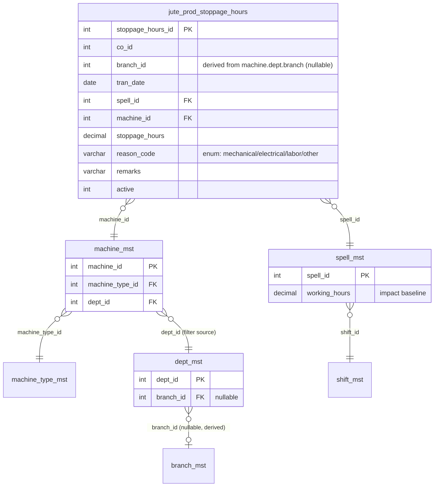

# Jute Production — Stoppage Hours (proposed)

Last verified: 2026-06-20

> Scope: complete design specification for the proposed **Stoppage Hours** page under Jute
> Production. Records machine stoppage events by reason (mechanical / electrical / labor / other)
> so that net running hours of a machine can be derived per (date, spell). This is a
> **SPEC SHEET ONLY — no DDL has been executed and no FE/ORM/router files exist yet.** All DDL,
> ORM, API, and page content below is **proposed (not yet implemented)**. Persona: **Portal**
> (`Depends(get_tenant_db)` + `get_current_user_with_refresh`, `{"data": …}` responses,
> soft delete via `active = 0`, **no approval workflow**). The per-stage working-hours IMPACT
> wiring is explicitly **DEFERRED** — see §11.

---

## 1. Overview

Stoppage Hours is a daily event-log entry page. An operator records every interval during which a
jute-production machine was stopped, tagged with the **reason** (mechanical, electrical, labor,
other) and the number of **stoppage hours**. The page lets the user narrow the machine list by
**department** (a cascading filter only — the department is *not* stored), pick the **spell**, enter
the **stoppage hours** and an optional **remark**, and save. Each save is one stoppage event; many
events may exist for the same machine on the same date and spell.

The business purpose is to feed a **working-hours impact** calculation: for any machine on a given
(date, spell), the **net running hours** equal the planned spell hours minus the sum of stoppage
hours logged against that machine for that date and spell. The actual linking of this impact into
each production stage (spreader / drawing / spinning / winding) is deferred future work (§11); this
spec defines the data, the page, the API surface, and the impact formula so that wiring is a
mechanical follow-up the user drives per machine/department later.

---

## 2. Goal & business rules

- **Reason-tagged downtime.** Every stoppage row carries exactly one reason from a **fixed enum**:
  `mechanical`, `electrical`, `labor`, `other` (§9). There is **no reason master table**.
- **Event log, not a unique key.** Multiple stoppage events per `(machine_id, tran_date, spell_id)`
  are allowed and expected (e.g. one `mechanical` + one `electrical` on the same machine/spell/day).
  **`(machine_id, tran_date, spell_id)` is NOT unique** — the table is an append/soft-delete log.
- **Net running hours formula** (per machine, per date, per spell):

  ```
  net_running_hours(machine_id, tran_date, spell_id)
      = spell_mst.working_hours
      − SUM(jute_prod_stoppage_hours.stoppage_hours
            WHERE machine_id = :machine_id
              AND tran_date  = :tran_date
              AND spell_id   = :spell_id
              AND active = 1)
  ```

  Baseline planned hours come from `spell_mst.working_hours DECIMAL(5,2)`. There is **no
  per-machine capacity master**; the spell's `working_hours` is the only baseline that exists
  (§11).
- **Department is derivable, not stored.** Department is a UI filter that narrows the machine
  dropdown via `machine_mst.dept_id = dept_mst.dept_id`. Only `machine_id` is stored; department and
  branch are always recoverable through `machine_mst.dept_id → dept_mst.branch_id` (§4, §10).
- **Branch is derived on insert** from the machine's department when the client omits it (§10), and
  reads tolerate legacy NULLs via `COALESCE`.
- **Validation:** `stoppage_hours > 0` and `stoppage_hours ≤ spell_mst.working_hours` for the
  selected spell (a single event cannot exceed the planned spell length). The *sum* across events
  may legitimately approach the full spell; if the cumulative sum exceeds `working_hours` the
  net is clamped at 0 by the read-side impact query (§11), but individual entry is gated only on
  the single-event bound.

---

## 3. Page UX

**Header title:** `Stoppage Hours` (under Jute Production).
**FE page (proposed):** `src/app/dashboardportal/juteProduction/stoppageHours/page.tsx`.
**Persona scope:** `co_id` + `branch_id` consumed from `useSidebarContext()` exactly as the
spreader/winding pages do (multi-branch auto-resolution from `selectedCompany?.branches`).

### 3.1 Screenshot columns (entry form + day grid)

The page captures these **7 columns**, in this order:

| # | Column | Control | Stored? | Notes |
|---|--------|---------|---------|-------|
| 1 | **Date** | `TextField type="date"` (`InputLabelProps={{ shrink: true }}`) | yes → `tran_date` | defaults to today |
| 2 | **Spell** | `TextField select` over `setup.spells` | yes → `spell_id` (INT) | value = `spell_id`; label = `spell_code`/`spell_name` (§3.3) |
| 3 | **Department** | `TextField select` over distinct depts | **NO — filter only** | cascades the Machine list; never saved (§3.2) |
| 4 | **Machine** | `TextField select` filtered by Department | yes → `machine_id` | disabled until a department is chosen |
| 5 | **Hours** (stoppage hours) | `TextField type="number"` (`inputProps={{ step: 0.25, min: 0 }}`) | yes → `stoppage_hours` | `> 0` and `≤ spell working_hours` |
| 6 | **Reason** | `TextField select` over the fixed enum (§9) | yes → `reason_code` | options are `mechanical / electrical / labor / other`; the `MenuItem` **value is the lowercase code** (e.g. `value="mechanical"`) and the visible text is the display label only, so the stored `reason_code` is guaranteed to be one of `STOPPAGE_REASONS` (§9) |
| 7 | **Remarks** | `TextField` (text) | yes → `remarks` | optional, ≤ 255 chars |

### 3.2 Department → Machine cascade (filter only)

Department is a **cascading filter and nothing more**. The user picks a department; the Machine
dropdown is filtered to machines whose `machine_mst.dept_id` equals the selected department. The
department value is **never written to the stoppage row** — only `machine_id` is stored, and
department/branch are derived from `machine_mst.dept_id → dept_mst.branch_id` on read.

Client wiring (mirrors the drawing module's dependent-dropdown pattern):

```tsx
const [deptId, setDeptId]   = React.useState<number | "">("");
const [machineId, setMachineId] = React.useState<number | "">("");

// Distinct departments derived from the machine setup list
const depts = React.useMemo(() => {
  const m = new Map<number, string>();
  setup.machines.forEach((x) => { if (x.dept_id && x.dept_name) m.set(x.dept_id, x.dept_name); });
  return Array.from(m, ([id, name]) => ({ id, name }));
}, [setup.machines]);

// Machine dropdown filtered to the selected department
const machinesForDept = React.useMemo(
  () => deptId === "" ? [] : setup.machines.filter((x) => x.dept_id === Number(deptId)),
  [deptId, setup.machines]
);

// Changing department resets the machine selection
onChange={(e) => { setDeptId(Number(e.target.value)); setMachineId(""); }}
```

The Machine `TextField` is `disabled={deptId === ""}`. Department dropdown options come from the
**same** `setup.machines` payload (no separate dept fetch is required), so the cascade is fully
client-side once `entry_create_setup` has loaded. (`GET /api/deptMaster/dept_master_table` remains
available if a full department list independent of machines is ever wanted — see §8.)

### 3.3 Spell dropdown

Spell options come from `setup.spells`. Because the new table stores `spell_id INT` (§4), the
dropdown **value is `spell_id`** while the visible label is `spell_code` / `spell_name`:

```tsx
{setup.spells.map((s) => (
  <MenuItem key={s.spell_id} value={s.spell_id}>{s.spell_code} — {s.spell_name}</MenuItem>
))}
```

The selected spell's `working_hours` is held client-side to drive the `Hours ≤ working_hours`
validation and to show the live "net running hours" hint (planned − entered). Dev3 spell set:
`A1 (5h)`, `B1 (3h)`, `A2 (3h)`, `B2 (5h)`, `C (8h, overnight)`.

### 3.4 Grid + entry form layout

- **Form** above a **day grid**, stacked vertically (`display:"flex", flexDirection:"column", gap:3`).
- Form fields in a responsive grid (`xs:"1fr"`, `sm:"repeat(2,…)"`, `md:"repeat(3,…)"`), `size="small"`.
- **Save** button: `variant="contained"`, `startIcon={<SaveIcon size={18} />}`, disabled while
  `formInvalid || saving`; success surfaced via `Snackbar`, errors via `Alert`.
- **Day grid** (`DataGrid` + `GridColDef`): one row per stoppage event for the selected date/branch,
  columns `Date | Spell | Department | Machine | Hours | Reason | Remarks` plus an actions cell
  (Edit / Delete with lucide `EditIcon` / `Trash2Icon`, delete = soft delete behind `confirm()`).
  Department in the grid is **display-only**, resolved server-side from `machine → dept`.

### 3.5 FE components to reuse

| Reuse | From | Purpose |
|-------|------|---------|
| Page shell (company/branch guards, `CircularProgress` while loading) | `spreader/page.tsx` | standard portal shell |
| Setup hook pattern | `spreader/hooks/useSpreaderSetup.ts` → new `useStoppageSetup.ts` | load machines + spells |
| Entries-by-date hook | drawing/spreader `entries_by_date` hooks → new `useEntriesByDate.ts` | day grid feed |
| Dependent dropdown pattern | `drawing/_components/DrawingEntryForm.tsx` | dept→machine cascade |
| Date / numeric inputs | `spreader/_components/ProductionEntryForm.tsx` | `type="date"`, `type="number"` |
| Grid + action cells | `spreader/_components/DailyEntriesGrid.tsx` | `DataGrid`, edit/delete |
| API client + routes | `src/utils/apiClient2.ts` (`fetchWithCookie`), `src/utils/api.ts` (`apiRoutesPortalMasters`) | wiring |

**Proposed FE structure** (mirrors spreader/drawing/winding):

```
src/app/dashboardportal/juteProduction/stoppageHours/
├── page.tsx
├── _components/  StoppageEntryForm.tsx, DailyStoppagesGrid.tsx
├── hooks/        useStoppageSetup.ts, useEntriesByDate.ts
├── types/        stoppageTypes.ts
└── utils/        stoppageCalc.ts   (net = working_hours − Σ stoppage_hours)
```

A landing tile is added to `juteProduction/page.tsx`.

---

## 4. Data model

A **single** proposed tenant-DB table holds the event log. Suggested name:
**`jute_prod_stoppage_hours`**. It uses the standard jute-production column kit
(`co_id NOT NULL`, nullable derived `branch_id`, `tran_date`, `active`, `updated_by`,
`updated_date_time` — **no `created_*`**, audit is trigger-based per CLAUDE.md).

| Column | Type | Null | Default | Notes |
|--------|------|------|---------|-------|
| `stoppage_hours_id` | INT AUTO_INCREMENT | no | — | PK |
| `co_id` | INT | no | — | tenant/company; indexed. From token/context (§10) |
| `branch_id` | INT | yes | NULL | **derived on insert** from machine→dept→branch (§10); indexed; reads `COALESCE` legacy NULLs |
| `tran_date` | DATE | no | — | the stoppage date; indexed (standard date col name) |
| `spell_id` | INT | no | — | **FK → `spell_mst.spell_id`**; INT, not a spell code string (§4.2); indexed |
| `machine_id` | INT | no | — | **FK → `machine_mst.machine_id`**; the only stage/department/branch anchor; indexed |
| `stoppage_hours` | DECIMAL(5,2) | no | — | downtime for this event; `> 0`, `≤` spell `working_hours` |
| `reason_code` | VARCHAR(20) | no | — | one of the fixed enum `mechanical/electrical/labor/other` (§9). No FK — not a master |
| `remarks` | VARCHAR(255) | yes | NULL | free text |
| `active` | TINYINT | no | `1` | soft-delete flag. DDL `TINYINT NOT NULL DEFAULT 1`; ORM `Column(Integer, nullable=False, default=1, server_default='1')` (matches `winding_models.py`) |
| `updated_by` | INT | yes | NULL | last writer (`user_id` from token) |
| `updated_date_time` | TIMESTAMP | no | `CURRENT_TIMESTAMP` | `server_default func.current_timestamp()` |

**Indexes (proposed):**

- `PRIMARY (stoppage_hours_id)`
- `idx_stoppage_co_branch_date (co_id, branch_id, tran_date)` — day-grid reads
- `idx_stoppage_machine_date_spell (machine_id, tran_date, spell_id)` — the impact `SUM` (§11);
  **non-unique (event log)** — declared `KEY`, never `UNIQUE`, so multiple stoppage events per
  `(machine_id, tran_date, spell_id)` remain valid.
- `idx_stoppage_spell (spell_id)` — FK support.

### 4.1 Why department is NOT stored

`machine_mst.dept_id` already binds every machine to exactly one department, and
`dept_mst.branch_id` binds that department to a branch. Storing `dept_id` on the stoppage row would
duplicate a fact already owned by `machine_mst` and risk drift if a machine is later reassigned.
Department is therefore a **pure cascading filter** in the UI (§3.2); on read it is resolved with the
canonical join `machine_mst m JOIN dept_mst d ON d.dept_id = m.dept_id`. No `dept_id` column exists
on `jute_prod_stoppage_hours`.

### 4.2 Why `spell_id INT` (not a spell code string)

Spell storage is split across legacy stages: spreader stores `spell VARCHAR(2)`, drawing stores
`spell VARCHAR(10)`, while the **newer** spinning and winding tables store `spell_id INT` FK to
`spell_mst`. This table follows the **new convention** — `spell_id INT FK` — for referential
integrity, to join directly to `spell_mst.working_hours` for the impact formula without a
code→id lookup, and to stay consistent with the winding/spinning models the user is standardizing on.

> Note: `spell_mst` is keyed for activity by a **`status` column (1 = active)**, **not** an `active`
> column. This table stores `spell_id` and joins by it, so the planned `working_hours` resolves
> correctly even for a retired spell — no spell-active filter is needed (§11). If one is ever added,
> use `spell_mst.status = 1`; **do not invent a non-existent `spell_mst.active` column.**

---

## 5. Relationship diagram



Note: there is **no edge** from `jute_prod_stoppage_hours` to `dept_mst` — department is reached
only transitively through `machine_mst.dept_id`, reflecting that `dept_id` is not stored on the row.
The `dept_mst }o--o| branch_mst` edge is **optional on the branch side** because
`dept_mst.branch_id` is nullable (FK `branch_mst`, nullable); a department may legitimately have no
branch, which is exactly why reads carry legacy NULLs through `COALESCE` (§4.1, §10).

---

## 6. Proposed DDL

> **PROPOSED — not yet executed.** Target tenant DB = `dev3` (confirm with user before running via
> the `run-migration` skill / pymysql per CLAUDE.md). No `mysql` CLI on this machine.

```sql
-- PROPOSED — not yet executed. Tenant DB (e.g. dev3).
-- Rollback: DROP TABLE IF EXISTS jute_prod_stoppage_hours;
CREATE TABLE jute_prod_stoppage_hours (
    stoppage_hours_id   INT          NOT NULL AUTO_INCREMENT,
    co_id               INT          NOT NULL,
    branch_id           INT          NULL,
    tran_date           DATE         NOT NULL,
    spell_id            INT          NOT NULL,
    machine_id          INT          NOT NULL,
    stoppage_hours      DECIMAL(5,2) NOT NULL,
    reason_code         VARCHAR(20)  NOT NULL,   -- mechanical | electrical | labor | other (fixed enum, app-enforced)
    remarks             VARCHAR(255) NULL,
    active              TINYINT      NOT NULL DEFAULT 1,
    updated_by          INT          NULL,
    updated_date_time   TIMESTAMP    NOT NULL DEFAULT CURRENT_TIMESTAMP ON UPDATE CURRENT_TIMESTAMP,
    PRIMARY KEY (stoppage_hours_id),
    KEY idx_stoppage_co_branch_date        (co_id, branch_id, tran_date),
    KEY idx_stoppage_machine_date_spell    (machine_id, tran_date, spell_id),   -- non-unique (event log): allows many events per machine/date/spell
    KEY idx_stoppage_spell                 (spell_id),
    CONSTRAINT fk_stoppage_machine FOREIGN KEY (machine_id) REFERENCES machine_mst (machine_id),
    CONSTRAINT fk_stoppage_spell   FOREIGN KEY (spell_id)   REFERENCES spell_mst   (spell_id)
);
```

`active` is `TINYINT NOT NULL DEFAULT 1` (the DDL convention); the ORM maps it as
`Column(Integer, nullable=False, default=1, server_default='1')` to match `winding_models.py` (§7).
`reason_code` is left as `VARCHAR(20)` (app-enforced enum) rather than a SQL `ENUM(...)` so the
four-value list lives in one place — `constants.py` (§9) — and can be validated identically on FE
and BE without a schema migration if the wording is ever adjusted. No `created_by` / `created_date`
columns (trigger-based audit). No `dept_id` column (§4.1).

---

## 7. Proposed ORM model sketch

> **PROPOSED — not yet implemented.** SQLAlchemy `Column` style consistent with
> `src/juteProduction/winding_models.py` (shared `Base` from `src/models/mst.py`). Suggested file:
> `src/juteProduction/stoppage_models.py`. Note `active` uses `Column(Integer, …)` even though the
> DDL column is `TINYINT` — both are functionally compatible and this matches `winding_models.py`.

```python
# PROPOSED — not yet implemented.
from sqlalchemy import Column, Integer, String, Date, DECIMAL, TIMESTAMP, func
from src.models.mst import Base


class JuteProdStoppageHours(Base):
    """Machine stoppage event log (one row per stoppage event).

    (machine_id, tran_date, spell_id) is intentionally NON-unique — multiple
    stoppage events per machine/spell/day are allowed. Department is NOT stored;
    it is a UI cascade filter only and is derived via machine_mst.dept_id ->
    dept_mst.branch_id on read. reason_code is a fixed app-level enum
    (STOPPAGE_REASONS) — there is no reason master table.
    """

    __tablename__ = "jute_prod_stoppage_hours"

    stoppage_hours_id = Column(Integer, primary_key=True, autoincrement=True)
    co_id             = Column(Integer, nullable=False, index=True)
    branch_id         = Column(Integer, nullable=True, index=True)   # derived from machine->dept->branch
    tran_date         = Column(Date, nullable=False, index=True)
    spell_id          = Column(Integer, nullable=False, index=True)  # FK spell_mst.spell_id (new convention)
    machine_id        = Column(Integer, nullable=False, index=True)  # FK machine_mst.machine_id
    stoppage_hours    = Column(DECIMAL(5, 2), nullable=False)
    reason_code       = Column(String(20), nullable=False)           # STOPPAGE_REASONS enum
    remarks           = Column(String(255), nullable=True)
    active            = Column(Integer, nullable=False, default=1, server_default="1")
    updated_by        = Column(Integer, nullable=True)
    updated_date_time = Column(TIMESTAMP, nullable=False, server_default=func.current_timestamp())
```

---

## 8. API contract

> **PROPOSED — not yet implemented** except where marked *reuse (exists)*. Persona: Portal
> (`Depends(get_tenant_db)` + `get_current_user_with_refresh`). All responses use the `{"data": …}`
> envelope. Suggested router file `src/juteProduction/stoppage_entry.py`, **prefix
> `/api/stoppageProd`**, registered in `src/main.py` after the winding routers. SQL builders in
> `src/juteProduction/stoppage_query.py`.

### 8.1 Setup / dropdowns

| api.ts const (proposed) | Method · URL | Params | Status | Response `data` |
|---|---|---|---|---|
| `STOPPAGE_ENTRY_CREATE_SETUP` | `GET /api/stoppageProd/entry_create_setup` | `co_id`, `branch_id?` | **NEW** | `{ machines:[{machine_id, machine_name, mech_code, machine_type_id, machine_type_name, dept_id, dept_name, branch_id (from dept_mst.branch_id)}], spells:[{spell_id, spell_code, spell_name, working_hours}], reasons:[{code,label}] }` |
| `STOPPAGE_DEPTS` *(optional)* | `GET /api/deptMaster/dept_master_table` | `co_id`, `branchids?` | **reuse (exists)** — `src/masters/departments.py:82` | `[{dept_id, dept_desc, dept_code, branch_id}]` — only if a machine-independent dept list is wanted; the cascade normally derives depts from `machines[]` |
| *(reference)* machines-by-branch | `GET /api/mechineMaster/mechine_master_table` | `co_id`, `branchids?`, `search?` | **reuse (exists)** — `src/masters/mechineMaster.py:156` | canonical machine list; the setup endpoint reuses this join filtered to jute stage machine types |
| *(reference)* spells | `GET /api/spell/get_spell_table` | `branch_id?`, `search?` | **reuse (exists)** — `src/masters/spell.py:108` | `[{spell_id, spell_code, working_hours, …}]`; setup endpoint embeds a trimmed copy |

In the `machines[]` shape above, **`branch_id` is the department's branch** (`dept_mst.branch_id`),
**not** a column on `machine_mst` — `machine_mst` has no `branch_id`. The setup query selects
`d.branch_id` per machine (consistent with §10), so any `branch_id` seen on a machine row is the
derived department branch.

The setup endpoint's machine query reuses the **canonical stage→machine join** so dept/branch come
along for the cascade:

```sql
SELECT m.machine_id, m.machine_name, m.mech_code,
       m.machine_type_id, mt.machine_type_name,
       d.dept_id, d.dept_desc AS dept_name, d.branch_id
FROM machine_mst m
JOIN machine_type_mst mt ON mt.machine_type_id = m.machine_type_id
JOIN dept_mst d          ON d.dept_id          = m.dept_id
WHERE m.active = 1 AND mt.active = 1
  AND (:branch_id IS NULL OR d.branch_id = :branch_id)
ORDER BY d.dept_desc, m.machine_name
```

> Open question (§12): whether to restrict `machines[]` to the four jute stage machine types
> (`Spreader/Drawing/Spinning/Winding`) or expose every active machine. Default proposal: include
> all active machines so any department's stoppage can be logged; filtering is a one-line `AND
> mt.machine_type_name IN (...)` if narrowing is later desired.

### 8.2 CRUD

| api.ts const (proposed) | Method · URL | Body / Params | Status | Response `data` |
|---|---|---|---|---|
| `STOPPAGE_ENTRY_CREATE` | `POST /api/stoppageProd/entry_create` | body (§8.3) | **NEW** | `{ stoppage_hours_id }` |
| `STOPPAGE_ENTRIES_BY_DATE` | `GET /api/stoppageProd/entries_by_date` | `co_id`, `branch_id?`, `tran_date` | **NEW** | `[{stoppage_hours_id, tran_date, spell_id, spell_code, machine_id, machine_name, dept_id, dept_name, stoppage_hours, reason_code, remarks}]` |
| `STOPPAGE_ENTRY_EDIT` | `PUT /api/stoppageProd/entry_edit/{stoppage_hours_id}` | `co_id` + editable fields (`stoppage_hours`, `reason_code`, `remarks`, `spell_id`) | **NEW** | `{ stoppage_hours_id }` |
| `STOPPAGE_ENTRY_DELETE` | `DELETE /api/stoppageProd/entry_delete/{stoppage_hours_id}` | `co_id` | **NEW** | `{ stoppage_hours_id }` (sets `active = 0`) |
| `STOPPAGE_NET_HOURS` *(read model, deferred)* | `GET /api/stoppageProd/net_running_hours` | `co_id`, `branch_id?`, `tran_date`, `machine_id?`, `spell_id?` | **NEW (deferred §11)** | `[{machine_id, tran_date, spell_id, working_hours, stoppage_total, net_running_hours}]` |

`entries_by_date` returns the resolved `dept_name` / `machine_name` / `spell_code` for grid display
via the canonical join (`COALESCE(s.branch_id, d.branch_id)` for legacy-NULL tolerance).

### 8.3 `entry_create` request body (Pydantic, proposed)

```python
# PROPOSED — not yet implemented.
class StoppageEntryCreate(BaseModel):
    co_id: int
    branch_id: Optional[int] = None     # derived on insert if None (§10)
    tran_date: date
    spell_id: int
    machine_id: int
    stoppage_hours: float               # > 0 and <= spell_mst.working_hours
    reason_code: str                    # must be in STOPPAGE_REASONS (§9)
    remarks: Optional[str] = None
```

Server validates `reason_code in STOPPAGE_REASONS` (400 otherwise) and
`0 < stoppage_hours ≤ working_hours` for the resolved `spell_id` (400 otherwise).

> **Branch is a derived attribute, not an independently stored fact.** `branch_id` in the body (and
> in `entry_edit`) is an **optional optimization only**: the server **ALWAYS prefers the
> machine → dept → branch derivation** (`machine_mst.dept_id → dept_mst.branch_id`, §10) and ignores
> a client-passed value that disagrees with the machine. The optional field mirrors
> `spreader_entry.py:186-200` and is **not** a contradiction of the locked decision that branch is
> derived from the machine — it is only a fallthrough when omitted.

---

## 9. Reason enum (fixed constant — no master)

The four reasons are a **fixed application enum**, defined once in
`src/juteProduction/constants.py`. There is **no `stoppage_reason_mst` table**. The same list is
mirrored on the FE (e.g. `stoppageTypes.ts`) for the dropdown.

```python
# src/juteProduction/constants.py  (PROPOSED addition)
# Fixed stoppage reasons (NOT a master table). reason_code stored on the row.
STOPPAGE_REASONS = ("mechanical", "electrical", "labor", "other")

# Optional display labels for the FE dropdown.
STOPPAGE_REASON_LABELS = {
    "mechanical": "Mechanical",
    "electrical": "Electrical",
    "labor":      "Labor",
    "other":      "Other",
}
```

- **Stored value:** the short lowercase `reason_code` string (`"mechanical"`, …) in
  `jute_prod_stoppage_hours.reason_code VARCHAR(20)`.
- **FE binding:** the dropdown `MenuItem` **`value` is the lowercase code** (`value="mechanical"`,
  `value="electrical"`, `value="labor"`, `value="other"`) and `STOPPAGE_REASON_LABELS` supplies the
  **display text only**. Binding value-to-code (never value-to-label) guarantees the persisted
  `reason_code` is always one of the four `STOPPAGE_REASONS` strings.
- **Validation:** BE rejects any `reason_code` not in `STOPPAGE_REASONS`; FE constrains the dropdown
  to these four. The `entry_create_setup` response includes
  `reasons: [{code, label}]` derived from this constant so the FE has a single source.

---

## 10. Branch / tenancy mapping

- **`co_id`** is supplied by the Portal context: the FE reads it from `useSidebarContext()`
  (`selectedCompany`) and sends it on every request; the BE runs against the tenant DB resolved by
  subdomain (`get_tenant_db`). `co_id` is **never hardcoded**.
- **`branch_id`** is **derived on insert** from the machine's department when the client omits it,
  using the exact spreader pattern (`spreader_entry.py:186-200`). The server treats the
  machine → dept → branch derivation as authoritative and only honors a client-supplied `branch_id`
  as a fallthrough (§8.3):

  ```sql
  -- branch derivation on INSERT when body.branch_id is None
  SELECT d.branch_id
  FROM machine_mst m
  INNER JOIN dept_mst d ON d.dept_id = m.dept_id
  WHERE m.machine_id = :machine_id
  ```

  ```python
  branch_id = body.branch_id
  if branch_id is None:
      derived = db.execute(
          text(
              "SELECT d.branch_id FROM machine_mst m "
              "INNER JOIN dept_mst d ON d.dept_id = m.dept_id "
              "WHERE m.machine_id = :machine_id"
          ),
          {"machine_id": int(body.machine_id)},
      ).fetchone()
      branch_id = derived.branch_id if derived else None
  ```

- **Reads** tolerate legacy NULL `branch_id` via `COALESCE(s.branch_id, d.branch_id)` where `s` is
  `jute_prod_stoppage_hours` and `d` is the joined `dept_mst`. (`dept_mst.branch_id` is itself
  nullable — §5 — so this COALESCE is the legacy-NULL safety net.)
- `machine_mst` has **no `co_id`** and **no `branch_id`** — branch is *only* reachable through
  `dept_mst.branch_id`, which is why the row stores `machine_id` and derives the rest.

---

## 11. Working-hours IMPACT (formula + integration points) — DEFERRED wiring

The impact of stoppage on a machine's usable hours is computed **at read time** from the event log:

```
stoppage_total(machine_id, tran_date, spell_id)
    = SUM(stoppage_hours) FROM jute_prod_stoppage_hours
      WHERE machine_id = :machine_id AND tran_date = :tran_date
        AND spell_id = :spell_id AND active = 1

net_running_hours = GREATEST(0, spell_mst.working_hours − stoppage_total)
```

Read-side SQL sketch (basis for `STOPPAGE_NET_HOURS`, §8.2):

```sql
SELECT s.machine_id, s.tran_date, s.spell_id,
       sp.working_hours,
       COALESCE(SUM(s.stoppage_hours), 0)                                AS stoppage_total,
       GREATEST(0, sp.working_hours - COALESCE(SUM(s.stoppage_hours), 0)) AS net_running_hours
FROM jute_prod_stoppage_hours s
JOIN spell_mst sp ON sp.spell_id = s.spell_id
WHERE s.active = 1 AND s.co_id = :co_id AND s.tran_date = :tran_date
  AND (:machine_id IS NULL OR s.machine_id = :machine_id)
  AND (:spell_id   IS NULL OR s.spell_id   = :spell_id)
GROUP BY s.machine_id, s.tran_date, s.spell_id, sp.working_hours
```

> The `spell_mst sp` join has **no active/status guard by design**: the row stores `spell_id` and
> joins by it, so an inactive (retired) spell still yields the correct planned `working_hours`. If a
> future variant must exclude retired spells, add `AND sp.status = 1` — `spell_mst` uses a `status`
> column (1 = active), **never** a `spell_mst.active` column (§4.2).

> **DEFERRED — per-department / per-stage wiring done later.** Capturing stoppage and computing
> `net_running_hours` is in-scope now; *substituting* `net_running_hours` for the planned
> `spell_mst.working_hours` inside each stage's production/efficiency math is **future work the user
> will wire per machine/department**. The known integration points per stage:

| Stage | Where planned hours are used today | Proposed impact hook (DEFERRED) |
|-------|-----------------------------------|----------------------------------|
| **Spreader** | No worked-hours column; uses `spell_mst.working_hours` implicitly | Subtract `stoppage_total` from the spell baseline in any spreader utilization report |
| **Drawing** | `jute_prod_drawing_entry.wrk_hours DECIMAL(5,2)` (actual worked hrs) | Reconcile/derive `wrk_hours` as `working_hours − stoppage_total`, or surface stoppage alongside `wrk_hours` |
| **Spinning** | `jute_prod_spinning_daily.minutes` drives the 100% production formula (`SPNG_PROD_*`) | Reduce effective `minutes` by `stoppage_total × 60` so `p100prod` reflects downtime |
| **Winding** | Reconciliation target uses `working − idle hours` (design doc §4) | Feed `stoppage_total` as the "idle hours" term in the winding target/efficiency calc |

Because there is **no per-machine capacity master**, every stage's baseline is
`spell_mst.working_hours`; the impact is uniformly `working_hours − stoppage_total`. The actual
edits to each stage's queries/reports are explicitly out of scope for this spec and will be done by
the user, machine-by-machine / department-by-department, when each stage is ready to consume the
impact.

---

## 12. Open questions / future work

1. **Machine-type scope of the dropdown** (§8.1): restrict `machines[]` to the four jute stage types
   (`Spreader/Drawing/Spinning/Winding`) or expose all active machines? Default: all active.
2. **Single-event upper bound** (§2): confirm a single event must be `≤ working_hours`. The
   cumulative sum can still exceed the spell; net is clamped to 0 by the read query (§11).
3. **Overnight spell `C` (22:00–06:00)** spans two calendar days — confirm `tran_date` convention
   (entry date = start date, as elsewhere in jute production) for the impact `SUM`.
4. **Reason granularity** — locked at four values now. If sub-reasons are ever needed, prefer
   extending `STOPPAGE_REASONS` (still no master) rather than introducing a reason table.
5. **Per-stage impact wiring** (§11) — DEFERRED; tracked per machine/department by the user.
6. **Reporting** — a stoppage-by-reason / machine-utilization report under
   `/api/juteProductionReports` is a likely follow-up once the event log has data.
7. **Menu wiring** — add the `Stoppage Hours` row under Jute Production via the `add-menu` skill
   (`portal_menu_mst` → tenant `menu_mst` + `role_menu_map`); not covered by this spec.
8. **Edit of `machine_id`/`tran_date`** — `entry_edit` (§8.2) intentionally limits edits to
   `stoppage_hours/reason_code/remarks/spell_id`; changing machine or date should be delete + re-add
   to keep branch derivation clean. Confirm.

---

## 13. Cross-repo file registry

| What | Path | Status |
|------|------|--------|
| This spec | `vowerp3ui/docs/claude/modules/jute-production/stoppage-hours/SPEC.md` | this file |
| Proposed FE page | `vowerp3ui/src/app/dashboardportal/juteProduction/stoppageHours/` | proposed |
| Proposed BE entry router | `vowerp3be/src/juteProduction/stoppage_entry.py` (prefix `/api/stoppageProd`) | proposed |
| Proposed BE SQL builders | `vowerp3be/src/juteProduction/stoppage_query.py` | proposed |
| Proposed ORM model | `vowerp3be/src/juteProduction/stoppage_models.py` | proposed |
| Reason enum | `vowerp3be/src/juteProduction/constants.py` → `STOPPAGE_REASONS` | proposed addition |
| Proposed DDL target | tenant DB `dev3` (via `run-migration` skill) | not executed |
| Reused: machines | `vowerp3be/src/masters/mechineMaster.py:156` (`/api/mechineMaster/mechine_master_table`) | exists |
| Reused: departments | `vowerp3be/src/masters/departments.py:82` (`/api/deptMaster/dept_master_table`) | exists |
| Reused: spells | `vowerp3be/src/masters/spell.py:108` (`/api/spell/get_spell_table`) | exists |
| Pattern: branch derivation | `vowerp3be/src/juteProduction/spreader_entry.py:186-200` | exists |
| Pattern: canonical machine join | `vowerp3be/src/juteProduction/query.py:8-32` | exists |
| Pattern: standard column kit | `vowerp3be/src/juteProduction/winding_models.py` | exists |
| FE API client / routes | `vowerp3ui/src/utils/apiClient2.ts`, `vowerp3ui/src/utils/api.ts` (`apiRoutesPortalMasters`) | exists |
| Register router | `vowerp3be/src/main.py` (after winding routers) | proposed |
| Add to module index | `vowerp3ui/docs/claude/modules/jute-production/_index.md` (knowledge parts table) | follow-up |
