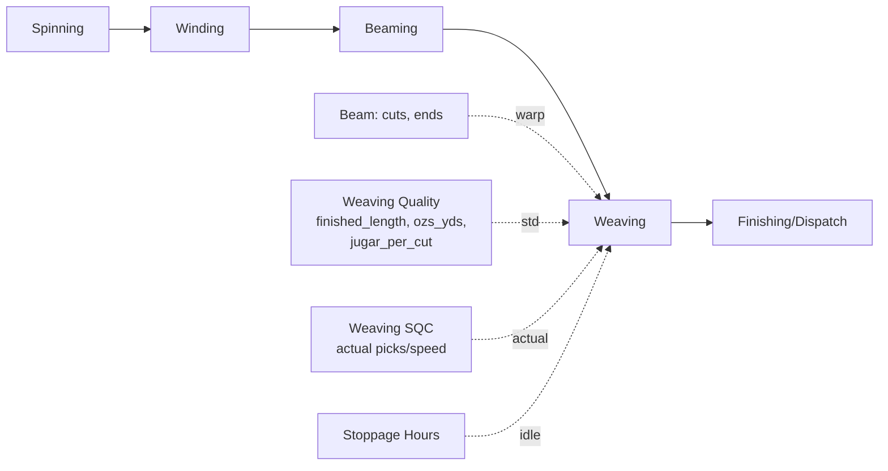

# Jute Production — Weaving (spec / proposed)

Last verified: 2026-06-23 — (c) ALL open questions resolved (§12): loom machine type **'Loom' id 7**
(Q1), **quality-only** standards + target speed+eff (Q5/Q5b), composite **`_dtl`** (Q6), EB via
attendance view + **beam-change tab** (Q7), reports (Q8), `_dtl`/Q15/Q16 etc.; **+ NEW spinning-style
Loom→Quality mapping** (§6.6) replacing inline select, **beam-change tab** (§6.7). (b) reconciled against the authoritative Sacking S14 + Hessian loom
production calculators: core yds/efficiency engine confirmed MATCH, **Q13 kg-constant RESOLVED to
28.35/1000**, §3.2 calculator + warp-prep cross-reference added, Q14/Q15/Q16 opened. (a) added §13.A
code3i (CodeIgniter PHP) + vow-ui-1.2 cross-walk — multi-agent research over ~13k LOC; new fields,
rounding, spell clock-windows, §6.5 Loom-Hours page, Q4/Q7 answers. Initial spec 2026-06-22 (vow 2.0
reference + vowerp3 beaming pattern).

> Scope: complete design specification for the **Weaving** section under Jute Production. Weaving is
> the stage **after Beaming**: warp **beams** (built up in *cuts*) are mounted on **looms** and the
> weft is interlaced to produce **jute cloth**, measured per **cut** (a fixed *finished length* of
> cloth) and per **jugar** (a partial/leftover cut carried across shifts). This spec defines **four
> pages**, deliberately mirroring the **already-implemented Beaming module** (`beaming/SPEC.md`) and
> the **Spinning** `spngTargetMap`/planning-grid pattern the user referenced:
>
> 1. **Weaving Quality Master** (`jute_prod_weaving_quality`) — master page; maps each *item* (woven
>    jute cloth) to one-or-many *weaving quality* codes, each carrying the **fixed construction**
>    attributes (`ends, finished_length, ozs_yds, no_of_jugar_per_cut, width, ports, shots, mc_teeth`).
> 2. **Weaving Standards / Targets Map** (`jute_prod_weaving_target_map`) — master page; **clones the
>    `spngTargetMap` / `beamingTargetMap` save pattern** (the data-saving style the user explicitly
>    referenced): an effective-dated, inline-grid editor with a **Type selector (Loom | Quality)**.
>    Quality-linked (`id_type='qid'`, `ref_id=weaving_quality_id`) params = std/target **picks**
>    (PPI), **speed** (picks/min), **eff**. Loom-linked (`id_type='mcid'`, `ref_id=machine_id`) params
>    (optional) = std/target **eff** (loom baseline/target efficiency).
> 3. **Weaving Production Entry** (`jute_prod_weaving_daily`) — daily per-loom/per-quality production
>    entry (date/shift/spell + loom; rows of quality, **cuts**, **closing jugar**), with a **server-computed
>    planning grid** (production yds, production kg, efficiency) — mirroring the Spinning/Beaming
>    planning grid. Weaving's one extra wrinkle vs beaming is the **jugar open/close carry-forward**
>    across spells `A1→B1→A2→B2→C` (and the day boundary).
> 4. **Weaving SQC** (`juteSQC/weaving`) — new page in the **juteSQC** module; reuses the
>    `/weavingTargetMap` endpoints with **`value_role='actual'`** (params `speed` = actual loom
>    speed, `picks` = actual PPI) to capture the **observed** values that override the standards in
>    the efficiency calc. This is the vowerp3 equivalent of the legacy
>    `tbl_prod_weaving_quality_mapping` date-effective actual-shot/speed override. Works exactly like
>    the Beaming SQC page (reuses the `TargetMapEditor` with `valueRole='actual'`).
>
> **Status: PROPOSED — all open questions resolved 2026-06-23 (§12); ready to build.** Locked: loom
> machine type = **`'Loom'`, `machine_type_id 7`** (Q1, matches code3i `type_of_mechine=7`); **full
> jugar carry-forward via the `vw_weaving_daily` window LAG — FREEZE NOTHING, no recompute cascade** (Q3); standards **quality-linked only** (`qid`; no loom
> `mcid`) (Q5), qid target = **speed + eff** (Q5b); reuse **Jute Cloth = 5** (Q2); **separate** weaving
> quality master (Q4); **composite qualities via `_dtl`** like beaming (Q6); **EB via attendance view +
> beam-change tab** (Q7); build **reports** (Q8); target **dev3** (Q12); kg constant **`× 28.35 / 1000`**
> (Q13, confirmed 2026-06-23); ends-in-beam /
> warp derivations **deferred** (Q14, SQC/planning); `finished_length` per-cut = per-piece (Q15);
> `ports` + `reed_porter` **both, distinct** (Q16). **NEW: Loom→Quality mapping** (spinning-style,
> §6.6) replaces inline quality select. Next step = **build**. Persona: **Portal**
> (`Depends(get_tenant_db)` + `get_current_user_with_refresh`, `{"data": …}` responses, soft delete
> via `active = 0`, **no approval workflow**, trigger-based audit — no `created_*`). Register routers
> in `src/main.py` after the beaming routers (`:216`). The **idle/working hours** impact is wired the
> same as beaming — `working_hours = max(0, spell working_hours − Σ jute_prod_stoppage_hours)`.
>
> **Reference sources** (read-only, for formulas/fields): legacy `vow_backend_2.0` (Java/Spring) and
> `vow-ui-2.0` (React). Key legacy files cited inline in §13. Working vowerp3 template: the **beaming**
> module (`beaming/SPEC.md`, `src/juteProduction/beaming_*.py`, `juteProduction/beaming/` FE).

---

## 0. Decisions to lock (this session)

> These mirror beaming's locked-decisions table. Items tagged **RECOMMENDED** are the spec's default
> (faithful to legacy + consistent with beaming); confirm or redline in §12 before implementation.

| # | Decision | Recommended value |
|---|----------|-------------------|
| 1 | **Page set** | **Four pages**, mirroring beaming: Quality Master + Standards/Targets Map + Production Entry + Weaving SQC. |
| 2 | **Production-entry grain** | **Per loom + quality, per spell.** Header = `tran_date, spell_id, machine_id (loom)`; each row = `weaving_quality_id` (**inherited from the Loom→Quality mapping, spinning-style — NOT selected inline**, §6.6), `cuts`, `close_jugar`. `cuts`/`close_jugar` (closing jugar reading) are the only operator inputs; `open_jugar` resolves from the last available close, `jugar` (jugars produced) is **derived** (§3); production/efficiency **server-computed**. EB/worker resolved via **attendance view** (not entered, Q7); beam via **beam-change tab** (§6.7, Q7). |
| 3 | **Two legacy engines → one INPUTS table + a VIEW** (FREEZE NOTHING, 2026-06-24) | Legacy had `WEAVING_PRODUCTION` (day/spell aggregate, Java) **and** `CUTS_JUGAR_BUFF_1` (per-loom 5-spell, native SQL). vowerp3 **consolidates to one** per-loom/quality/spell table `jute_prod_weaving_daily` that stores **inputs only** (`cuts`, `close_jugar`, `less_production` + identity); **every standard/derived/computed column is recomputed on read by `vw_weaving_daily`** (§6.1a) — nothing is frozen. Shift/day/quality rollups are still **derived by query** (SUM over the view). |
| 4 | **Quality master content** ✅Q4/Q6/Q16 | **Separate** `jute_prod_weaving_quality` (not shared with spinning) stores `item_id, weaving_quality_code, weaving_quality_name, ends, width, ports, reed_porter (distinct from ports, Q16), shrinkage_pct, shots, finished_length, ozs_yds, std_ozs_yds, no_of_jugar_per_cut, jbo_rbo, reed_space, tpi, yarn_count, mc_teeth`. **Composite qualities via `jute_prod_weaving_quality_dtl`** (Q6 — mirror `jute_prod_bm_quality_dtl`). Many qualities per `item_id`. **`no_of_jugar_per_cut` mandatory**; `finished_length` = yds/cut = per piece (Q15). |
| 5 | **Standards split (target map)** ✅Q5/Q5b | **Quality-linked only (`qid`, `ref_id=weaving_quality_id`)** — **NO loom (`mcid`) standards** (Q5): `speed`(picks/min), `picks`(PPI), `eff` — std; **`speed` + `eff`** — target (Q5b). No FE Type selector (quality-only). |
| 6 | **Actuals (Weaving SQC)** | The Weaving SQC page captures **`value_role='actual'`** for `speed` (actual loom picks/min) and `picks` (actual PPI), quality-linked (`qid`), effective-dated — reuses `/weavingTargetMap` endpoints (= legacy `tbl_prod_weaving_quality_mapping`). When an actual exists as-of the production date it **overrides** the corresponding standard in the efficiency calc; otherwise the standard is used. |
| 7 | **Jugar carry-forward** ✅Q3 (revised 2026-06-24; FREEZE NOTHING) | Operator enters **`close_jugar`** (cj, the closing reading, 0≤cj≤jc); **`open_jugar`** (oj), produced **`jugar`**, and `production_yds` are **all computed on read by `vw_weaving_daily`** — NOT stored. `oj` = the view's window `LAG(close_jugar)` over existing active rows `PARTITION BY (co_id, machine_id, weaving_quality_id) ORDER BY (tran_date, spell_rank)` — which inherently skips empty spells (A1.close=12, B1 empty ⇒ A2.open=12; 0 at chain start) and auto-propagates across the day boundary. `jugar = max(0, X−jc if X>jc else X)` with `X=jc−oj+cj`. **No recompute cascade and no compute-on-save** — the LAG over existing rows handles propagation; an edit just changes an input and the next read re-derives everything. |
| 8 | **Working hours** | `working_hours = max(0, spell_mst.working_hours − Σ jute_prod_stoppage_hours[machine,date,spell])` — wired to the Stoppage Hours module exactly like beaming (§3). |
| 9 | **No approval workflow** | Direct CRUD + soft delete (`active=0`); no `status_id`, consistent with all of jute production. |
| 10 | **Target tenant DB** ✅Q12 | **dev3** (QA/dev tenant) for all DDL/seed/testing. |
| 11 | **Quality mapping (NEW)** ✅ | **Loom→Quality mapping** like **spinning** (not beaming's inline select): quality assigned per `(tran_date, spell_id, machine_id)` on a mapping tab; production grid **inherits** it. New table `jute_prod_weaving_quality_map` + tab (§6.6). |
| 12 | **Beam-change tab (NEW)** ✅Q7 | Beam→loom mapping on beam change (with spell + date) on a separate tab; `beam_no` is **not** a production-row field. New table `jute_prod_weaving_beam_map` (§6.7). |

### 0.1 Foundations to apply to dev3 (mirrors beaming §0.1)

Before the module tables, three foundations must exist in the target tenant (seed via migrations,
like beaming's `create_beaming_item_type_and_machine_type.sql` + `seed_beaming_menu.sql`):

| Object | Action | Notes |
|--------|--------|-------|
| **Loom machine type** | **`machine_type_mst.machine_type_name = 'Loom'`, `machine_type_id = 7`** (Q1, 2026-06-23) — matches code3i `type_of_mechine = 7`. Looms are `machine_mst` rows of this type. `WEAVING_MACHINE_TYPE_NAME = 'Loom'` / `WEAVING_MACHINE_TYPE_ID = 7` resolve looms at runtime. | Confirm `'Loom'` = id 7 exists in dev3, else seed it. (**Overrides** the earlier `'Weaving'` lock.) |
| **Woven-cloth item type** | Weaving qualities key off woven jute-cloth items. **Reuse `item_type_master 'Jute Cloth' = 5`** (already applied for beaming, §beaming 0.1) — the woven product is jute cloth. | `WEAVING_ITEM_TYPE_IDS = (5,)`. Confirm whether woven cloth should be a distinct item type vs share `Jute Cloth` with beaming. §12 Q2. |
| **Menus** | 4 `menu_mst` rows under parent *Jute Production* (`menu_id` 768): Weaving Production, Weaving Quality Master, Weaving Standards; + 1 under the juteSQC parent: Weaving SQC. `role_menu_map` left to tenant admin. Seed via `seed_weaving_menu.sql` + `seed_weaving_sqc_menu.sql` (mirror beaming's). | §11. |

---

## 1. Overview

**Weaving** sits between **beaming** (warp preparation) and **finishing**. A warp **beam** (produced
in beaming, built over a number of *cuts*) is mounted on a **loom**; the loom interlaces weft to
weave **jute cloth**. Output is measured in **cuts** — each cut is a fixed **finished length** of
cloth (yards) defined by the quality. A partial cut left on the loom at shift-end is a **jugar**,
carried forward to the next shift.

Each *item* (a woven jute-cloth item, `item_grp_mst.item_type_id = 5` — **Jute Cloth**) is woven as
one or more **weaving qualities** (`weaving_quality`), a code that encodes the cloth construction and
carries `ends`, `finished_length` (yds/cut), `ozs_yds` (weight/length), `no_of_jugar_per_cut`, etc.
Multiple qualities map to one item.

The four pages form a small pipeline (identical shape to beaming's three masters + SQC):

```
Page A  Weaving Quality Master      item → weaving_quality (+ ends, finished_length,    [reference data]
                                     ozs_yds, no_of_jugar_per_cut, width, ports, shots)
Page B  Weaving Standards/Targets    per-quality std/tgt picks, speed, eff (+ optional   [reference data,
        Map                          per-loom eff) — effective-dated                       spngTargetMap clone]
Page C  Weaving Production Entry      daily: loom + quality + cuts + closing jugar         [transaction]
                                     → server computes production yds/kg + efficiency
Page D  Weaving SQC (juteSQC)         daily actual picks/speed per quality                 [actuals capture,
        (value_role='actual')        (overrides standards in efficiency calc)               beamingTargetMap clone]
```

Pages A and B are **masters** (`juteProduction/masters/`); Page C is the **production-entry** page
(`juteProduction/weaving/`); Page D lives in the **juteSQC** module (`juteSQC/weaving/`). This is the
same split as Beaming (`beamingQualityMaster` / `beamingTargetMap` masters, `beaming` entry,
`juteSQC/beaming`).

### Process-chain position



---

## 2. Parameter dictionary & linkage (proposed)

The legacy "Parameters" sheet resolved against this spec's decisions. **Linkage** = where the value
comes from at production time, and the `id_type` (`mcid` = loom, `qid` = quality) each target-map
param keys off.

| Parameter | Source (`id_type`) | Linkage (resolved) |
|-----------|--------------------|--------------------|
| `item_id` | `item_mst` via `item_grp_mst.item_type_id = 5` (**Jute Cloth**) | via mapped quality |
| `weaving_quality` | `jute_prod_weaving_quality` | **quality-mapping page** (spinning-style: assigned to loom per spell/date, §6.6) — **not** selected inline per row |
| `ends` | `jute_prod_weaving_quality.ends` | **quality-linked** (master column) |
| `finished_length` (yds/cut) | `jute_prod_weaving_quality.finished_length` | **quality-linked** (master column) — core production driver |
| `ozs_yds` (oz/yd) | `jute_prod_weaving_quality.ozs_yds` | **quality-linked** (master column) — core kg driver |
| `no_of_jugar_per_cut` | `jute_prod_weaving_quality.no_of_jugar_per_cut` | **quality-linked** (master column) — jugar→yards divisor (mandatory) |
| `width`, `ports`, `shots`, `mc_teeth` | `jute_prod_weaving_quality.*` | **quality-linked** (master columns; reference/guard, not in core formula) |
| `std_speed` (picks/min) | `jute_prod_weaving_target_map` **`qid`**`/standard/speed` (`ref_id=weaving_quality_id`) | **quality-linked** (std, effective-dated) |
| `tgt_speed` (picks/min) | **`qid`**`/target/speed` | **quality-linked** (target — Q5b: target = speed + eff) |
| `act_speed` (picks/min) | **`qid`**`/actual/speed` — **Weaving SQC** | resolved as-of `tran_date`; **overrides** std when present, else falls back to std |
| `std_picks` (PPI / actual_shots) | **`qid`**`/standard/picks` | **quality-linked** (std) — efficiency denominator driver |
| `act_picks` (PPI) | **`qid`**`/actual/picks` — **Weaving SQC** | resolved as-of `tran_date`; **overrides** std when present (= legacy `tbl_prod_weaving_quality_mapping.actual_shot`) |
| `std_eff` | **`qid`**`/standard/eff` | **quality-linked** (std) |
| `tgt_eff` | **`qid`**`/target/eff` | **quality-linked** (target) |
| ~~loom-linked eff (`mcid`)~~ | — | **DROPPED (Q5): quality-only standards, no loom `mcid`** |
| `shift_hours` | `spell_mst.working_hours` | **spell-linked** |
| `idle_hours` | `Σ jute_prod_stoppage_hours` for (machine, date, spell) | **wired** (Stoppage Hours module); 0 when none |
| `working_hours` | `max(0, shift_hours − idle_hours)` | **derived** (net of stoppage) |
| `oz→kg` (constant) | `× 28.35 / 1000` (divisor 35.273; Q13) | `WEAVING_GRAMS_PER_OZ = 28.35` |
| `yard_factor` (constant) | `36` (picks→yards conversion in std-prod) | constant `WEAVING_YARD_FACTOR` |
| `date` | entry | **header** |
| `shift` | derived from `spell` (`LEFT(spell_code,1)`) | **derived** |
| `spell` | `spell_mst` (5 weaving spells **A1, B1, A2, B2, C**) | **header** |
| `loom` (`machine_id`) | `machine_mst` where `machine_type_name = 'Loom'` (id 7, Q1) | **header** |
| `eb_no` | resolved via **attendance view** (attendance-taker enters ebno; joined for display) | **not entered** (Q7) |
| `beam_no` | **beam-change tab** — beam mapped to loom on change (spell + date) (§6.7) | **separate tab** (Q7), not a production-row field |
| `cuts` | entry | **data-entry field** (per row) — full cuts woven |
| `close_jugar` (cj) | entry | **data-entry field** (per row) — the closing jugar reading (0 ≤ cj ≤ jc) |
| `open_jugar` (oj) | resolved (§3) | **last available** close for (loom, quality) before this (date,spell); skips empty spells; 0 at chain start |
| `jugar` (= total_jugar) | derived (§3) | **computed** `cuts·jc + cj − oj − less_production` (no wrap/clamp) |
| `production_yds` | derived (§3) | **computed** |
| `production_kg` / `production_mt` | derived (§3) | **computed** |
| `efficiency` | derived (§3) | **computed** |

---

## 3. Calculations (formulas)

All numeric calc is **server-authoritative** (FE shows previews only via `weavingCalc.ts`, exactly
as Spinning/Beaming). The two canonical formulas come straight from the legacy native SQL (§13 B.3,
B.4); the kg conversion from the legacy Java (§13 B.1). Constants: `OZ_TO_KG = 35.2`,
`YARD_FACTOR = 36`. **kg-constant divergence (code3i):** the original real-production system
computes kg as `ozs_yds × yds × 28.35 / 1000` (28.35 g/oz ⇒ effective divisor **35.273**), NOT
35.2 (`Weaving_daily_entry.php:284`, `Loom_hrs_prod_updt.php:260`); 35.2 is a ~0.2%-off
approximation. **§12 Q13 RESOLVED (2026-06-23):** the spec adopts `× 28.35 / 1000` (divisor 35.273)
— confirmed by **both authoritative loom production calculators** (Sacking S14 uses `oz×28.35/1000`;
Hessian uses `÷35.27`) and code3i; the 35.2 placeholder is dropped. `YARD_FACTOR = 36` is
**CONFIRMED** by code3i and both calculators (`Weaving_daily_entry.php:275-305`).

Per production row (loom + quality + spell), with standards resolved **as-of `tran_date`**
(quality-linked `qid`; loom-linked `mcid` optional):

```text
# ---- resolved inputs ------------------------------------------------------
finished_length = jute_prod_weaving_quality.finished_length        # yds per full cut (fixed)
ozs_yds         = jute_prod_weaving_quality.ozs_yds                 # ounces per yard (fixed)
jugar_per_cut   = jute_prod_weaving_quality.no_of_jugar_per_cut     # jugars per full cut (fixed, > 0)
std_speed       = qid/standard/speed     # picks/min
std_picks       = AVG(picks) from vw_weaving_pick_act for EXACT tran_date   # "actual PPI" (REVISED 2026-06-30)
#   = SQC R-08-21 jute_sqc_weaving_pick daily quality-average; no SQC that day ⇒ 0 (no last-date, no target-map fallback)
act_speed       = qid/actual/speed       # Weaving SQC; NULL ⇒ use std_speed
act_picks       = vw_weaving_pick_act LAST-DATE   # VESTIGIAL — no longer used in std-prod
eff_speed       = COALESCE(act_speed, std_speed)   # speed used in std-prod denominator (legacy override)
eff_picks       = COALESCE(act_picks, std_picks)   # VESTIGIAL — std-prod now divides by std_picks directly
shift_hours     = spell_mst.working_hours
idle_hours      = Σ jute_prod_stoppage_hours[machine,date,spell]
working_hours   = max(0, shift_hours - idle_hours)

# ---- jugar  (oj=open, cj=close ENTERED, jc=jugar_per_cut, adj=less_production) -  (REVISED 2026-06-30)
oj  (open_jugar)  = the LAST AVAILABLE close jugar for this (loom, weaving_quality) strictly before
                    this (tran_date, spell) in order A1→B1→A2→B2→C then across the day boundary;
                    0 when none. SKIPS EMPTY SPELLS: if A1.close=12 and B1 has no entry, A2.open=12
                    (NOT the immediately-prior slot, NOT 0). Quality-scoped.
cj  (close_jugar) = OPERATOR INPUT — the closing jugar reading (0 ≤ cj ≤ jc; reject cj > jc).
jc                = jugar_per_cut (above), fixed, > 0.
adj (less_production) = reduce-jugar deduction from the Adjustment tab (COALESCE 0).

total_jugar = cuts * jc + cj - oj - adj    # straight count, NO wrap, NO clamp.
#   The cuts*jc term keeps total_jugar ≥ 0 in practice, so no max(0,·) guard is applied.
#   The reported `jugar` column == total_jugar.

# ---- production (yards) ---------------------------------------------------  (REVISED 2026-06-30)
production_yds  = total_jugar * finished_length / jc    # guard jc > 0
#   Worked (jc=16, FL=L):  A1 oj=0,cuts=10,cj=12 → total=172 → 172/16·L = 10.75 L.
#                          A2 oj=12,cuts=5,cj=4 (B1 empty) → total=72 → 72/16·L = 4.50 L.
#   Supersedes the 2026-06-24 wrap model (X=jc−oj+cj; jugar=X−jc if X>jc else X; (cuts+jugar/jc)·FL):
#   cuts are now rolled into total_jugar directly and the cyclic-counter wrap is dropped.

# ---- production (kg / MT) -------------------------------------------------  (legacy §13 B.1, B.12)
production_kg   = production_yds * ozs_yds * 28.35 / 1000   # 28.35 g/oz ⇒ divisor 35.273; round 3 dp (Q13 RESOLVED)
#   (was /35.2 — a ~0.2%-off placeholder; both authoritative loom calculators + code3i use 28.35/1000.)
production_mt   = production_kg / 1000

# ---- "100prod" = 100% / standard-possible production (yards) --------------  (REVISED 2026-06-30)
std_prod_yds    = (eff_speed * working_hours * 60) / (36 * std_picks)   # divide by std_picks (actual PPI), NOT eff_picks
#   "100prod" — theoretical max at 100% efficiency; no SQC that day ⇒ std_picks 0 ⇒ 100prod 0 ⇒ efficiency 0.

# ---- "std prod" = efficiency-weighted standard production -----------------  (NEW 2026-06-30)
std_prod_eff    = std_prod_yds * std_eff / 100          # 100prod × std eff%; planning_grid serializer (not the view)

# ---- efficiency (%) -------------------------------------------------------  (ACTUAL eff vs 100prod)
efficiency      = production_yds * 100 / std_prod_yds                         # guard std_prod_yds(100prod) > 0

# ---- target production (optional; not shown on planning grid) -------------
target_prod_yds = std_prod_yds * tgt_eff / 100          # if a qid/target/eff exists

# ---- standard production kg (legacy code3i — uses the STANDARD basis weight) --  (Weaving_daily_entry.php:315-318)
std_prod_kg     = production_yds * std_ozs_yds * 28.35 / 1000   # std_ozs_yds ≠ ozs_yds; guard prod>0; round 0 dp (Q13)

# ---- second efficiency (legacy code3i stores TWO) -------------------------  (Weaving_daily_entry.php:310-314)
#   efficiency (above) == legacy 'a_eff' (actual-shots basis; matches eff_picks = COALESCE).
#   optional actual_eff = production_yds * 100 / std_prod_yds_avg, where std_prod_yds_avg uses the
#     STANDARD shots over total looms ÷ tsft (count of spells run). Report-parity only.
#   ⚠ legacy code3i has NO div-by-zero guard on the efficiency denominator — DO NOT replicate
#     (vowerp3 guards std_prod_yds > 0).
```

**Rollups (derived by query, never stored):** per spell+quality `SUM(cuts)`, `SUM(production_yds)`,
`SUM(production_kg)`, loom count, and `AVG(efficiency)`; line-wise efficiency = `AVG` of A/B/C spell
effs per `machine_mst.line_number` (legacy §13 B.9/B.10) — implement in `reportQueries.py`, not DB
views.

### 3.1 Rounding, spell clock-windows, and the two legacy production models

**Rounding (legacy code3i, `Weaving_daily_entry.php:251-319`):** actual kg → 3 dp; target kg &
std-prod kg → integer (0 dp); both efficiencies → 2 dp; per-spell std/target yards → integer.
**vowerp3:** store full DEC precision (DEC(14,3)/(10,4)); round only at report/display — an
intentional divergence from legacy integer-rounded yards.

**Spell ↔ clock-window (authoritative, `weaving_daily_entry.php:440-457`)** — the default-spell
the entry UI auto-selects by wall-clock hour, and the basis for `spell_mst.working_hours` validation:

| Spell | Clock window | Hours |
|-------|--------------|-------|
| A1 | 06:00–11:00 | 5 |
| B1 | 11:00–14:00 | 3 |
| A2 | 14:00–17:00 | 3 |
| B2 | 17:00–22:00 | 5 |
| C  | 22:00–06:00 | 8 |

**Two legacy production models (code3i):** (1) the per-loom **5-spell** `cuts_jugar_buff_1` engine
(jugar-aware: `cuts*FL − open*FL/jpc + jugar*FL/jpc`, where jugar was an INPUT) — **superseded** by the revised §3 engine (close entered, jugar derived, 2026-06-24); and
(2) a quality-aggregate **3-spell A/B/C** save path (`weaving_daily_transaction`) where
`production_yds = cuts*FL` with **no jugar term** (`Weaving_daily_entry.php:263-273`,
`Loom_hrs_prod_updt.php:239-249`) — there jugar is bookkept separately and not folded into yards.
vowerp3 keeps model (1) per-loom but **revised the engine 2026-06-24** (§3): `close_jugar` is the
operator input, `open_jugar` is the last-available close, and `jugar` (produced) is derived — so
vowerp3's `production_yds = (cuts + jugar/jc)·FL`, NOT the legacy
`cuts*FL − open*FL/jpc + jugar*FL/jpc` (kept as legacy reference only, §13 B.3). The legacy 3-spell
rollup maps **A=A1+A2, B=B1+B2, C=C** for report parity.

**Working hours (divergence):** the real legacy source is `daily_attendance.working_hours −
idle_hours` per ticket/spell, with machine stoppage tracked separately in
`daily_ebmc_attendance.mc_stoppage_hours` (`Loom_hrs_prod_updt.php:74-84`,
`Weaving_daily_entry.php:489-523`); worker/loom/spell joined via `ticket_no_{spell}` (= EB). The
spec's `spell_mst.working_hours − Σ stoppage` is a deliberate simplification — reconcile if/when
attendance integration exists in vowerp3.

> **Legacy bugs NOT to replicate** (§13): (a) B2/C production rows used `finished_length_a2` instead
> of their own spell's FL — use **each spell's own** `finished_length`. (b) Group-average efficiency
> used `a + b/2` instead of `(a+b)/2` (Java precedence) — use `(a+b)/2`. (c) Beaming report hardcoded
> an 8-hour shift — vowerp3 uses `working_hours` (net of stoppage) per spell. (d) code3i HARDCODED
> `company_id = 2` in attendance/quality buff-update SELECTs (`Weaving_daily_entry.php:497-498,717,789`;
> `Loom_hrs_prod_updt.php:511`) — scope every resolve by the actual `co_id`. (e) Worker-name CONCAT
> duplicates `worker_name` (`Loom_hrs_prod_updt.php:75`). (f) No div-by-zero guard on the efficiency
> denominators (`Weaving_daily_entry.php:310-314`). (g) Two inconsistent oz→kg constants in the same
> save (actual `28.35/1000`=35.273 vs target `4408/125`=35.264) — pick ONE (§12 Q13).

### 3.2 Loom production reference calculators (planning view) + warp-prep cross-reference

Two authoritative Excel loom calculators — **S14 (Sacking)** and **Hessian** — were reconciled against
§3 (2026-06-23). The **core engine matches exactly**: their "Production @ 100% efficiency" line **is**
`std_prod_yds = (speed × hours × 60) / (36 × picks)` (Sacking `(480/12.70)×(60/36)×8 = 503.937`;
Hessian `(480×7.833×60)/(36×12) = 522.2`), and "Production @ set efficiency" **is**
`target_prod_yds = std_prod_yds × eff/100` (Hessian `522.2 × 0.85 = 443.870`). `YARD_FACTOR = 36`
confirmed. The calculators differ from the daily-entry path only in **direction**: they take
**efficiency as an input** and project production forward (planning); the daily-entry screen computes
**efficiency as an output** from operator-entered `cuts`/`jugar` (actuals). The FE `weavingCalc.ts`
is this planning view and reuses the §3 engine.

**kg conversion** in both calculators = `oz/yd × 28.35 / 1000` (divisor 35.273) — see §12 Q13 RESOLVED.
**Display-only derivations** (no stored column): `picks/dm = PPI × 3.937` (spec stores PPI/picks-per-inch
on `qid/picks`; if a tenant enters metric **picks/dm**, the entry layer must `÷ 3.937` before persisting);
`cut_weight_lbs = finished_length × ozs_yds / 16` (reference, uses `WEAVING_OZ_PER_LB`).

**Warp-prep quantities are NOT weaving-production inputs** — they belong to the already-implemented
**Beaming** module and must never be entered on the weaving screen:

| Calc field | Belongs in (beaming) |
|------------|----------------------|
| Laid length (110 yds) | `jute_prod_beaming_target_map` qid/standard/`laid_length` |
| Std warp count (8 lbs/spy) | `jute_prod_bm_quality.std_count` (from `jute_yarn_mst`) — not weaving's free-text `yarn_count` |
| Ends in beam (642) | `jute_prod_bm_quality.ends` (stored, not derived) |
| Warp weight (39.22 lbs) | beaming `kg_per_cut` (lbs = kg × 2.20462) = `Σ(ends × laid_length × count) / 14400` |

The Hessian **ends-in-beam** derivation `((width × (1+shrink%)) × reed_porter × 2) / 1.85` is a NEW
warp-prep planning helper — if adopted it belongs in **beaming-quality** (it needs width/shrinkage/
reed_porter), see §12 Q14. Keep a single source of truth for `ends`; don't duplicate weaving↔beaming.

---

## 4. Page A — Weaving Quality Master

Master page; same shape as **Beaming Quality Master** (`beamingQualityMaster/page.tsx`,
`beaming_masters.py`). Maps an *item* (woven jute cloth) → one-or-many *weaving qualities*.

### 4.1 Table `jute_prod_weaving_quality` (tenant DB)

| Column | Type | Notes |
|--------|------|-------|
| `weaving_quality_id` | INT PK autoinc | |
| `co_id` | INT NOT NULL, idx | company scope |
| `branch_id` | INT NULL | |
| `item_id` | INT NOT NULL, idx | woven cloth item (`item_grp_mst.item_type_id=5`) |
| `weaving_quality_code` | VARCHAR(50) NOT NULL | join key (legacy `quality_code`) |
| `weaving_quality_name` | VARCHAR(100) | |
| `ends` | INT NOT NULL | warp ends |
| `finished_length` | DECIMAL(12,3) NOT NULL | yds per full cut — = per-finished-piece only when 1 cut = 1 piece (reconcile vs `no_of_jugar_per_cut`; §12 Q15) |
| `ozs_yds` | DECIMAL(10,4) NOT NULL | **ACTUAL** ounces per yard — drives `production_kg` (legacy `q_ozs_yds`) |
| `std_ozs_yds` | DECIMAL(10,4) NULL | **STANDARD** oz/yd — drives `std_prod_kg`; distinct from `ozs_yds` (legacy `std_ozs_yds`) |
| `no_of_jugar_per_cut` | DECIMAL(10,3) NOT NULL | jugars per full cut (>0) |
| `width` | DECIMAL(10,3) NULL | fabric width (finished/grey) — loom-calc ends-in-beam input |
| `ports` | DECIMAL(10,3) NULL | reed ports; clarify vs loom-calc `reed_porter` (§12 Q16) |
| `reed_porter` | DECIMAL(10,3) NULL | reed porter — loom-calc ends-in-beam input; may equal `ports` (§12 Q16; or beaming-owned per Q14) |
| `shrinkage_pct` | DECIMAL(6,3) NULL | width-wise shrinkage % — ends-in-beam input (reference; may be beaming-owned, §12 Q14) |
| `shots` | DECIMAL(10,3) NULL | target shots/pick (reference) |
| `mc_teeth` | INT NULL | change-gear teeth |
| `jbo_rbo` | VARCHAR(10) NULL | single/double-loom indicator; quality display `width-ports×shots/jbo_rbo` (legacy `weaving_master.jbo_rbo`) |
| `reed_space` | DECIMAL(10,3) NULL | reed space (legacy `q_reed_space`); home for loom-calc 'Reed used' (reference) |
| `tpi` | DECIMAL(10,3) NULL | twist per inch — reporting (legacy `weaving_quality_master.tpi`) |
| `yarn_count` | VARCHAR(20) NULL | reporting (legacy `weaving_quality_master.yarn_count`) |
| `active` | INT NOT NULL default 1 | soft-delete |
| `updated_by` | INT NULL | audit (triggers handle created_*) |
| `updated_date_time` | TIMESTAMP | server default CURRENT_TIMESTAMP |

> **Composite qualities (Q6 ✅ — same as beaming):** add `jute_prod_weaving_quality_dtl` mirroring
> `jute_prod_bm_quality_dtl` (header `weaving_quality_id` FK + per-component rows). Header carries the
> fixed construction; `_dtl` holds the multi-warp/composite components. Clone beaming's header→dtl shape.
> Also add the construction columns from §0 row 4 (`std_ozs_yds, reed_porter, shrinkage_pct, jbo_rbo,
> reed_space, tpi, yarn_count`) — see the §4.1 table above.
> ORM: `JuteProdWeavingQuality` + `JuteProdWeavingQualityDtl` in `src/juteProduction/weaving_models.py`
> (clone `JuteProdBmQuality` + `JuteProdBmQualityDtl`).

### 4.2 Endpoints — `weaving_masters.py`, prefix `/api/weavingMasters` (Portal)

| Method | Path | Purpose |
|--------|------|---------|
| GET | `/weaving_quality_setup` | options: items (cloth), for the create dialog |
| GET | `/weaving_quality_list` | list (filter `co_id`, optional `item_id`/`search`) |
| POST | `/weaving_quality_create` | insert one quality |
| PUT | `/weaving_quality_edit/{id}` | patch |
| DELETE | `/weaving_quality_delete/{id}` | soft-delete (`active=0`) |

### 4.3 Frontend

`juteProduction/masters/weavingQualityMaster/page.tsx` — list + create/edit dialog, **no approval**.
Clone `beamingQualityMaster/page.tsx`. Honors `co_id` from `SidebarContext`. Fields per §4.1
(numeric inputs use the `TextFieldNormal`/`TextFieldReq` validation style of the legacy form, §13).

---

## 5. Page B — Weaving Standards / Targets Map

Master page; **clones `spngTargetMap`/`beamingTargetMap` verbatim** (the save pattern the user
referenced). Effective-dated, inline editable grid; LAST-DATE resolution (MAX `effective_date` ≤
`on_date` among active rows, branch-agnostic). Single EAV-style table; applicable params per
`(id_type, value_role)` defined **in code** via `grid_params_for(...)` — there is **no** separate
parameter-definition table (this is the proven pattern, see beaming/spinning).

### 5.1 Table `jute_prod_weaving_target_map` (tenant DB)

Structurally **identical** to `jute_prod_beaming_target_map` (PK renamed):

| Column | Type | Notes |
|--------|------|-------|
| `weaving_target_map_id` | INT PK autoinc | |
| `co_id` | INT NOT NULL, idx | |
| `branch_id` | INT NULL | stored, **not** used in resolution (branch-agnostic) |
| `effective_date` | DATE NOT NULL | versioning key |
| `ref_id` | INT NOT NULL | `weaving_quality_id` (qid). **Quality-only (Q5)** — no `mcid` rows. `id_type` kept for table-shape parity with beaming. |
| `id_type` | VARCHAR(8) | `'qid'` only (Q5; `'mcid'` dropped — no loom-linked standards) |
| `value_role` | VARCHAR(10) | `'standard'` \| `'target'` \| `'actual'` |
| `param` | VARCHAR(20) | `'speed'`,`'picks'`,`'eff'` |
| `value` | DECIMAL(12,4) NOT NULL default 0 | |
| `active` | INT NOT NULL default 1 | |
| `updated_by` | INT NULL | |
| `updated_date_time` | TIMESTAMP | |

ORM: `JuteProdWeavingTargetMap` in `weaving_models.py` (clone `JuteProdBeamingTargetMap`).

### 5.2 Applicable params (`grid_params_for`, in code — single source of truth)

```python
# weaving_target_map.py  (mirrors beaming_target_map.grid_params_for) — QUALITY-ONLY (Q5)
QID:  standard -> ("speed", "picks", "eff")     # quality-linked standards
      target   -> ("speed", "eff")               # Q5b: target = speed + eff
      actual   -> ("speed", "picks")             # Weaving SQC page
# MCID (loom-linked) DROPPED — Q5 quality-only; no loom baseline/target eff.
```

### 5.3 Endpoints — `weaving_target_map.py`, prefix `/api/weavingTargetMap` (Portal)

Clone beaming's 7 endpoints verbatim (rename table/PK/ref queries):

| Method | Path | Purpose |
|--------|------|---------|
| GET | `/target_map_setup` | pick-lists: qualities (qid), value_roles, params (no looms — quality-only, Q5) |
| GET | `/target_map_grid` | the editable grid: `params = grid_params_for(id_type,value_role)`, refs × params, LAST-DATE-resolved cells with `is_exact` |
| POST | `/target_map_bulk_save` | upsert/clear cells (exact-key, branch-agnostic, one transaction); returns `{inserted,updated,cleared}` |
| GET | `/target_map_list` | flat list (alt view) |
| POST | `/target_map_create` | single-row insert (with cross-dimension `param ∈ grid_params_for` guard) |
| PUT | `/target_map_edit/{id}` | patch `effective_date/value/active` |
| DELETE | `/target_map_delete/{id}` | soft-delete |

`qid` refs come from `jute_prod_weaving_quality` (code+name). **No `mcid` refs** — quality-only (Q5).

### 5.4 Frontend

`juteProduction/masters/weavingTargetMap/{page.tsx, _components/TargetMapEditor.tsx,
_components/TargetGrid.tsx}` — copy beaming's three files; change only: (a) editor's two route
constants → `WEAVING_TARGET_MAP_GRID`/`_BULK_SAVE`; (b) `PARAM_LABELS = {speed:"Speed (picks/min)",
picks:"Picks (PPI)", eff:"Efficiency %"}`; (c) **no `ID_TYPE` selector** — quality-only (Q5), grid is
always `qid`; (d) page title. `VALUE_ROLE_OPTIONS = ["standard","target"]` (**"actual" excluded —
entered on the SQC page**); target params = `speed` + `eff` (Q5b). Plain TS types, no Zod/RHF.

---

## 6. Page C — Weaving Production Entry

Daily per-loom/per-quality entry. **STORAGE MODEL = FREEZE NOTHING + VIEW (2026-06-24):** the entry
endpoints **persist operator INPUTS only** (`cuts`, `close_jugar`, `less_production`); every standard
and derived column is **computed on read by `vw_weaving_daily`** (§6.1a). There is no compute-on-save
and no recompute cascade — client-sent computed columns are ignored, and a write simply changes an
input (the next read re-derives everything, including downstream open-jugar via the view's LAG).

### 6.1 Table `jute_prod_weaving_daily` (tenant DB) — INPUTS ONLY

Grain (locked header) = `(co_id, tran_date, spell_id, machine_id, weaving_quality_id, active=1)`.
**STORAGE MODEL = FREEZE NOTHING + VIEW (decided 2026-06-24).** The table stores **only identity +
operator inputs**. Every resolved-standard and computed-output column is **DROPPED** — all are
reproducible and are recomputed on read by `vw_weaving_daily` (§6.1a). Nothing is frozen; reads always
reflect current masters + as-of standards.

| Group | Columns (the ONLY stored columns) |
|-------|---------|
| Identity | `weaving_daily_id` PK · `co_id` idx · `branch_id` · `tran_date` idx · `spell_id` idx · `machine_id` idx (loom) · `weaving_quality_id` idx (**from Loom→Quality map §6.6, not entered**) · `eb_id` null (**resolved via attendance view, not entered** — Q7) · `beam_no` VARCHAR(50) null (**resolved from beam-change map §6.7** — Q7) |
| Inputs | `cuts` INT NOT NULL · `close_jugar` DEC(10,3) null default 0 (operator closing-jugar reading; 0 ≤ cj ≤ `no_of_jugar_per_cut`, **rejected at write time when cj > jc**) · `less_production` DEC(12,3) null default 0 (operator-entered deduction; legacy `cuts_jugar_buff_1.less_production_{spell}`) |
| Audit | `active` default 1 · `updated_by` · `updated_date_time` |

**Dropped (all reproducible — now view-computed, §6.1a):** `open_jugar`, `jugar`, `finished_length`,
`ozs_yds`, `std_ozs_yds`, `no_of_jugar_per_cut`, `std_speed`, `act_speed`, `std_picks`, `act_picks`,
`std_eff`, `target_eff`, `working_hours`, `production_yds`, `production_kg`, `production_mt`,
`std_prod_yds`, `target_prod_yds`, `efficiency`, `std_prod_kg`, `target_kg`, `actual_eff`, `aports`.

ORM: `JuteProdWeavingDaily` in `weaving_models.py` is **slimmed to the inputs-only shape above**
(`cuts` INT, `close_jugar` DEC(10,3), `less_production` DEC(12,3) + identity/audit). Migration:
`dbqueries/migrations/alter_weaving_daily_lean_and_view.sql` (drops the 23 cols, changes `close_jugar`
to DEC(10,3), creates the view); `create_weaving_tables.sql` carries the lean shape + view for fresh
tenants.

### 6.1a View `vw_weaving_daily` — computes EVERYTHING on read (FREEZE NOTHING)

**Purpose.** A single read-model view that reproduces every derived/standard/computed column from the
inputs-only base table + current masters + as-of standards, so nothing is frozen and reads always
track the latest masters. `entries_by_date` and `planning_grid` SELECT from it; the planning grid still
starts from the quality-map driver rows (mapped looms, even with no entry) LEFT JOIN the view.

**What it computes** (every column, server-authoritative; the §3 formulas):
- **Labels / display:** `spell_code`, `shift_bucket`, `spell_rank`, `mech_code`, `machine_name`,
  `line_no`, `item_id/code/name`, `weaving_quality_code/name`, `is_composite` (JOIN machine_mst /
  item_mst / quality master, like the planning grid).
- **Inherited quality:** `weaving_quality_id = COALESCE(daily.weaving_quality_id, quality_map.*)` (§6.6).
- **Quality construction:** `finished_length`, `ozs_yds`, `std_ozs_yds`, `no_of_jugar_per_cut`.
- **As-of standards (LAST-DATE, branch-agnostic):** `std_speed`/`act_speed`, `std_picks`,
  `std_eff`/`target_eff` from `jute_prod_weaving_target_map` (id_type=`qid`, ref_id=weaving_quality_id,
  effective_date ≤ tran_date); **`act_picks` from `vw_weaving_pick_act`** (avg_picks, LAST-DATE by
  entry_date) — NOT the target map; `eff_speed=COALESCE(act_speed,std_speed)`,
  `eff_picks=COALESCE(act_picks,std_picks)`.
- **Working hours:** `max(0, spell_mst.working_hours − Σ jute_prod_stoppage_hours[co,machine,date,spell])`.
- **open_jugar (window LAG semantics):**
  ```sql
  open_jugar = COALESCE(LAG(close_jugar) OVER (
      PARTITION BY co_id, machine_id, weaving_quality_id
      ORDER BY tran_date, spell_rank), 0)        -- A1=1,B1=2,A2=3,B2=4,C=5
  ```
  Because LAG runs over the **existing active rows only**, it inherently **skips empty spells** (A1
  close=12, B1 has no row ⇒ A2.open=12) AND **auto-propagates downstream and across the day boundary**.
- **Derived jugar + production:** `X=jc−oj+cj`; `jugar=GREATEST(0, X−jc if X>jc else X)`;
  `production_yds=(cuts+jugar/jc)·FL` (guard jc>0); `production_kg`, `production_mt`, `std_prod_yds`
  (guard 36·eff_picks>0), `efficiency` (guard std_prod_yds>0), `target_prod_yds`, `std_prod_kg`,
  `target_kg`.

**Freeze-nothing consequences.** Because the open-jugar LAG and standards resolution live in the view,
the Python **`resolve_open_jugar` and `recompute_cascade` are DELETED** — there is no compute-on-save
and no cascade. Edits/inserts just persist inputs; the next read recomputes everything (and any
downstream spell's open auto-shifts). Requires **MySQL 8.0+** for the window function (dev3 = 8.0.42,
verified 2026-06-24); on < 8.0 substitute a correlated-subquery `open_jugar` (last available close for
the (co_id, machine_id, weaving_quality_id) strictly before this (tran_date, spell_rank)).

### 6.2 Endpoints — `weaving_entry.py`, prefix `/api/weavingProd` (Portal)

Mirror beaming_entry.py:

| Method | Path | Purpose |
|--------|------|---------|
| GET | `/entry_create_setup` | looms, spells (no quality picker — quality comes from the map §6.6) |
| GET | `/entries_by_date` | rows for date/spell/loom — **SELECT from `vw_weaving_daily`** (quality **inherited** via the view's COALESCE; every derived column computed on read) |
| GET | `/machine_standards` | resolve std/target/actual params + working_hours as-of date for a (loom, mapped quality) — FE prefill (still calls `resolve_quality_standards`) |
| POST | `/entry_create` | upsert one loom+quality row — **persists INPUTS only** (validates quality mapped + `cj ≤ jc`); **no compute-on-save** |
| PUT | `/entry_edit/{id}` | update inputs only — **no re-resolve, no recompute cascade** (the view's LAG auto-propagates) |
| DELETE | `/entry_delete/{id}` | soft-delete |
| GET | `/planning_grid` | per-loom/quality planning grid — driver rows from the active loom→quality map (mapped looms, even with no entry) **LEFT JOIN `vw_weaving_daily`** (all derived cols from the view) |
| POST | `/planning_grid_save` | batch upsert; **persists INPUTS only** (ignores any client computed cols), commit-once |
| GET/POST | `/quality_map_get` · `/quality_map_save` · `/quality_map_mapped` | **Loom→Quality mapping** (§6.6, spinning-style) |
| GET/POST | `/beam_map_get` · `/beam_map_save` | **Beam-change tab** (§6.7) |

Inputs (`BeamingEntryCreate`-style Pydantic): `co_id, branch_id?, tran_date, spell_id, machine_id,
cuts (ge 0), close_jugar (ge 0, ≤ no_of_jugar_per_cut)` — the Pydantic field is **`close_jugar`** (not
`jugar`). **`weaving_quality_id` is NOT in the entry body** — inherited from the loom→quality map
(§6.6). The endpoint persists ONLY these inputs; all standards/derived columns are **read from
`vw_weaving_daily`** (which resolves FL/ozs_yds/std_ozs_yds/no_of_jugar_per_cut from the quality master,
speed/picks/eff from the target map + SQC actual, working_hours net of stoppage, and `eb_id`/`beam_no`
joins) — see §6.1a.

### 6.3 Service `services/weaving_rules.py` + `services/weaving_standards.py` (FREEZE-NOTHING)

- `weaving_standards.resolve_quality_standards(db, co_id, weaving_quality_id, on_date)` — LAST-DATE
  resolve `qid` std/target/actual `speed`/`picks`/`eff` (quality-only, no `mcid` — Q5; `act_picks` from
  `vw_weaving_pick_act`). **Retained for `machine_standards` (FE prefill) only** — the daily reads use
  the view, which resolves standards itself.
- `weaving_rules.py` — **`resolve_open_jugar`, `close_jugar()`, `recompute_cascade`, and the
  `compute_weaving_daily` save-path are DELETED.** The view's `open_jugar` LAG (over existing rows)
  replaces the last-available resolver AND the cascade. **Keep only a thin pure formula module**
  (`effective_jugar(jc, oj, cj)` returning `max(0, X−jc if X>jc else X)` with `X=jc−oj+cj`, plus
  `production_yds=(cuts+jugar/jc)·FL`) — for **FE parity + unit tests only**, never on a save path.

### 6.4 Frontend

`juteProduction/weaving/` — model on the **spinning** entry page (tabbed), not beaming. A shared
**Date + Spell** header drives **tabs**: **(1) Loom → Quality** (§6.6), **(2) Production Entry**,
**(3) Beam Change** (§6.7) — plus the **Planning Grid**. Files: `page.tsx`,
`types/weavingTypes.ts`, `hooks/{useWeavingSetup, useWeavingEntriesByDate, useWeavingPlanningGrid,
useLoomQualityMap, useWeavingBeamMap}.ts`, `_components/{LoomQualityMapGrid, WeavingEntryGrid,
WeavingBeamChangeGrid, WeavingPlanningGrid}.tsx`, `utils/weavingCalc.ts` (FE preview of §3, server
authoritative). **The production grid does NOT have a quality dropdown** — each loom row shows its
**mapped** quality (read-only, inherited via COALESCE from the loom→quality map, exactly like
spinning's doff/planning grids); operator types only `cuts`/`close_jugar` (closing reading). Honors `co_id`/`branch_id` from
`SidebarContext`. (Clone `FrameMapGrid.tsx` → `LoomQualityMapGrid.tsx`.)

### 6.5 Loom-Hours / Production-Update page (operator edit — legacy `Loom_hrs_prod_updt.php`)

A post-computation operator edit screen surfaced by code3i (new vs the vow2.0-derived spec). Grain =
**(date, spell, loom)**. Header inputs: Date, Spell, Loom. Grid columns: Mech Code, EB No, Name,
Cuts, Jugar, Production, Efficiency, Working Hrs, **Mc Stop Hrs**, **Less Prod**. Only **Stoppage
Hrs** and **Less Prod** are user-editable; cuts/jugar/production/efficiency are read-only (derived by
the loom-data build). Save atomically writes `less_production` to `jute_prod_weaving_daily` and
`mc_stoppage_hours` to the stoppage source (`Loom_hrs_prod_updt.php:455-490`, view `142-253`).

**Loom-data build pipeline** (legacy 3-step AJAX chain `weaving_daily_entry.php:841-925`; vowerp3 =
one server transaction): (1) resolve per-loom-per-spell `quality_code` + `actual_shots` from the
quality assignment ⋈ date-effective actual override (`updatelmqc`, `:710-718`); (2) resolve
`ticket_no`(= EB/worker) + `working_hours` from attendance `working_hours − idle_hours`
(`updatelmeb`, `:489-523`); (3) seed `open_A1` from prior-day `close_C`, then compute
`close_{spell} = (jugar>0 ? jugar : open)` (`updatelmopen`, `:730-745`). ⚠ Intra-day chaining
`open_B1 = close_A1` … is **not** present in these controllers — confirm in vow2.0
`CutsJugarBuff1DAO.java:496-540`. Suggested endpoints under `/api/weavingProd`: `loom_hours_records`
(GET, by date/spell/loom) and `loom_hours_update` (POST: writes `less_production` + stoppage).

### 6.6 Loom → Quality mapping (spinning-style — NOT beaming's inline select)

The user requires weaving quality to be **mapped to looms** exactly like **spinning's Frame → Quality**
tab, not selected inline per production row as beaming does. This is the vowerp3 form of code3i
`daily_weaving_qualities` (per-loom-per-spell-per-date quality assignment). **Clone the spinning
frame-map pattern verbatim** (`spinning_entry.py::frame_map_get/save/mapped`,
`spinning_query.py:251-441`, FE `FrameMapGrid.tsx`).

**Table `jute_prod_weaving_quality_map`** (model on spinning `DailyDoffFramesWinding` S-rows):

| Column | Type | Notes |
|--------|------|-------|
| `weaving_quality_map_id` | INT PK autoinc | |
| `co_id` | INT NOT NULL, idx | |
| `branch_id` | INT NULL | |
| `tran_date` | DATE NOT NULL, idx | date dimension |
| `spell_id` | INT NOT NULL, idx | spell dimension |
| `machine_id` | INT NOT NULL, idx | loom (`machine_type='Loom'`, id 7) |
| `weaving_quality_id` | INT NOT NULL | the assigned quality |
| `active` | INT default 1 | **one active row per `(tran_date, spell_id, machine_id)`** (upsert) |
| `updated_by` / `updated_date_time` | | audit |

**Endpoints** (`weaving_entry.py`, `/api/weavingProd`; clone spinning frame-map):
- `GET /quality_map_get` — grid: every loom + its saved mapping for `(date, spell)`, **plus a
  carry-forward draft** (each loom's most-recent saved mapping across any spell/date as
  `prev_quality_*`), so a never-mapped spell bootstraps from the latest setup. Prefilled cells are
  dirty/"Unsaved" until explicitly saved (nothing auto-persists).
- `POST /quality_map_save` — upsert: per loom, update the active row else insert (one active row per key).
- `POST /quality_map_mapped` — back-stamp the mapped `weaving_quality_id` onto that `(date, spell)`'s
  production rows (and stamp the operator from attendance) — spinning's "Mapped" action.

**Consumption:** the production grid (§6.2 `/entries_by_date`) and `/planning_grid` **inherit** the
quality via `COALESCE(daily.weaving_quality_id, map.weaving_quality_id)`; the planning **driver rows
are sourced from the active map rows** (`WHERE active AND weaving_quality_id IS NOT NULL`), exactly
like `get_spinning_plan_driver_query`. An unmapped loom produces no production/planning row. Quality
is **read-only at entry time**.

FE: `LoomQualityMapGrid.tsx` (clone `FrameMapGrid.tsx`) — one row per loom, a quality `<select>` per
row, **Save Map** + **Mapped** buttons, dirty/"Unsaved" chips, carry-forward banner. API consts
`WEAVING_QUALITY_MAP_GET/_SAVE/_MAPPED`.

### 6.7 Beam-change tab (Q7)

A separate tab on the weaving production-entry page records **beam → loom** assignment whenever the
beam is changed, scoped by **spell + date** (not a per-production-row field).

**Table `jute_prod_weaving_beam_map`**: `weaving_beam_map_id` PK · `co_id` · `branch_id` · `tran_date`
· `spell_id` · `machine_id` (loom) · `beam_no` VARCHAR(50) · `active` · audit. Endpoints
`GET /beam_map_get` · `POST /beam_map_save` (`/api/weavingProd`). The production row's `beam_no` is
**resolved** from the latest beam-change for `(loom, spell, date)`. FE `WeavingBeamChangeGrid.tsx`.

> **EB / worker (Q7):** not entered here either — employee↔loom mapping is done separately during
> attendance (the attendance-taker enters the `eb_no`), and is **joined in via a view** for display
> once available. `jute_prod_weaving_daily.eb_id` is populated/displayed from that attendance view, not
> typed on the weaving screen.

---

## 7. Page D — Weaving SQC (juteSQC module)

New page `src/app/dashboardportal/juteSQC/weaving/page.tsx`. **Reuses the `/weavingTargetMap`
endpoints with `value_role='actual'`** (params `speed` = actual loom picks/min, `picks` = actual PPI),
quality-linked (`qid`), effective-dated — i.e. it reuses the **same `TargetMapEditor`** as Page B but
pinned to `valueRole='actual'` with SQC labels. Exactly like the **Beaming SQC** page
(`juteSQC/beaming/page.tsx`, §beaming 0.2). No new backend — the actuals it writes are resolved
as-of `tran_date` by the production entry (§3 `act_speed`/`act_picks`, overriding the standards). This
is the vowerp3 replacement for legacy `tbl_prod_weaving_quality_mapping` (§13 A.7).

> Menu lives under the juteSQC parent (seed `seed_weaving_sqc_menu.sql`, mirror
> `seed_beaming_sqc_menu.sql`).

---

## 8. Constants (`src/juteProduction/constants.py` additions)

```python
# Loom machine type — resolved against machine_type_mst (Q1, 2026-06-23; matches code3i type_of_mechine=7).
WEAVING_MACHINE_TYPE_NAME = "Loom"          # (was "Weaving"; overridden Q1)
WEAVING_MACHINE_TYPE_ID   = 7               # machine_type_id for looms in dev3 (confirm/seed)
WEAVING_ITEM_TYPE_IDS     = (5,)            # 'Jute Cloth' (reuse beaming's; Q2 ✅)
WEAVING_GRAMS_PER_OZ      = 28.35           # CANONICAL (Q13 resolved): production_kg = yds * ozs_yds * 28.35 / 1000
WEAVING_OZ_TO_KG          = 35.273          # = 1000/28.35 (reference/inverse; was 35.2 placeholder, dropped)
WEAVING_OZ_PER_LB         = 16              # cut-weight (lbs) reference derivation only (finished_length * ozs_yds / 16)
WEAVING_YARD_FACTOR       = 36              # picks -> standard-yards conversion
WEAVING_ID_TYPE_QLTY      = "qid"           # quality-only (Q5; no "mcid")
WEAVING_VALUE_ROLES       = ("standard", "target", "actual")
WEAVING_QID_PARAMS_STD    = ("speed", "picks", "eff")
WEAVING_QID_PARAMS_TARGET = ("speed", "eff")     # Q5b: target = speed + eff
WEAVING_PARAMS_ACTUAL     = ("speed", "picks")   # Weaving SQC
# WEAVING_MC_PARAMS_* dropped — Q5 quality-only (no loom-linked standards).
# SPELLS already defined: ("A1","A2","B1","B2","C")
```

---

## 9. Backend registration (`src/main.py`)

Add after the beaming routers (`:216`):

```python
from src.juteProduction.weaving_masters    import router as weaving_masters_router
from src.juteProduction.weaving_target_map import router as weaving_target_map_router
from src.juteProduction.weaving_entry      import router as weaving_entry_router

app.include_router(weaving_masters_router,    prefix="/api/weavingMasters",   tags=["jute-weaving-masters"])
app.include_router(weaving_target_map_router, prefix="/api/weavingTargetMap", tags=["jute-weaving-targets"])
app.include_router(weaving_entry_router,      prefix="/api/weavingProd",      tags=["jute-weaving"])
```

New BE files: `weaving_models.py` (incl. `JuteProdWeavingQualityDtl`, `JuteProdWeavingQualityMap`,
`JuteProdWeavingBeamMap`), `weaving_masters.py`, `weaving_query.py`, `weaving_target_map.py`,
`weaving_target_map_query.py` (or fold into `weaving_query.py`), `weaving_entry.py` (production +
quality-map + beam-map endpoints), `services/weaving_standards.py`, `services/weaving_rules.py`.
Migrations in `dbqueries/migrations/`: `create_weaving_tables.sql` (`jute_prod_weaving_quality` +
`_dtl`, `_target_map`, `_daily`, **`_quality_map`**, **`_beam_map`**), `seed_weaving_loom_machine_type.sql`
(confirm/seed `'Loom'`=id 7), `seed_weaving_menu.sql`, `seed_weaving_sqc_menu.sql`. Tests in
`src/test/`: `test_weaving_target_map.py`, `test_weaving_entry.py`, `test_weaving_masters.py`,
`test_weaving_quality_map.py` (carry-forward prefill, upsert, mapped back-stamp),
`test_weaving_rules.py` (the thin pure formula module: `effective_jugar`/`production_yds` parity — no
cascade); plus a DB-level check that `vw_weaving_daily` reproduces the §3 worked example
(open-jugar LAG skips empty spells; A1 oj=0,cuts=10,cj=12,jc=16 ⇒ 10.75·FL; A2 oj=12,cuts=5,cj=4 ⇒ 5.5·FL).

---

## 10. Frontend route constants (`src/utils/api.ts`)

Add under `apiRoutesPortalMasters` (copy beaming's blocks):

```
# Weaving Quality Master  (/weavingMasters/...)
WEAVING_QUALITY_SETUP, WEAVING_QUALITY_LIST, WEAVING_QUALITY_CREATE, WEAVING_QUALITY_EDIT, WEAVING_QUALITY_DELETE
# Weaving Target Map  (/weavingTargetMap/...)
WEAVING_TARGET_MAP_SETUP, _LIST, _CREATE, _EDIT, _DELETE, _GRID, _BULK_SAVE
# Weaving Production Entry  (/weavingProd/...)
WEAVING_ENTRY_CREATE_SETUP, WEAVING_ENTRIES_BY_DATE, WEAVING_MACHINE_STANDARDS, WEAVING_ENTRY_CREATE,
WEAVING_ENTRY_EDIT, WEAVING_ENTRY_DELETE, WEAVING_PLANNING_GRID, WEAVING_PLANNING_GRID_SAVE
# Loom → Quality mapping  (/weavingProd/...) — §6.6, spinning-style
WEAVING_QUALITY_MAP_GET, WEAVING_QUALITY_MAP_SAVE, WEAVING_QUALITY_MAP_MAPPED
# Beam-change tab  (/weavingProd/...) — §6.7
WEAVING_BEAM_MAP_GET, WEAVING_BEAM_MAP_SAVE
```

The Weaving SQC page reuses `WEAVING_TARGET_MAP_GRID` / `WEAVING_TARGET_MAP_BULK_SAVE`.

---

## 11. Menus (vowconsole3 template + tenant DB)

Mirror beaming's `seed_beaming_menu.sql` / `seed_beaming_sqc_menu.sql`. Add to `portal_menu_mst`
(vowconsole3 template) and `menu_mst` (tenant DB) under parent *Jute Production* (`menu_id` 768) and
the juteSQC parent; map via `role_menu_map` (left to tenant admin). Use the `add-menu` skill.

| Menu | Parent | Page route |
|------|--------|-----------|
| Weaving Quality Master | Jute Production | `juteProduction/masters/weavingQualityMaster` |
| Weaving Standards | Jute Production | `juteProduction/masters/weavingTargetMap` |
| Weaving Production | Jute Production | `juteProduction/weaving` |
| Weaving SQC | juteSQC | `juteSQC/weaving` |

---

## 12. Open questions / decisions to confirm

| # | Question | Status / answer |
|---|----------|-----------------|
| Q1 | **Loom machine type** — exact `machine_type_mst` for looms in dev3? | ✅ **RESOLVED (2026-06-23): `machine_type_name = 'Loom'`, `machine_type_id = 7`** (matches code3i `type_of_mechine=7`). **Overrides** the earlier `'Weaving'` lock. Confirm/seed id 7 in dev3. |
| Q3 | **Jugar carry-forward** — full roll-forward, or simplified per-spell? | ✅ **RESOLVED (revised 2026-06-24): close entered, open = last-available, jugar derived — computed by the VIEW (FREEZE NOTHING).** Operator enters `close_jugar`; `open_jugar`, `jugar` and `production_yds` are computed on read by `vw_weaving_daily` (§6.1a) — nothing frozen. `open_jugar` = the view's window `LAG(close_jugar)` over existing active rows for (co_id, machine_id, weaving_quality_id) ORDER BY (tran_date, spell_rank) — skips empty spells, crosses days (A1.close=12, B1 empty ⇒ A2.open=12; 0 at chain start). `jugar=max(0, X−jc if X>jc else X)` with `X=jc−oj+cj`; `production_yds=(cuts+jugar/jc)·FL`. **No recompute cascade, no compute-on-save** — the LAG propagates. |
| Q5 | **Loom-linked standards** — include optional `mcid` eff, or quality-only? | ✅ **RESOLVED (2026-06-23): quality-only (`qid`)** — **no loom `mcid` standards**. |
| Q2 | **Item type for woven cloth** — share `Jute Cloth` (item_type 5)? | ✅ **RESOLVED (2026-06-23): yes — reuse `Jute Cloth` (5).** |
| Q4 | **Quality master vs reuse beaming quality** — separate `jute_prod_weaving_quality`, or extend `jute_prod_bm_quality`? | ✅ **separate** — code3i has a dedicated weaving quality master (`weaving_master` by q_code / `weaving_quality_master` by quality_id), not shared with spinning (`Loom_hrs_prod_updt.php:197,504-508`; `Weaving_daily_entry.php:59-65,221-233`). Confirm which legacy table name is current (two coexist — likely a migration). |
| Q5b | **Target speed** — add `qid/target/speed`, or target only `eff`? | ✅ **RESOLVED (2026-06-23): target = `speed` + `eff`.** |
| Q6 | **Composite weaving qualities** — `_dtl` table like beaming? | ✅ **RESOLVED (2026-06-23): yes — `jute_prod_weaving_quality_dtl`, same as beaming** (§4.1). |
| Q7 | **`beam_no` / `eb_id` on entry** — capture per row? | ✅ **RESOLVED (2026-06-23): NO, not per row.** **EB** is mapped separately during attendance (attendance-taker enters `eb_no`) and **joined in via a view** for display. **Beam** entry = a separate **beam-change tab** (§6.7): `beam_no` mapped to a loom on each beam change, with spell + date. |
| Q8 | **Reports** — which weaving reports first? | ✅ **RESOLVED (2026-06-23): yes, build them** — loom-yards line-wise eff (today/30-day), EB-wise eff, single/double loom (§13 B.9–B.11). |
| Q12 | **Target tenant DB** | ✅ **RESOLVED (2026-06-23): dev3.** |
| Q13 | **oz→kg constant** — `× 28.35 / 1000` vs `35.2`? | ✅ **RESOLVED + user-confirmed (2026-06-23): `× 28.35 / 1000`** (28.35 g/oz; divisor 35.273). Confirmed by both authoritative loom calculators + code3i. Do NOT use `4408/125`=35.264. |
| Q14 | **ends-in-beam derivation home** | ✅ **RESOLVED (2026-06-23): DEFERRED** — not needed for production calcs now; it is SQC / planning / quality info. Revisit later (likely beaming-quality). `shrinkage_pct`/`reed_porter` kept as reference columns but not used in production. |
| Q15 | **`finished_length` semantics** — per-cut vs per-finished-piece? | ✅ **RESOLVED (2026-06-23): same — 1 cut = 1 piece**; `finished_length` is both yds/cut and yds/piece. |
| Q16 | **`reed_porter` vs `ports`** | ✅ **RESOLVED (2026-06-23): distinct — keep BOTH columns** on `jute_prod_weaving_quality`. |
| Q17 | **Quality mapping (NEW)** — how is quality assigned to looms? | ✅ **RESOLVED (2026-06-23): spinning-style Loom→Quality mapping** (`jute_prod_weaving_quality_map`, §6.6) — per `(date, spell, loom)`; production inherits it; NOT beaming's inline select. |

---

## 13. Legacy reference cross-walk (vow 2.0 → vowerp3)

> Source: `/home/user/vow_backend_2.0` (Java/Spring/JPA) + `/home/user/vow-ui-2.0` (React). No `.sql`
> DDL exists in the legacy repo — entities are the schema truth.

### Legacy tables → vowerp3

| Legacy (vow 2.0) | vowerp3 |
|------------------|---------|
| `WEAVING_QUALITY_MASTER` (`QUALITY_TYPE=1`) — `WeavingQuality.java`; cols `quality_code, quality_name, width, ports, shots, finished_length, ends, speed, ozs_yds, std_ozs_yds, actual_shots, mc_teeth` + **unmapped** `no_of_jugar_per_cut` | split: fixed attrs → `jute_prod_weaving_quality`; `speed/actual_shots(picks)/eff` → `jute_prod_weaving_target_map` (qid) |
| `CUTS_JUGAR_BUFF_1` — per-loom/day, 5 spell groups A1/B1/A2/B2/C (`CutsJugarBuff1.java`); the real production engine | `jute_prod_weaving_daily` (per loom+quality+spell row; rollups by query) |
| `CUTS_JUGAR` — raw cuts/jugar entries (`CutsJugar.java`) | folded into `jute_prod_weaving_daily` inputs (`cuts`,`jugar`) |
| `WEAVING_PRODUCTION` — day/spell aggregate (`WeavingProduction.java`) | derived rollup (report query) — no separate table |
| `DAILY_WEAVING_QUALITIES` — loom→quality/day/spell (`DailyWeavingQualities.java`) | the loom+quality grain on `jute_prod_weaving_daily` |
| `TBL_PROD_WEAVING_QUALITY_MAPPING` — date-effective actual_shot/speed/finished_length (`WeavingQualityMapping.java`) | `jute_prod_weaving_target_map` rows with `value_role='actual'` (Weaving SQC page) |
| `MECHINE_MASTER` looms (`machineType in 'S4 Loom','Loom'`) — `PROD_EFF`,`TARGET_EFF` | `machine_mst` (`machine_type='Loom'`, id 7); loom eff **dropped** (Q5 quality-only) |
| `SPELL_MASTER` (`Spells.java`) — `WORKING_HOURS`, spells A1/B1/A2/B2/C | `spell_mst` (already used by beaming/spinning) |
| Efficiency views `VIEW_EB_WISE_DAY/DAILY/MONTHLY_EFFICIENCY`, `VIEW_SINGLE_DOUBLE_LOOM_REPORT` | reimplement in `reportQueries.py` (§12 Q8) |

### Canonical formulas (exact legacy locations)

| Formula | Legacy file:line | §3 mapping |
|---------|------------------|-----------|
| production_kg = (cuts × finished_length × ozs_yds) / 35.2 (⚠ canonical is now `× 28.35 / 1000` = 35.273, §12 Q13) | `WeavingProductionServiceImpl.java:56` | `production_kg` |
| efficiency = (cuts×FL×100) / ((speed×wh×60)/actual_shots×36) × no_of_loom | `WeavingProductionServiceImpl.java:62` | `efficiency` (per-loom; vowerp3 drops the ×no_of_loom — computed per loom row) |
| production_{spell} = cuts×FL − open×FL/jugar_per_cut + jugar×FL/jugar_per_cut (legacy; jugar = INPUT) | `CutsJugarBuff1DAO.java:580-589` | `production_yds` — vowerp3 **REVISED** to `(cuts + jugar/jc)·FL` with `close` entered + `jugar` derived (§3, 2026-06-24) |
| efficiency_{spell} = round(prod×100 / ((speed×wh×60)/(36×actual_shots)),2) | `CutsJugarBuff1DAO.java:616-625` | `efficiency` ⭐ |
| open/close jugar roll-forward A1→B1→A2→B2→C (+ day boundary) | `CutsJugarBuff1DAO.java:496-540` | `open_jugar` (last-available resolve) / `close_jugar` (entered) — §3 revised 2026-06-24 |
| quality attrs pulled into buffer (FL, actual_shots, speed, jugar_per_cut; actual_shots overridden from mapping) | `CutsJugarBuff1DAO.java:371-386` | resolved std + SQC override |
| working_hours/ticket from attendance | `CutsJugarBuff1DAO.java:194-250` | vowerp3: `spell_mst.working_hours` − stoppage |
| line-wise eff (today + 30-day) = avg of A/B/C spell effs by `line_number` | `CutsJugarDAO.java:488`, `LoomYardsReportImpl.java:214-257` | report rollup (§3) |

### Legacy UI screens (vow-ui-2.0) → vowerp3 pages

| Legacy screen | vowerp3 page |
|---------------|--------------|
| `Master/WeavingQualityMaster/` (fields: qualityCode, qualityName, clothWidth, ports, shots, ends, speed, ouncePerYard, mcTeeth, jugarPerCut) | Page A (§4) |
| `JuteProduction/WeavingProduction/` (date, time, spell, quality, noOfLoom, cuts; shows "From Jugar Entry" reference) | Page C (§6) |
| `JuteProduction/CutsAndJugarEntry/` (loom×spell cuts/jugar grid; server-side "Calculate Production & Efficiency") | Page C planning grid (§6) |
| `JuteProduction/BeamingProduction/` (upstream) | already implemented (beaming) |

### 13.A code3i (CodeIgniter PHP, EMPMILL12) + vow-ui-1.2 cross-walk

> OLDER real-production sources, **distinct from** the vow 2.0 (Java) entries above. code3i =
> `application/controllers/admin/Weaving_daily_entry.php`, `Loom_hrs_prod_updt.php`, model
> `Weaving_daily_data_Model.php`, views `views/admin/weaving/`; plus vow-ui-1.2 React screens.
> Verified against source (multi-agent research, 2026-06-23). ⚠-flagged items are
> confirm-against-vow2.0 or open decisions, not settled fact (notably the jugar-in-yards term and
> the kg constant, §12 Q13).

**Legacy tables → vowerp3**

| Legacy (code3i / EMPMILL12) | vowerp3 | legacy_ref |
|------------------------------|---------|------------|
| `weaving_master` (q_code key; `q_finish_length, q_speed, q_shots, q_ozs_yds, std_ozs_yds, target_eff, q_ports, q_width, q_reed_space, jbo_rbo`) | `jute_prod_weaving_quality` (+ `std_ozs_yds, jbo_rbo, reed_space`) | `Weaving_daily_entry.php:221-233,317` |
| `weaving_quality_master` (quality_id key; `quality_code, speed, tpi, std_ozs_yds, finished_length, tar_eff, yarn_count`) | `jute_prod_weaving_quality` + `jute_prod_weaving_target_map` (speed/eff) | `Weaving_daily_entry.php:59-65` |
| `daily_weaving_qualities` (mc_id, quality_code, wv_qual_date, spell, is_active) — per-loom-per-spell-per-date quality assignment | **`jute_prod_weaving_quality_map`** (§6.6, spinning-style Loom→Quality map) — production **inherits** quality from it | `Weaving_daily_entry.php:710-718` |
| `cuts_jugar_buff_1` (wide; per spell: cuts/jugar/production/efficiency/less_production/ticket_no/quality_code/actual_shots/open/close) | `jute_prod_weaving_daily` (tall, one row/spell; + `less_production`, `ticket_no`/`eb`) | `Loom_hrs_prod_updt.php:74-84,504-538,712-745` |
| `weaving_daily_transaction` (q_code grain; 3-spell A/B/C aggregate; `yds100, prd_std_ozs, aports, actual_eff, a_eff, tarprda/b/c`) | derived report query (no stored table) | `Weaving_daily_entry.php:321-353`; `Loom_hrs_prod_updt.php:297-335` |
| `tbl_prod_weaving_quality_mapping` (mapping_date, quality_id, quality_type=1, is_active, actual_shot) | `jute_prod_weaving_target_map` `value_role='actual'` (Weaving SQC) | `Weaving_daily_entry.php:59-65,710-714` |
| `daily_ebmc_attendance` (`mc_stoppage_hours`, `dtl_rec_id`, `daily_atten_id`, `mc_id`, `eb_id`, `eb_no`, `spell`) | stoppage source for `working_hours` (decision: standalone vs attendance-linked) | `Loom_hrs_prod_updt.php:79-82,474-478` |
| `daily_attendance` (`working_hours`, `idle_hours`, `eb_no`, `attendance_date`, `spell`) | working-hours source (legacy: `working_hours − idle_hours`) | `Loom_hrs_prod_updt.php:74-84` |
| `worker_master` (`eb_no`, `worker_name`, `last_name`) | worker name via `ticket_no`/`eb` | `Loom_hrs_prod_updt.php:75,83` |
| `mechine_master` looms = `type_of_mechine=7` (numeric) | `machine_mst` `machine_type='Loom'`, **id 7** (Q1 — matches code3i `type_of_mechine=7`; vow2.0 used string `'S4 Loom'/'Loom'`) | `Weaving_daily_data_Model.php:19`; `Weaving_daily_entry.php:492` |

**Legacy formulas (code3i locations)**

| Formula | legacy_ref |
|---------|------------|
| `actkgs = round(ozsyds * actyds * 28.35 / 1000, 3)` (actual kg; 28.35 g/oz ⇒ divisor 35.273) | `Weaving_daily_entry.php:284`; `Loom_hrs_prod_updt.php:260` |
| `tarkgs = round(taryds * ozsyds / (4408/125), 0)` (target kg; divisor 35.264) | `Weaving_daily_entry.php:306,319`; `Loom_hrs_prod_updt.php:282,295` |
| `prdstdyds = round((yds_a+yds_b+yds_c) * std_ozs_yds * 28.35 / 1000, 0)` (std prod kg; guard actyds_ashots>0) | `Weaving_daily_entry.php:315-318` |
| `yds100_{spell} = round((spd*60*hrs*looms) / (36*actual_shots), 0)` (100% std prod, per spell) | `Loom_hrs_prod_updt.php:270`; `Weaving_daily_entry.php:275-305` |
| `tar_{spell} = round((spd*hrs*60*looms*tef) / (36*actual_shots*100), 0)` (target prod, per spell) | `Loom_hrs_prod_updt.php:251`; `Weaving_daily_entry.php:275-305` |
| `actual_eff = round(actyds/yds100avg*100, 2)`; `a_eff = round(actyds/yds100*100, 2)` (two efficiencies) | `Weaving_daily_entry.php:310-314` |
| `production_yds (aggregate save) = cuts * finished_length` (⚠ NO jugar term — jugar carry lives only in the per-loom engine) | `Weaving_daily_entry.php:263-273`; `Loom_hrs_prod_updt.php:239-249` |

> Notes: spec **"picks" ≡ legacy "shots"/"actual_shots"/"ashots"**; `eff_picks = COALESCE(act_picks,
> std_picks)` matches "divide by actual shots". Legacy std/target prod multiply by **looms per spell**
> (`*frames`) because that path is a multi-loom *aggregate*; vowerp3 is **per-loom (×1)** and sums by
> query. `prd_std_ozs` is **misnamed** in legacy (it stores a KG value) — use `std_prod_kg` in vowerp3.

**Legacy screens → vowerp3 pages**

| Legacy screen | vowerp3 page | legacy_ref |
|---------------|--------------|------------|
| `views/admin/weaving/weaving_daily_entry.php` (3-spell A/B/C quality-aggregate daily entry + "Map Loom Data" 3-step chain) | Page C (§6) + server-side loom-data build | `weaving_daily_entry.php:841-925` |
| `views/admin/weaving/Loom_hrs_prod_updt.php` (per-loom Stoppage Hrs + Less Prod edit; grain date/spell/loom) | NEW §6.5 Loom-Hours / Production-Update page | `Loom_hrs_prod_updt.php:455-490`; view `142-253` |
| vow-ui-1.2 `Master/WeavingQualityMaster.js`, `Production/WeavingProduction.js`, `AppData/AppDataCutsJugar.js` | Pages A / C (field-set reference) | — |

**New do-not-replicate legacy bugs (code3i)** — also folded into the §3 blockquote (d)–(g):

| Bug | legacy_ref |
|-----|------------|
| `company_id` HARDCODED to 2 in attendance/quality buff-update SELECTs — multi-tenant defect (resolve by actual `co_id`) | `Weaving_daily_entry.php:497-498,717,789`; `Loom_hrs_prod_updt.php:511` |
| Worker-name CONCAT duplicates `worker_name`: `CONCAT(wm.worker_name,' ',wm.worker_name,' ',wm.last_name)` | `Loom_hrs_prod_updt.php:75` |
| No div-by-zero guard on efficiency denominators (`yds100avg`/`yds100`=0 crashes) | `Weaving_daily_entry.php:310-314` |
| Two inconsistent oz→kg constants in the same save (actual `28.35/1000`=35.273 vs target `4408/125`=35.264) — pick ONE (§12 Q13) | `Weaving_daily_entry.php:284,306` |
| `tarkgs` computed twice (3 dp then overwritten 0 dp) — dead first calc | `Weaving_daily_entry.php:306,319` |

---

## 14. Implementation checklist (when approved)

**Backend** — clone beaming (+ spinning frame-map for quality mapping), rename weaving:
1. Migration `create_weaving_tables.sql` (`jute_prod_weaving_quality` + **`_dtl`** (Q6),
   `jute_prod_weaving_target_map`, **lean `jute_prod_weaving_daily` (inputs-only) + `vw_weaving_daily`**,
   **`jute_prod_weaving_quality_map`** (§6.6), **`jute_prod_weaving_beam_map`** (§6.7)) +
   `seed_weaving_loom_machine_type.sql` (confirm/seed `'Loom'`=id 7); **`alter_weaving_daily_lean_and_view.sql`**
   for existing tenants (drops the 23 reproducible cols, `close_jugar`→DEC(10,3), creates the view).
   Apply to **dev3** via pymysql (run-migration skill).
2. `weaving_models.py` (clone beaming + `JuteProdWeavingQualityDtl`, `JuteProdWeavingQualityMap`,
   `JuteProdWeavingBeamMap`).
3. `constants.py` additions (§8) — `WEAVING_MACHINE_TYPE_NAME='Loom'`, `_ID=7`, qid-only params, target = speed+eff.
4. `weaving_query.py` (+ target-map query builders + quality-map get/save/mapped, clone
   `spinning_query.py:251-441`) — branch-agnostic LAST-DATE resolve; quality-map carry-forward prefill.
5. `weaving_masters.py`, `weaving_target_map.py` (`grid_params_for` §5.2, **qid-only**), `weaving_entry.py`
   (production + **quality-map** + **beam-map** endpoints; clone spinning `frame_map_*`).
6. `services/weaving_standards.py` (retained for `machine_standards` prefill); `services/weaving_rules.py`
   **slimmed to a thin pure formula module** (`effective_jugar` + `production_yds` for FE parity + unit
   tests) — **`resolve_open_jugar`, `close_jugar()`, `recompute_cascade`, the `compute_weaving_daily`
   save-path are DELETED** (FREEZE NOTHING — the view's LAG handles open-jugar + propagation, §6.1a).
7. Register routers in `main.py` (§9). Tests in `src/test/` (incl. `test_weaving_quality_map.py`).

**Frontend** — model on spinning (tabbed entry) + beaming masters:
8. `api.ts` constants (§10) — incl. `WEAVING_QUALITY_MAP_GET/_SAVE/_MAPPED`, `WEAVING_BEAM_MAP_*`.
9. `juteProduction/masters/weavingQualityMaster/`, `juteProduction/masters/weavingTargetMap/`,
   `juteProduction/weaving/` (tabbed: **Loom→Quality** (clone `FrameMapGrid`) | Production | Beam-Change
   | Planning), `juteSQC/weaving/`.
10. Menus (§11) via `add-menu`.

**Gotchas to preserve:** quality is **mapped (spinning-style), not selected inline** — production grid
inherits it via COALESCE; loom machine type = **`'Loom'` id 7**; standards **qid-only** (no mcid),
target = speed+eff; **EB via attendance view, beam via beam-change tab** (not per-row); kg constant
**`× 28.35 / 1000`**; `no_of_jugar_per_cut` mandatory; **FREEZE NOTHING + VIEW** — `jute_prod_weaving_daily`
stores INPUTS only, `vw_weaving_daily` computes everything on read, jugar carry-forward via the view's
window **LAG (no recompute cascade, no compute-on-save)**; target-map branch-agnostic single EAV table;
production entry **persists inputs only**; SQC writes `value_role='actual'`; do **not** replicate the
legacy bugs (§3 note).
