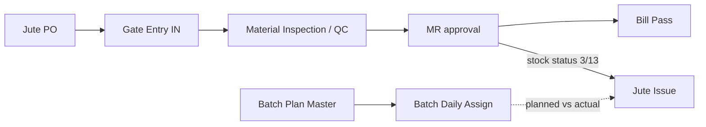

# Jute Purchase Module — Index

Last verified: 2026-06-12

> Scope: jute raw-material procurement — Jute PO → Gate Entry (IN/OUT) → Material Inspection (QC) →
> Material Receipt (MR) → Bill Pass, plus Jute Issue, Batch Daily Assign, Batch Plan Master and
> reports. General (non-jute) procurement is a separate module (`module-procurement`).
> Persona: **Portal** (tenant DB, tables prefixed `jute_`).

## Document chain

**Single-table core (critical):** the Gate Entry table was **merged into `jute_mr`** (2026-01).
Gate Entry, Material Inspection, MR and Bill Pass are all views over the same
`jute_mr` (+ `jute_mr_li`) row at different lifecycle stages:

- Gate Entry IN **creates** the `jute_mr` row (status 1, gate-entry no. per branch + FY)
- Material Inspection sets `qc_check = 1` and writes QC data into `jute_mr_li`
- Gate Entry OUT (sets `out_time`) is **blocked until QC is complete**
- MR approval (final) generates `branch_mr_no` **and** `bill_pass_no`, computes totals/TDS
- Bill Pass updates invoice fields on the same row (`update_bill_pass/{jute_mr_id}`)

Consumption side: `jute_issue` lines reference `jute_mr_li_id`; issuable stock comes from
`vw_jute_stock_outstanding` (MRs with `status_id IN (3, 13)` — see
`../vowerp3be/src/juteProcurement/constants.py`). `jute_batch_daily_assign` assigns Batch Plan
recipes to yarn qualities per day; the batch-cost report compares planned vs actual issue.

**Jute-specific status 13** = Pending / Finalised (terminal on the MR screen, handed off to an
external system) — it is not part of the global 21/1/20/3/4/5/6 set.

## Cross-repo file registry

| What | Path |
|------|------|
| FE pages | `src/app/dashboardportal/jutePurchase/` |
| FE services | `src/utils/juteReportService.ts` (reports); `src/app/dashboardportal/jutePurchase/mr/utils/mrService.ts` (MR — **local to the page tree**); everything else calls `apiRoutesPortalMasters` constants directly |
| FE route constants | `src/utils/api.ts` → `apiRoutesPortalMasters` (`JUTE_PO_*`, `JUTE_GATE_ENTRY_*`, `JUTE_MATERIAL_INSPECTION_*`, `JUTE_MR_*`, `JUTE_BILL_PASS_*`, `JUTE_ISSUE_*`, `BATCH_DAILY_ASSIGN_*`, `BATCH_PLAN_*`, `JUTE_REPORT_*`) |
| BE routers | `../vowerp3be/src/juteProcurement/` (`jutePO.py`, `juteGateEntry.py`, `materialInspection.py`, `mr.py`, `juteAgentMap.py`, `billPass.py`, `issue.py`, `batchDailyAssign.py`, `reports.py`) |
| BE queries | `../vowerp3be/src/juteProcurement/query.py`, `reportQueries.py`; Excel helpers `_excel_utils.py`, doc-no formatters `formatters.py` |
| BE constants | `../vowerp3be/src/juteProcurement/constants.py` (`JUTE_MR_APPROVED_STATUSES = (3, 13)`, `TDS_CAP_INR`) |
| Batch Plan Master BE | `../vowerp3be/src/masters/batchPlanMaster.py` (a **masters** router; FE page lives in this module) |
| Migrations | `../vowerp3be/dbqueries/migrations/add_approval_level_to_jute_mr.sql`, `add_approval_level_to_jute_po.sql` |
| Router registration | `../vowerp3be/src/main.py:175-183` (jute procurement), `:150` (batchPlanMaster) |

Note: `juteAgentMap.py` is registered under this module's BE folder, but its FE page lives in
`src/app/dashboardportal/masters/juteAgentMap/` (masters module).

## Knowledge parts

| File | Covers |
|------|--------|
| `pages-01-po-gate-mr.md` | Jute PO, Gate Entry, MR pages |
| `pages-02-inspection-issue-billpass-batch-reports.md` | Material Inspection, Jute Issue, Bill Pass, Batch Daily Assign, Batch Plan Master, Reports |
| `backend-map.md` | Router file → prefix → every endpoint |
| `approval-flows.md` | Status lifecycles for Jute PO, MR, Jute Issue, Batch Daily Assign (mermaid state diagrams) |
