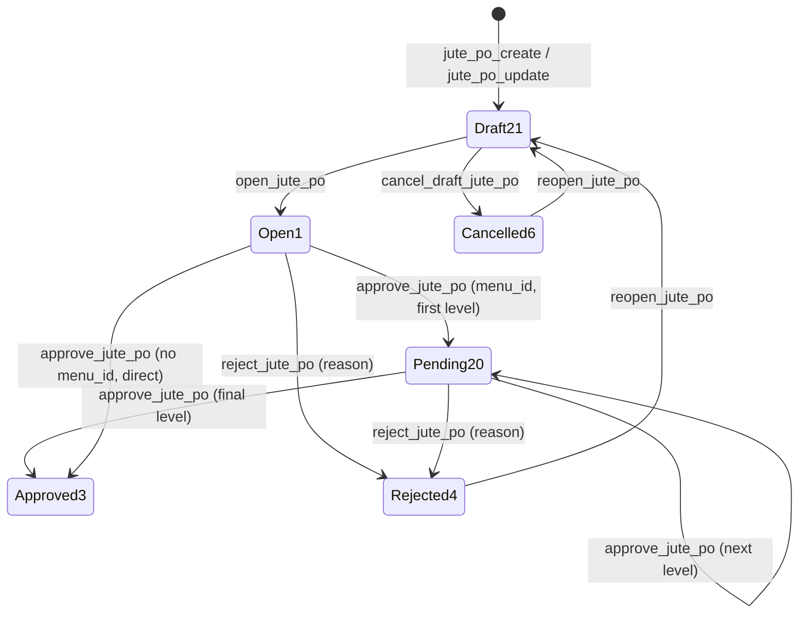
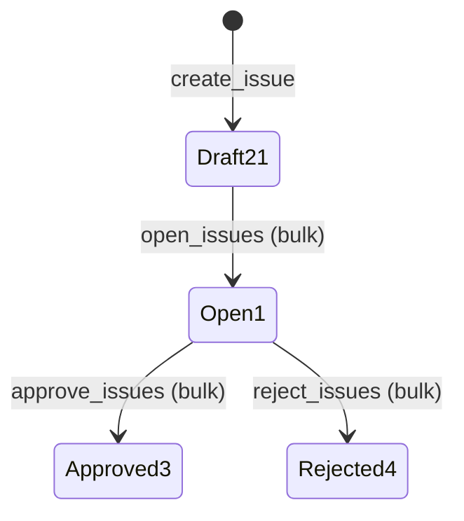
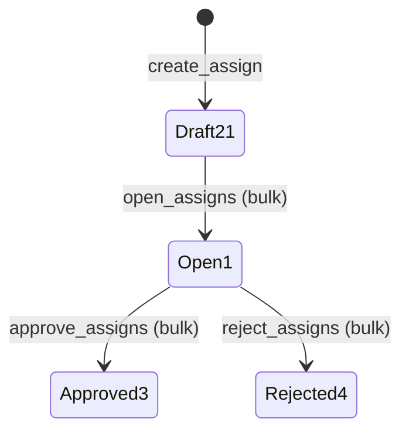

# Jute Purchase Approval Flows

Last verified: 2026-06-12

> Scope: status lifecycles for the four jute documents that have one. Status IDs are global
> (21 Draft · 1 Open · 20 Pending Approval · 3 Approved · 4 Rejected · 6 Cancelled) **plus the
> jute-only 13 Pending/Finalised** (terminal on the MR screen, handed off to an external system).
> Multi-level approval uses the shared `process_approval` / `process_rejection` utilities in
> `../vowerp3be/src/common/approval_utils.py` — they auto-transition 1 → 20 and increment
> `approval_level` when the caller sends `menu_id`; without `menu_id` both routers fall back to
> direct single-step approval (backward compatible).

## Jute PO

Endpoints on `/api/jutePO` (BE `src/juteProcurement/jutePO.py`); FE
`po/createPO/hooks/useJutePOApproval.ts` + `JutePOApprovalBar.tsx`. **No send-for-approval
endpoint** — the first `approve_jute_po` call with `menu_id` moves 1 → 20 via `process_approval`.
**Reopen always returns to Draft 21** (unlike procurement PO, where a rejected PO reopens to
Open 1).

| Action | Endpoint | Guard / effect |
|---|---|---|
| Save | POST `/jute_po_create`, PUT `/jute_po_update/{id}` | Create → 21; update allowed in 21 or 1 |
| Open | POST `/open_jute_po/{id}` | 21 → 1 |
| Approve | POST `/approve_jute_po/{id}` | From 1 or 20; multi-level with `menu_id`, else direct → 3 |
| Reject | POST `/reject_jute_po/{id}` | From 1 or 20 → 4; clears `approval_level`; reason appended to `internal_note` as `Rejected: <reason>` |
| Cancel draft | POST `/cancel_draft_jute_po/{id}` | 21 → 6 |
| Reopen | POST `/reopen_jute_po/{id}` | 4 or 6 → **21** |

## Material Receipt (MR)

Endpoints on `/api/juteMR` (BE `src/juteProcurement/mr.py`, constants at `mr.py:819-825`); FE
`mr/hooks/useMRApproval.ts` + `MRApprovalBar.tsx` / `MRApprovalDialog.tsx` via
`mr/utils/mrService.ts`. MRs are **created by Gate Entry at status 1** ("IN" = Open numerically),
so Draft → Open via `open_mr` is a backward-compat path, not the normal flow.

```mermaid
stateDiagram-v2
    [*] --> Open1: gate entry IN (creates jute_mr at status 1)
    Draft21 --> Open1: open_mr (compat; requires party + party branch)
    Open1 --> Pending13: pending_mr (terminal, external system)
    Open1 --> Pending20: approve_mr (menu_id, first level)
    Pending20 --> Pending20: approve_mr (next level)
    Pending20 --> Approved3: approve_mr (final - mr_date mandatory)
    Open1 --> Approved3: approve_mr (no menu_id, direct)
    Open1 --> Rejected4: reject_mr (reason)
    Pending20 --> Rejected4: reject_mr (reason)
    Open1 --> Cancelled6: cancel_mr
```

| Action | Endpoint | Guard / effect |
|---|---|---|
| Open | POST `/open_mr` | 21 → 1; party + party branch required |
| Pending | POST `/pending_mr` | 1 → **13** (Pending/Finalised — terminal on this screen) |
| Approve | POST `/approve_mr` | From 1 or 20; multi-level with `menu_id`. **Final approval:** `mr_date` mandatory; generates `branch_mr_no` + `bill_pass_no` (per branch + FY); sets `bill_pass_date = mr_date`; computes `total_amount`, `claim_amount`, `roundoff`, `net_total` and **194Q TDS** (0.1% once cumulative party MR value in the FY crosses ₹50,00,000) |
| Reject | POST `/reject_mr` | From 1 or 20 → 4 (reason; `process_rejection` when `menu_id`) |
| Cancel | POST `/cancel_mr` | 1 → 6 |
| (generic) | PUT `/change_status/{mr_id}` | Sets any status; validates party/branch when leaving 21 — no FE caller |

No reopen endpoint — MR statuses 3/4/6/13 are terminal on this screen. Approved (3) feeds Bill
Pass; 3 **and** 13 count as issuable stock (`vw_jute_stock_outstanding`).

## Jute Issue — simplified, bulk

Endpoints on `/api/juteIssue` (BE `src/juteProcurement/issue.py`); inline buttons on
`juteIssue/edit/page.tsx` (no approval bar component). All three lifecycle endpoints are **bulk**:
explicit `issue_ids` or everything for a `branch_id` + `issue_date`. No Pending 20, no reopen.

Draft lines can be deleted (`DELETE /delete_issue/{id}`) or updated (`PUT /update_issue/{id}`);
both are blocked once the line leaves 21.

## Batch Daily Assign — simplified, bulk

Endpoints on `/api/batchDailyAssign` (BE `src/juteProcurement/batchDailyAssign.py`); inline
buttons on `batchPlan/edit/page.tsx`. Bulk by explicit id list (`_bulk_status_change` rejects the
call if any row is not in the expected from-status).

Draft rows can be deleted (`DELETE /delete_assign/{id}`, 21 only). No reopen.

## No lifecycle

- **Gate Entry** — `status_id` stays as created (1, "IN"); completion is tracked by `out_time`,
  and OUT is blocked until `qc_check = 1` (`juteGateEntry.py:555-559`).
- **Material Inspection** — single `complete_inspection` action (`qc_check = 1`); rejects re-runs.
- **Bill Pass** — Save / Complete on `update_bill_pass/{jute_mr_id}`; requires MR `status_id = 3`;
  Complete sets `bill_pass_complete = 1` (then read-only in the UI).
- **Batch Plan Master** — master data, no statuses.
