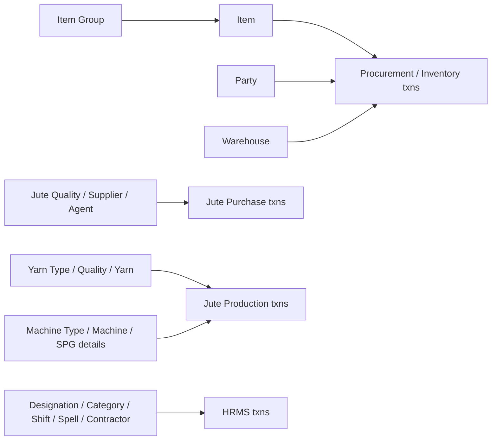

# Masters Module — Index

Last verified: 2026-06-12

> Scope: all portal master-data pages under `src/app/dashboardportal/masters/` (26 page folders +
> a landing `page.tsx`) and their backend routers (mostly `../vowerp3be/src/masters/`, plus two
> cross-module routers). Persona: **Portal** (tenant DB, `*_mst` tables). Masters are plain CRUD —
> **no approval workflows** anywhere in this module.

## Module overview

Masters hold the reference data every transaction depends on: items and item groups, parties
(suppliers/customers), warehouses, projects, cost factors, departments, jute/yarn/machine
masters, and HR/finance masters (designation, worker category, shift, spell, contractor, bank
details). The standard page shape is **list page (`page.tsx`, MUI DataGrid) + create/edit dialog
component in the same folder** — there are no `create*/page.tsx` sub-routes like transactions.
A few masters are more complex (see complexity tiers below).

## Complexity tiers

| Tier | Pages | Pattern |
|------|-------|---------|
| **Complex** | itemMaster (UOM + min/max mapping tables, bulk-create grid, prefetched edit setup), partyMaster (party + `party_branches` in one form), mechineMaster & machinespgdetails & projectMaster (separate Create/Edit/View dialog components), yarnMaster (large form), yarnqualitymaster (service layer + tests) | Multi-component folders, nested rows, services |
| **Simple** | All the rest | `page.tsx` list + one `Create*.tsx` dialog calling table/setup/create/edit constants |

## Cross-repo file registry

| What | Path |
|------|------|
| FE pages | `src/app/dashboardportal/masters/` (26 folders + landing `page.tsx`) |
| FE route constants | `src/utils/api.ts` → `apiRoutesPortalMasters` |
| FE services | `src/utils/yarnQualityService.ts` (+ test), `src/utils/machineSpgDetailsService.ts`, `src/utils/itemSearchService.ts` (`/itemMaster/item_search`); all other pages call constants directly via `fetchWithCookie` |
| BE routers | `../vowerp3be/src/masters/` (~23 router files; also `models.py`, `query.py`, `machineSpgDetailsQuery.py`, `constants.py`, and a typo'd `__intit__.py`) |
| Cross-module BE routers | `../vowerp3be/src/juteProcurement/juteAgentMap.py` (`/api/juteAgentMap`), `../vowerp3be/src/bomcosting/stdRateCard.py` (`/api/stdRateCard`) |
| Router registration | `../vowerp3be/src/main.py:133-158` (masters), `:163` (stdRateCard), `:179` (juteAgentMap) |

## Scoping

Every list/setup call passes `co_id`. Most pages read it from
`localStorage.getItem("sidebar_selectedCompany")` (written by the portal sidebar); the newer HR
masters (categoryMaster, designationMaster, shiftMaster, spellMaster, contractorMaster,
itemGroupMaster) also use `useSidebarContext()` (`selectedBranches`, `hasMenuAccess`).
Branch-scoped masters (department, costFactor, machine, SPG details, yarn quality, category,
contractor, …) additionally pass `branch_id` / pick a branch from setup data.

## Knowledge parts — every page maps to exactly one part

| File | Pages covered |
|------|---------------|
| `pages-01-items-inventory.md` | itemGroupMaster, itemMaster, itemMake, warehouseMaster, partyMaster, projectMaster, costFactor, departmentMaster, subDepartmentMaster |
| `pages-02-jute-yarn-machines.md` | juteQualityMaster, juteSupplierMaster, juteSupplierMap, juteAgentMap, yarnMaster, YarnTypeMaster, yarnqualitymaster, mechineMaster, machineTypeMaster, machinespgdetails |
| `pages-03-hr-finance-misc.md` | designationMaster, categoryMaster, shiftMaster, spellMaster, contractorMaster, bankDetailsMaster, stdRateCard, landing `page.tsx` |
| `backend-map.md` | Router file → prefix → every endpoint; known dead routes |

## Known dead routes (FE constant exists, backend endpoint does not)

Verified against router sources on the date above — these calls 404 at runtime:

- `DEPT_MASTER_VIEW` → `/deptMaster/dept_master_view` (used by departmentMaster page)
- `SUBDEPT_MASTER_VIEW` → `/deptMaster/subdept_master_view` (used by subDepartmentMaster page)
- `PROJECT_MASTER_EDIT` / `PROJECT_MASTER_VIEW` → `/projectMaster/project_master_edit|view` (used by projectMaster edit/view dialogs)
- Unused-by-pages but defined in `api.ts`: `EDIT_ITEM_GRP`, `WAREHOUSE_CREATE_SETUP`, `WAREHOUSE_EDIT_SETUP`, `WAREHOUSE_EDIT`, `MECHINE_TYPE_MASTER_CREATE_SETUP`, `MECHINE_TYPE_MASTER_VIEW`
