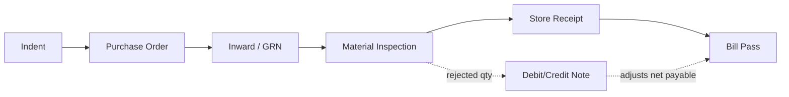

# Procurement Module — Index

Last verified: 2026-06-12

> Scope: the general procurement chain — Indent → Purchase Order → Inward → Material Inspection →
> Store Receipt (SR) → Bill Pass, plus Debit/Credit Notes and reports. Jute raw-material procurement
> is a separate module (`module-jute-purchase`). Persona: **Portal** (tenant DB, tables prefixed `proc_`).

## Document chain

Traceability columns: `proc_po_dtl.indent_dtl_id` → `proc_inward_dtl.po_dtl_id` → `issue_li.inward_dtl_id`.
SR and Bill Pass live on the `proc_inward` header (`sr_status`, bill-pass fields) rather than separate header tables.

## Cross-repo file registry

| What | Path |
|------|------|
| FE pages | `src/app/dashboardportal/procurement/` |
| FE services | `src/utils/indentService.ts`, `poService.ts`, `inwardService.ts`, `billPassService.ts` (inspection/SR/DR-CR/reports call constants directly from pages) |
| FE route constants | `src/utils/api.ts` → `apiRoutesPortalMasters` |
| Shared print header | `src/app/dashboardportal/procurement/_shared/PrintHeader.tsx` |
| BE routers | `../vowerp3be/src/procurement/` (`indent.py`, `po.py`, `inward.py`, `material_inspection.py`, `sr.py`, `drcr_note.py`, `billpass.py`, `reports.py`) |
| BE queries | `../vowerp3be/src/procurement/query.py`, `reportQueries.py` |
| BE constants | `../vowerp3be/src/procurement/constants.py` (indent types — must stay in sync with `indentConstants.ts`) |
| Deep-dive doc | `../vowerp3be/docs/procurement-inward-to-bill-pass-approval-flows.md` |
| GST docs | `../vowerp3be/docs/GST_PROCUREMENT.md`, `docs/GST_PROCUREMENT_FRONTEND.md` |

## Knowledge parts

| File | Covers |
|------|--------|
| `pages-01-indent-po-inward.md` | Indent, Purchase Order, Inward pages |
| `pages-02-inspection-sr-billpass-reports.md` | Material Inspection, SR, Bill Pass, DR/CR Note, Reports |
| `backend-map.md` | Router file → prefix → every endpoint |
| `approval-flows.md` | Status lifecycles for Indent, PO, SR, DR/CR Note (mermaid state diagrams) |
