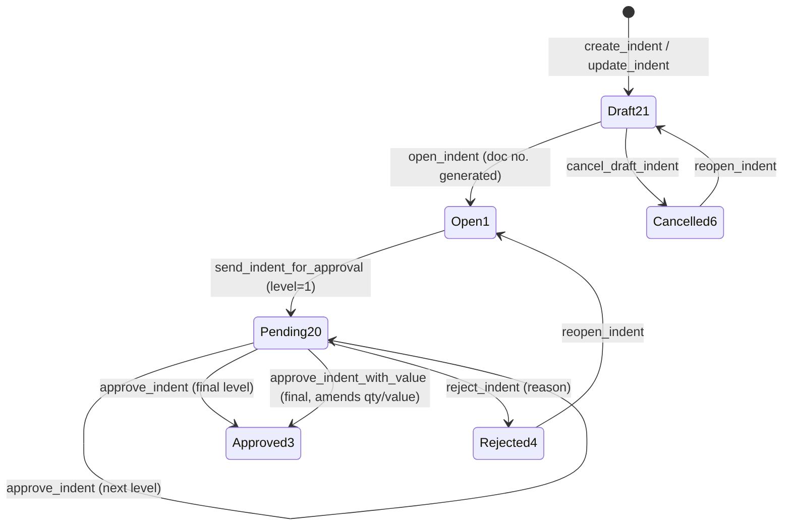
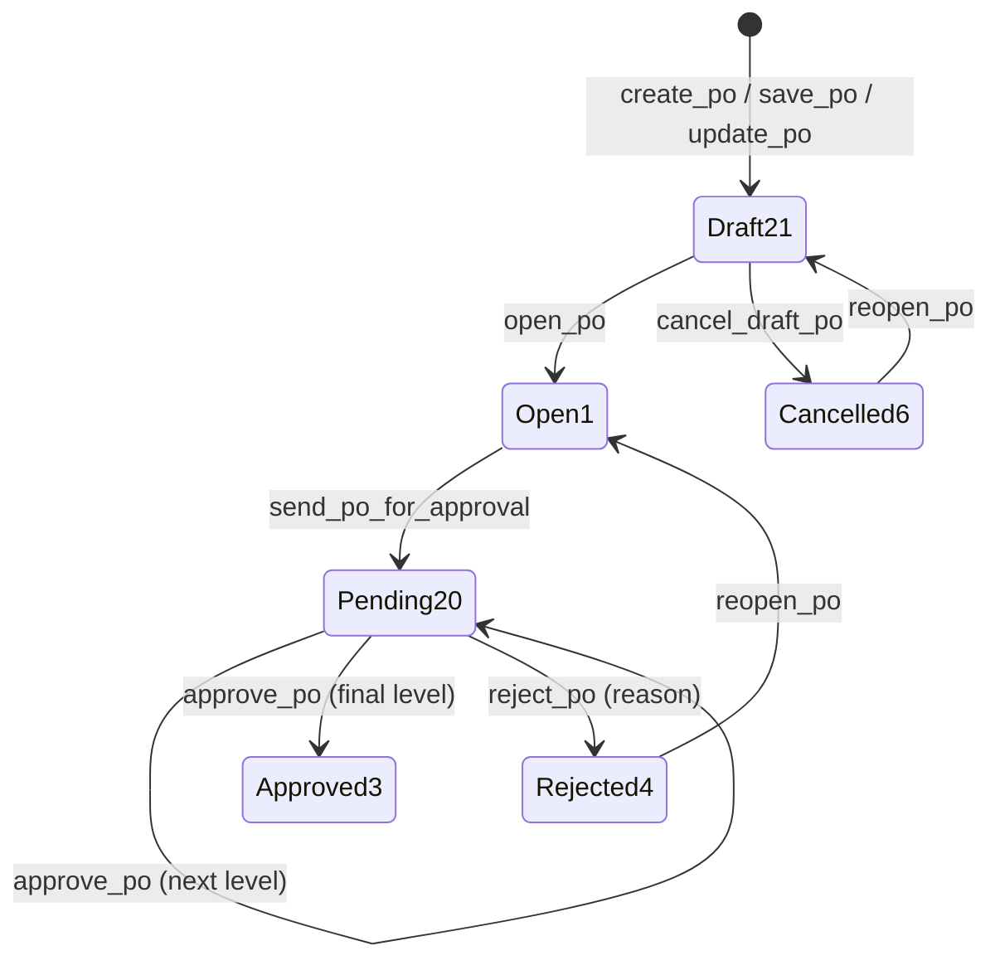
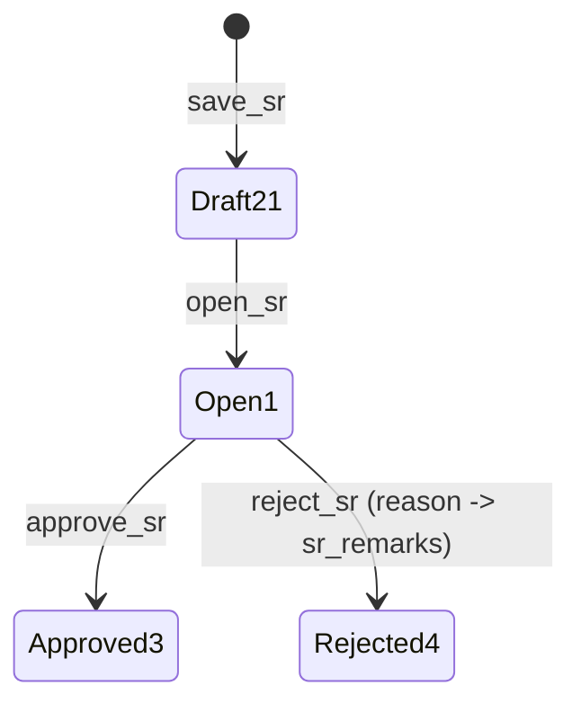
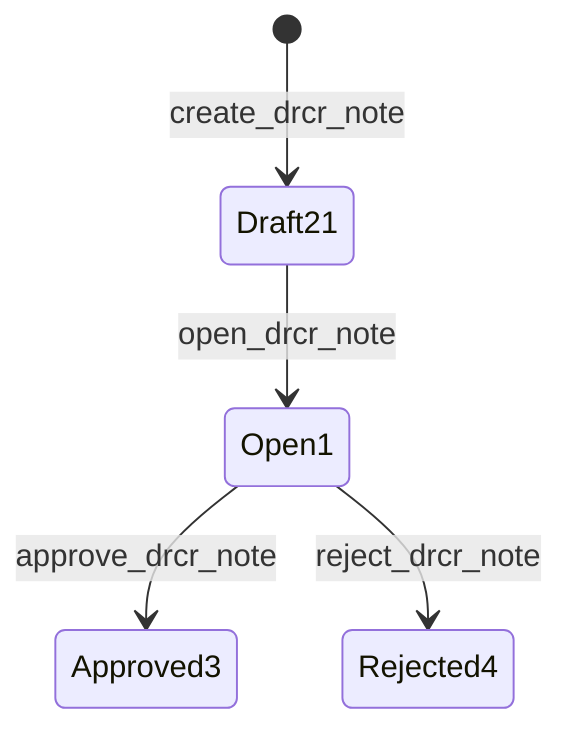

# Procurement Approval Flows

Last verified: 2026-06-12

> Scope: status lifecycles for the four procurement documents that have one. Status IDs are global:
> 21 Draft · 1 Open · 20 Pending Approval · 3 Approved · 4 Rejected · 5 Closed · 6 Cancelled.
> Approval levels within status 20 come from the hierarchy configured in dashboardadmin
> (`GET_APPROVAL_FLOW` → `/get_approval_flow`).

## Indent — full workflow

Endpoints on `/api/procurementIndent` (BE `src/procurement/indent.py`); FE
`useIndentApproval.ts` + `IndentApprovalBar.tsx` via `indentService.ts`.

`approve_indent_with_value` is the Indent-specific variant where the approver amends quantities
before approving.

## Purchase Order — full workflow

Endpoints on `/api/procurementPO` (BE `src/procurement/po.py`); FE `usePOApproval.ts` +
`POApprovalBar.tsx` via `poService.ts`. Same shape as Indent (no approve-with-value), plus
`clone_po` which copies any PO into a fresh Draft 21.

## Store Receipt — simplified (on `proc_inward.sr_status`)

Endpoints on `/api/storesReceipt` (BE `src/procurement/sr.py`); FE `useSRApproval.ts` +
`SRApprovalBar.tsx`. No send-for-approval step and no Pending 20 state.

Bill Pass requires `sr_status = 3` — the backend update enforces it in SQL
(`query.py`, `WHERE sr_status = 3`) plus application guards in `billpass.py`.

## Debit/Credit Note — simplified

Endpoints on `/api/drcrNote` (BE `src/procurement/drcr_note.py`); actions inline on the list page.

Creation requires the source inward's SR to be Approved (3).

## No approval workflow

- **Inward** — gated by Material Inspection (`inspection_check`) instead.
- **Material Inspection** — single `complete_inspection` action.
- **Bill Pass** — Save / Complete on `update_bill_pass/{inward_id}`.
