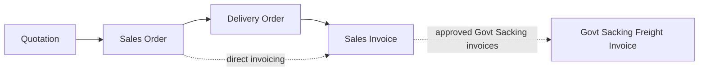

# Sales Module — Index

Last verified: 2026-06-12

> Scope: the sales document chain — Quotation → Sales Order → Delivery Order → Sales Invoice,
> plus the Jute Tally Download and the sales reports page. Persona: **Portal** (tenant DB,
> tables prefixed `sales_`). All four transactions carry the full approval workflow; behavior
> branches per **invoice type** (Regular / Hessian / Govt Sacking / Jute Yarn / Raw Jute /
> Govt Sacking Freight).

## Document chain

Each downstream document sources only **Approved (3)** upstream documents: SO setup lists
approved quotations, DO setup lists approved SOs, SI setup lists approved DOs **and** approved
SOs (direct invoicing). A Govt Sacking Freight invoice (type 7) sources approved Govt Sacking
(type 3) invoices via `govt_sacking_source_list`. Document numbers (`SQ`/`SO`/`DO`/`SI` prefixes,
`SALES_DOC_TYPES`) are generated at `/open_*` per branch + financial year.

## Invoice types (drives form behavior on SO, DO, SI)

Defined in `invoice_type_mst`, mapped per company via `invoice_type_co_map` (managed from the
Tenant Admin dashboard); canonical IDs in `../vowerp3be/src/sales/constants.py`
(`INVOICE_TYPE_IDS`): 1 Regular, 2 Hessian, 3 Govt Sacking, 4 Jute Yarn, 5 Raw Jute,
7 Govt Sacking Freight. Each create folder for SO/DO/SI carries an in-folder
`invoiceTypeDoc.md` describing the per-type header/line behavior — read it before touching
type-specific logic.

## Cross-repo file registry

| What | Path |
|------|------|
| FE pages | `src/app/dashboardportal/sales/` (landing `page.tsx` is a stub) |
| FE services | `src/utils/quotationService.ts`, `salesOrderService.ts`, `deliveryOrderService.ts`, `salesInvoiceService.ts`, `salesReportService.ts` |
| FE route constants | `src/utils/api.ts` → `apiRoutesPortalMasters` (`QUOTATION_*`, `SALES_ORDER_*`, `DELIVERY_ORDER_*`, `SALES_INVOICE_*`, `SALES_REPORT_*`) |
| FE shared utils | `src/app/dashboardportal/sales/utils/govtskgTransportCharges.ts` (SO + SI), `src/utils/hessianCalculations.ts` |
| In-folder type docs | `salesOrder/createSalesOrder/invoiceTypeDoc.md`, `deliveryOrder/createDeliveryOrder/invoiceTypeDoc.md`, `salesInvoice/createSalesInvoice/invoiceTypeDoc.md` |
| BE routers | `../vowerp3be/src/sales/` (`quotation.py`, `salesOrder.py`, `deliveryOrder.py`, `salesInvoice.py`, `reports.py`) |
| BE queries | `../vowerp3be/src/sales/query.py` (transactions), `reportQueries.py` (reports) |
| BE constants | `../vowerp3be/src/sales/constants.py` (`SALES_STATUS_IDS`, `SALES_DOC_TYPES`, `INVOICE_TYPE_IDS`, `resolve_invoice_type_code`) |
| BE hessian math | `../vowerp3be/src/sales/hessian_calculations.py` — **mirror contract** with `src/utils/hessianCalculations.ts` |
| BE e-invoice stub | `../vowerp3be/src/sales/e_invoice_handler.py` (placeholder, raises `NotImplementedError`) |
| Approval helpers | `../vowerp3be/src/common/approval_utils.py` (`process_approval`, `process_rejection`, `calculate_approval_permissions`) |
| Router registration | `../vowerp3be/src/main.py:77-81` (imports), `src/main.py:204-208` (prefixes) |

Key tables: `sales_quotation(_dtl, _dtl_gst)`; `sales_order(_dtl, _dtl_gst, _dtl_hessian,
_additional, _additional_gst, _jute(_dtl), _juteyarn, _govtskg(_dtl))`;
`sales_delivery_order(_dtl, _dtl_gst)`; `sales_invoice(_dtl, _dtl_gst, _additional,
_additional_gst, _freight, _freight_source, _govtskg, _hessian(_dtl), _jute(_dtl),
_juteyarn(_dtl))`. Note the singular-`sale` typo tables `sale_invoice_jute` and
`sale_invoice_govtskg_dtl` — production names, do not "fix".

## Knowledge parts

| File | Covers |
|------|--------|
| `pages-01-quotation-salesorder.md` | Quotation and Sales Order pages |
| `pages-02-delivery-invoice-reports.md` | Delivery Order, Sales Invoice, Jute Tally Download, Reports |
| `backend-map.md` | Router file → prefix → every endpoint |
| `approval-flows.md` | Status lifecycles for all four transactions (mermaid state diagrams) |
