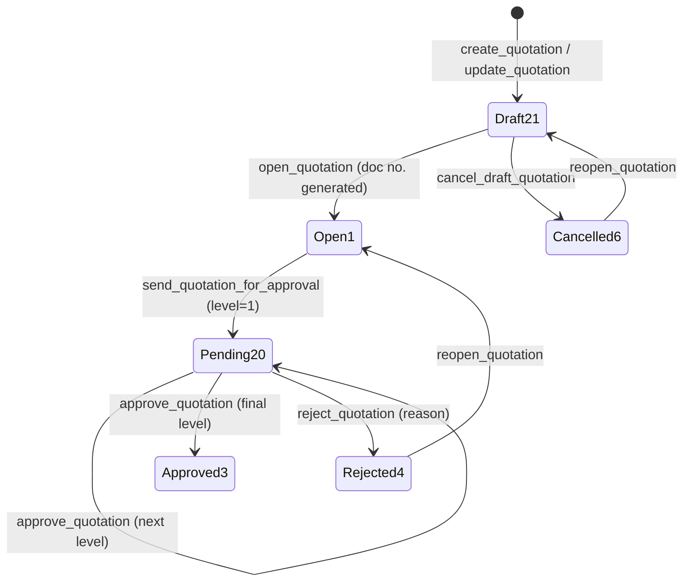
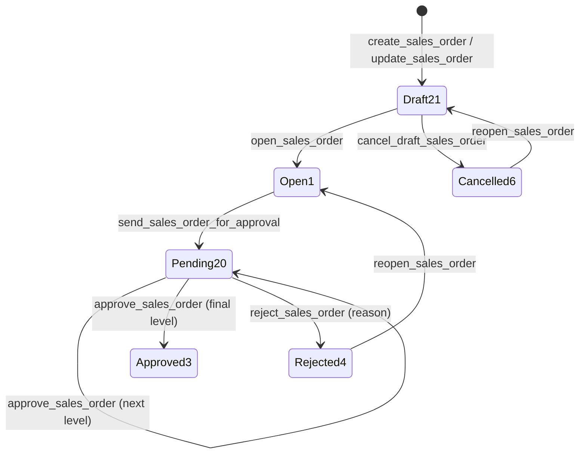
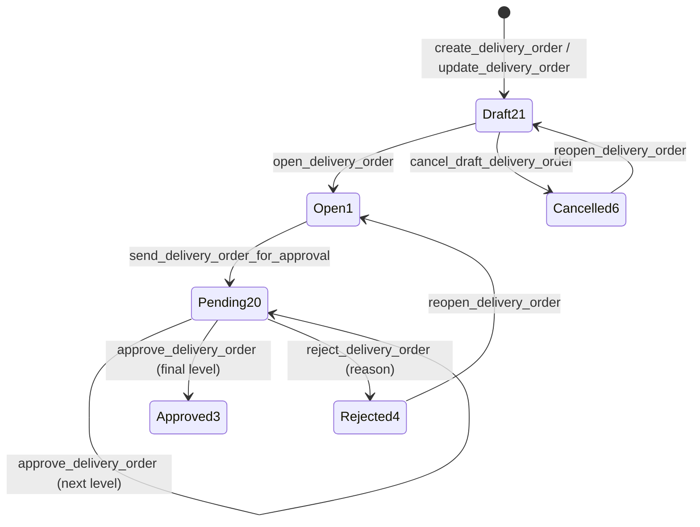
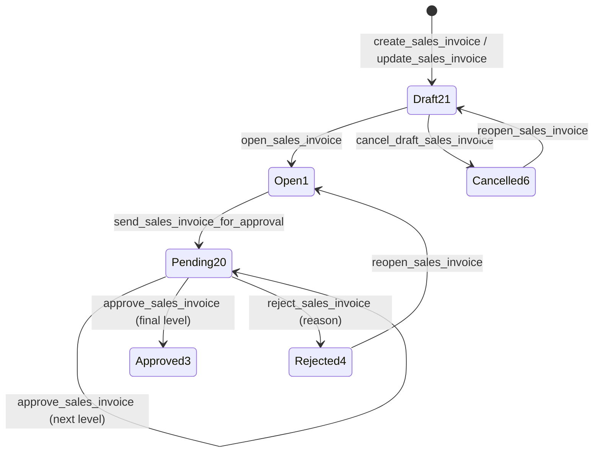

# Sales Approval Flows

Last verified: 2026-06-12

> Scope: status lifecycles for all four sales documents. Status IDs are global: 21 Draft · 1 Open ·
> 20 Pending Approval · 3 Approved · 4 Rejected · 5 Closed · 6 Cancelled. All four share the **same
> full multi-level lifecycle** driven by `../vowerp3be/src/common/approval_utils.py`
> (`process_approval` / `process_rejection`, value-based on the document amount). Status 5 (Closed)
> is defined in `SALES_STATUS_IDS` but no sales router ever sets it today.

## Shared shape (all four documents)

- Save (`create_*` / `update_*`) keeps the document at **Draft 21**.
- `/open_*` (21 → 1) requires `branch_id` and generates the document number (max + 1 per
  branch + financial year, prefixes SQ/SO/DO/SI).
- `/cancel_draft_*` (21 → 6) — draft only.
- `/send_*_for_approval` (1 → 20, `approval_level = 1`).
- `/approve_*` (requires `menu_id`) → `process_approval`: stays at 20 with incremented level
  until the final level, then 3. Value-based limits use `net_amount` (quotation/SO/DO) or
  `invoice_amount` (invoice).
- `/reject_*` (accepts `reason`) → `process_rejection` (20 → 4).
- `/reopen_*`: 6 → 21, 4 → 1; any other status is a 400.
- Action permissions come from the `permissions` block of `get_*_by_id` (when `menu_id` is
  passed), computed by `calculate_approval_permissions` — there is **no** sales
  `get_approval_flow` endpoint. FE fallback logic per status lives in each `use*Approval` hook.

## Quotation

Endpoints on `/api/salesQuotation` (BE `src/sales/quotation.py`); FE `useQuotationApproval.ts` +
`QuotationApprovalBar.tsx` via `quotationService.ts`.

## Sales Order

Endpoints on `/api/salesOrder` (BE `src/sales/salesOrder.py`); FE `useSalesOrderApproval.ts` +
`SalesOrderApprovalBar.tsx` via `salesOrderService.ts`. Approved (3) is the gate for downstream
documents: only approved SOs appear in the DO and direct-invoice pickers.

## Delivery Order

Endpoints on `/api/salesDeliveryOrder` (BE `src/sales/deliveryOrder.py`); FE
`useDeliveryOrderApproval.ts` + `DeliveryOrderApprovalBar.tsx` via `deliveryOrderService.ts`.
Approved DOs feed the invoice picker.

## Sales Invoice

Endpoints on `/api/salesInvoice` (BE `src/sales/salesInvoice.py`); FE `useSalesInvoiceApproval.ts`
+ `SalesInvoiceApprovalBar.tsx` via `salesInvoiceService.ts`. Value-based approval uses
`invoice_amount`. Finalized **Govt Sacking (type 3)** invoices become eligible sources for a
Govt Sacking Freight (type 7) invoice via `/govt_sacking_source_list`.

## No approval workflow

- **Jute Tally Download** and **Reports** — read-only; they consume only Approved (3) documents
  (the Tally export additionally filters `invoice_type = RAW_JUTE`).
