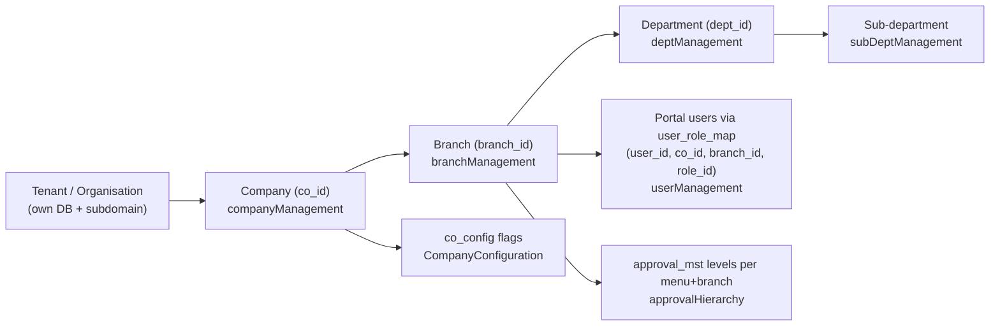

# Tenant Admin Module — Index

Last verified: 2026-06-12

> Scope: the **Tenant Admin dashboard** (`/dashboardadmin`) — where each tenant (organisation)
> configures itself: companies, branches, departments/sub-departments, company configuration,
> invoice-type mapping, machine types, pay schemes, tenant-admin and portal users/roles, and the
> multi-level approval hierarchy used by portal transactions. Persona: **Tenant Admin**
> (login via `/authRoutes/login`, org resolved from the subdomain).

## Persona context (read first)

Three dashboards, three personas — do not mix them up:

- `dashboardctrldesk` — the **VOW vendor team's own console** (manages all orgs/tenants).
- `dashboardadmin` — **this module**: each tenant's self-configuration desk.
- `dashboardportal` — daily operations (procurement, inventory, sales, ...).

Backend split for this dashboard (verified against `../vowerp3be/src/main.py:119-132`):

- `/api/companyAdmin` → `../vowerp3be/src/common/companyAdmin/` — 6 routers (menu, roles, users,
  company, branch, dept_subdept).
- `/api/admin/PortalData` → `../vowerp3be/src/common/portal/` — 4 routers (roles, users, menu,
  approval) — portal-admin data (portal users/roles/menus/approval hierarchy) managed *from* this
  dashboard.
- A few pages additionally borrow **portal business** prefixes: `/api/mechMaster` and `/api/hrms`
  (machine types, pay schemes/components).

**Two databases behind `/api/companyAdmin`** (verified per router):

| Routers | DB dependency | Database | Tables |
|---|---|---|---|
| `company.py`, `branch.py`, `dept_subdept.py` | `Depends(get_tenant_db)` | **tenant DB** (subdomain) | `co_mst`, `co_config`, `currency_mst`, `branch_mst`, `dept_mst`, `sub_dept_mst`, `invoice_type_mst`, `invoice_type_co_map` |
| `users.py`, `roles.py`, `menu.py` | `Session(default_engine)` + `get_org_id_from_subdomain` | **vowconsole3** (org-scoped) | `con_user_master` (`con_user_type=1`), `con_user_role_mapping`, `con_role_master`, `con_role_menu_map`, `con_menu_master` |

All `/api/admin/PortalData` routers use `Depends(get_tenant_db)` → tenant DB (`user_mst`,
`user_role_map`, `roles_mst`, `role_menu_map`, `menu_mst`, `approval_mst`).

## Tenant hierarchy — created on this dashboard

The tenant (org) itself is created on the Control Desk; everything below it — companies, branches,
departments, users, roles, approval levels — is created here.

## Cross-repo file registry

| What | Path |
|------|------|
| FE pages | `src/app/dashboardadmin/` |
| FE layout / sidebar | `src/app/dashboardadmin/layout.tsx` → `src/components/dashboard/sidebarCompanyConsole.tsx` |
| FE sidebar menu hook | `src/hooks/use-org-console_menu.tsx` → `GET_TENANT_ADMIN_MENU_ROLE` |
| FE route constants | `src/utils/api.ts` → `apiRoutesconsole` (company/branch/dept/config), `apiRoutes` (users/roles/approval), `apiRoutesPortalMasters` (machine type, pay scheme) |
| FE services | none — pages/hooks call `fetchWithCookie` with constants directly |
| BE routers (companyAdmin) | `../vowerp3be/src/common/companyAdmin/` (`menu.py`, `roles.py`, `users.py`, `company.py`, `branch.py`, `dept_subdept.py`; SQL in `query.py`, models in `models.py`, schemas in `schemas.py`) |
| BE routers (portal-admin) | `../vowerp3be/src/common/portal/` (`roles.py`, `users.py`, `menu.py`, `approval.py`; SQL in `query.py`, models in `models.py`) |
| BE borrowed business routers | `../vowerp3be/src/masters/mechineMaster.py` (`/api/mechMaster`), `../vowerp3be/src/hrms/payScheme.py` + `payComponent.py` (`/api/hrms`) |
| Registrations | `../vowerp3be/src/main.py:119-132` (companyAdmin + PortalData), `:136` (mechMaster), `:212/:216` (hrms pay) |

## Scoping model

Tenant-admin pages do **not** use the portal `SidebarContext`. Org scope comes from the subdomain
on the backend; company/branch selection is per-form (dropdowns populated from setup endpoints).
Exception: `mechineTypeMasterAdmin` reads the *portal* sidebar's localStorage keys
(`sidebar_selectedCompany`, `sidebar_selectedBranches`) for its co/branch filter.

## Knowledge parts

| File | Covers |
|------|--------|
| `pages-01-company-org-structure.md` | companyManagement, branchManagement, deptManagement, subDeptManagement, CompanyConfiguration, coInvoiceTypeMap, mechineTypeMasterAdmin, paySchemeCreation, paySchemeParameters |
| `pages-02-users-roles-approvals.md` | userManagement, userManagementAdmin, roleManagement, roleManagementAdmin, approvalHierarchy |
| `backend-map.md` | Router file → prefix → every endpoint, plus known quirks |
