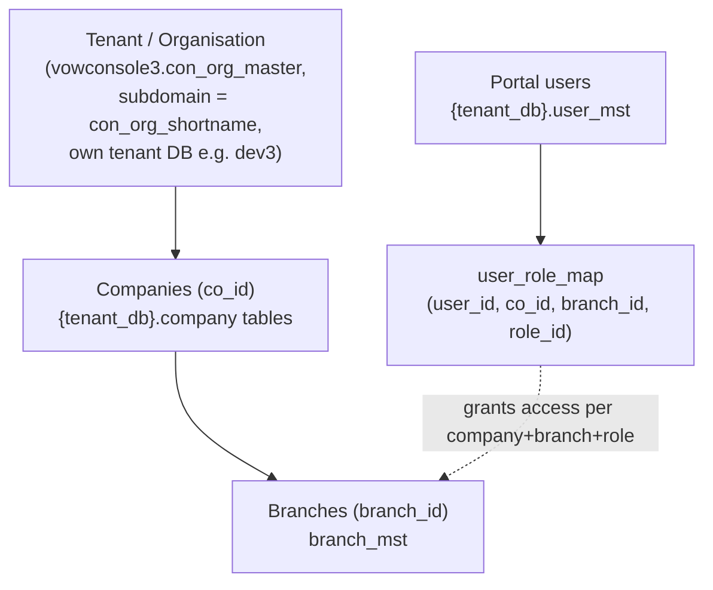
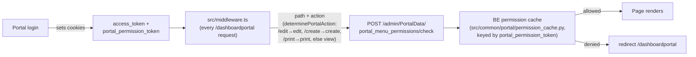

# Roles & Users Across VoWERP3

Last verified: 2026-06-12

> Scope: how users, roles, and permissions work across the three dashboards — who lives in which
> table, how access is scoped by tenant/company/branch, how portal action-level permissions are
> enforced, and where each is managed. Cross-repo: frontend (this repo) + backend (`../vowerp3be`).

## The tenancy hierarchy

A **tenant** (organisation) owns its own database; inside it there are **companies** (`co_id`) and
**branches** (`branch_id`). A portal user's reach is whatever combinations exist in `user_role_map`.
The portal sidebar's company/branch selector reflects exactly these mappings — which is why every
portal page must pass the selected `co_id`/`branch_id` on its API calls.

`dev3` is the QA/dev tenant — the default target for new work.

## Three user populations

| | Control Desk user | Tenant Admin user | Portal user |
|---|---|---|---|
| Table | `vowconsole3.con_user_master` | `vowconsole3.con_user_master` | `{tenant_db}.user_mst` |
| Discriminator | `con_user_type = 0`, `con_org_id IS NULL` | `con_user_type = 1`, `con_org_id = <org>` | `active = 1` |
| Who | The VOW team itself (vendor) | The tenant's own administrators | Day-to-day operational users |
| Logs into | `dashboardctrldesk` | `dashboardadmin` | `dashboardportal` |
| Login endpoint | `/api/authRoutes/loginconsole` | `/api/authRoutes/loginconsole` | `/api/authRoutes/login` (token carries `type: "portal"`) |
| Access scope | System-wide (all orgs) | Own organisation only | Per `user_role_map` (co_id + branch_id + role_id) |
| Managed from | ctrldesk → userManagementAdmin | ctrldesk creates tenant admins; dashboardadmin → userManagement | dashboardadmin/ctrldesk → tenantAdminUserMgmt + portal admin (`/admin/PortalData`) |

## Roles and menus

| Side | Role table | Menu mapping | Sidebar fed by |
|---|---|---|---|
| Control Desk | `con_role_master` | `con_role_menu_map` → `control_desk_menu` | `dashboardctrldesk` |
| Tenant Admin | `con_role_master` (org+company scoped) | `con_role_menu_map` → `con_menu_master` | `dashboardadmin` |
| Portal | role rows in tenant DB | `role_menu_map` → `menu_mst` (templated from `vowconsole3.portal_menu_mst`) | `dashboardportal` |

Portal role CRUD endpoints (BE `../vowerp3be/src/common/portal/roles.py`, prefix
`/api/admin/PortalData`): `get_roles_portal`, `portal_menu_full`, `portal_menu_by_roleid/{role_id}`,
`create_role_portal`, `edit_role_portal`. Portal user CRUD (`users.py`): `get_users_portal`,
`get_user_create_setup_data`, `get_user_edit_setup_data/{portal_user_id}`, `create_user_portal`,
`edit_user_portal` — these write the `user_role_map` rows that define company/branch/role reach.

## Portal action-level permissions (view / print / create / edit)

Portal permissions are **per menu, per action**: view=1, print=2, create=3, edit=4.

Enforcement flow:

- `src/middleware.ts` also verifies the session (`/authRoutes/verify-session`) for ALL three
  dashboards; only `dashboardportal` gets the extra per-route permission check.
- The permission payload is held server-side in an in-memory cache keyed by the
  `portal_permission_token` cookie (`permission_cache.py`) — not serialized into the cookie.
- Helpers: `src/utils/portalPermissions.ts` (`determinePortalAction`, `normalisePortalPath`).

## Approval hierarchy

Multi-level transaction approval (the Pending-20 loop used by Indent, PO, etc.) is **configured in
dashboardadmin → approvalHierarchy** and served by `../vowerp3be/src/common/portal/approval.py`
(`/api/admin/PortalData`): `co_branch_submenu`, `approval_level_data_setup`,
`approval_level_data_setup_submit`. Transactions read their level chain via each module's
`get_approval_flow`-style endpoint. See `docs/claude/modules/procurement/approval-flows.md` for how
the levels play out on a document.

## Where to read more

| Topic | Doc |
|---|---|
| Tenant Admin pages (users, roles, approval hierarchy) | `docs/claude/modules/tenant-admin/` + `module-tenant-admin` agent |
| Control Desk pages | `module-ctrldesk` agent |
| Persona/DB rules (backend) | `../vowerp3be/CLAUDE.md` → Three-Persona Architecture |
| Menu system tables | `../vowerp3be/.claude/agents/dbmanager.md` §7; `add-menu` skill |
